## 1.系统激活

**注意：对于官方 RouterOS 路由器产品（包括 RouterBOARD ），系统自带授权，可跳过本篇内容。**  

在上一篇文章 [00.PVE下安装系统](./00.PVE下安装系统.md) 中，已经在 PVE 环境下安装好了 RouterOS 。  

本文将告诉大家如何激活正版 RouterOS 系统。  

### 1.1.购买 License

因为使用的是原装系统，不像其它 “克隆版” RouterOS 虚拟机镜像，导入后开机就是激活状态。  

因此需要使用 Mikrotik 的官方 `License` 来激活 RouterOS 系统。  

首先需要用邮箱注册 Mikrotik 账号，注册地址为 `https://mikrotik.com/client` 。

然后使用某宝或其他渠道购买一个 `License` ，CHR 的 `License` 分为 P1、P10、PU 三个版本，其区别在于 “网口限速” 。  

对于有 2.5G 网口的设备，推荐购买 P10 授权。

- P1  版本：限速为 1Gbps ，物理接口为千兆设备使用
- P10 版本：限速为 10Gbps ，物理接口为千兆以上万兆以下设备使用
- PU  版本：不限速，任意速度的物理接口均可使用

授权购买后，打开 Mikrotik 官网并登录账号，进入到账户中心。  

在 `Transfer prepaid keys` 页面会看到有一个新的 `License` 。  

**注意：只有这里显示出新购买的 `License` 才表示这个 `License` 真正属于你了。**  

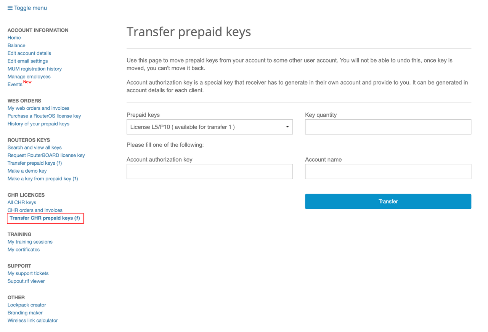

### 1.2. RouterOS 联网

由于 Winbox 目前只支持 Windows 系统，在 macOS 或 Linux 系统下使用则需要准备一个 Windows 的虚拟机或者使用 `Wine` 。  

参考下图中各网口对应关系，连接网线：  

- 将 PVE 服务器的 ETH0 网口，与 `前置路由器` 或 `光猫` LAN 口相连。  
- 将 PVE 服务器的 ETH1 到 ETH3 中的任意网口，与 Windows 设备的网口相连。  

  

打开 Winbox ，此时 Winbox 会识别到一个新的 RouterOS 设备，并显示出该设备的 MAC 地址和 IP 地址（ `0.0.0.0` ）。  

点击 MAC 地址来登录 RouterOS，默认账户 `admin` ，无需密码即可登录。  

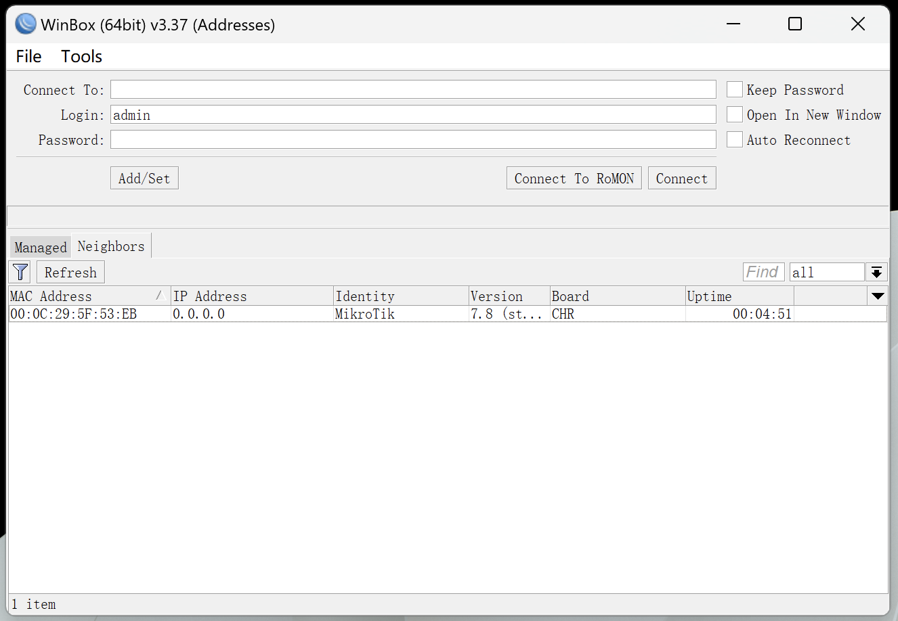  

对于使用官方 ISO 镜像安装的 RouterOS ，首次登录系统后可能显示：

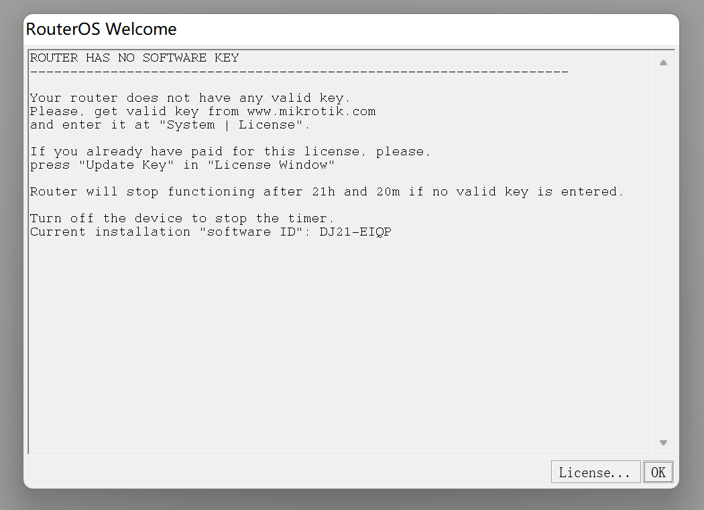

该对话框表示该 RouterOS 未被授权，此时 RouterOS 处于 “试用” 状态，时长为 24 小时，且带宽被限制在 `1Mbps` 。  

系统提示当前账户密码已经过期，需要重设密码。  

由于后续 `admin` 账户将作为 “只读” 账户使用，因此设置一个方便记忆的密码即可。  

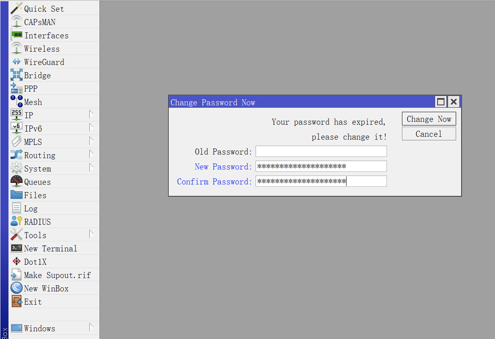

点击 Winbox 左侧导航 `IP` 菜单的子菜单 `DHCP Client` ，查看当前 DHCPv4 客户端状态。  

一般情况下， RouterOS 会在第一个网口 `ether1` 上自动创建一个 `DHCP Client` 。  

该 `DHCP Client` 将从 `前置路由器` 或 `光猫` 中获取 IPv4 地址，并自动设置系统 DNS 。  

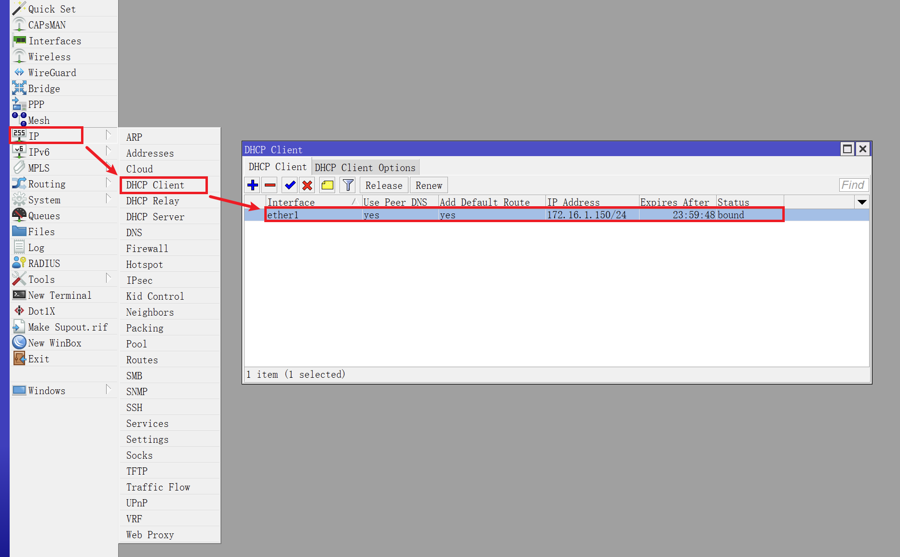

如果 `DHCP Client` 中无数据，则需要手动创建，点击 ` + ` 按钮：

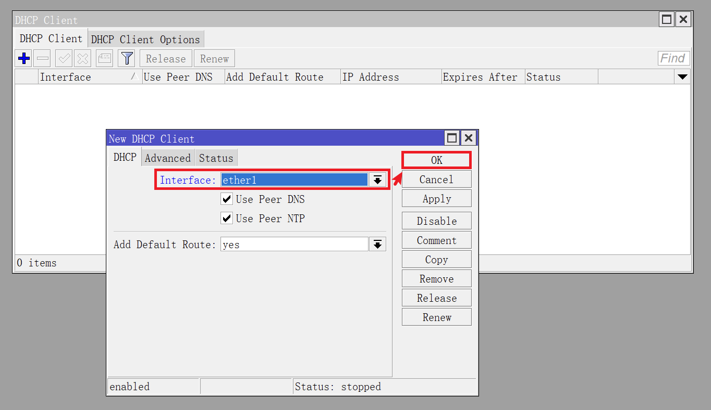

### 1.3.更新 System ID

此时 RouterOS 已经联网，点击左侧导航 `System` 菜单的子菜单 `License` 。  

如果希望更换 `System ID`，或从 P1 升级到更高级授权，可以点击 `Generate New ID` 来更新。  

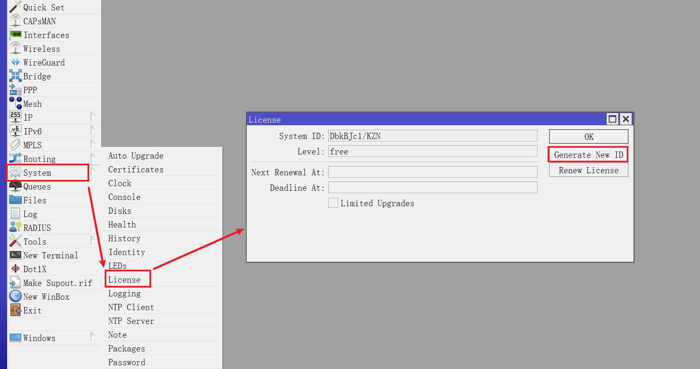

系统会提示 “旧授权将不再可用，是否确认” ，点击 `yes` 即可：  

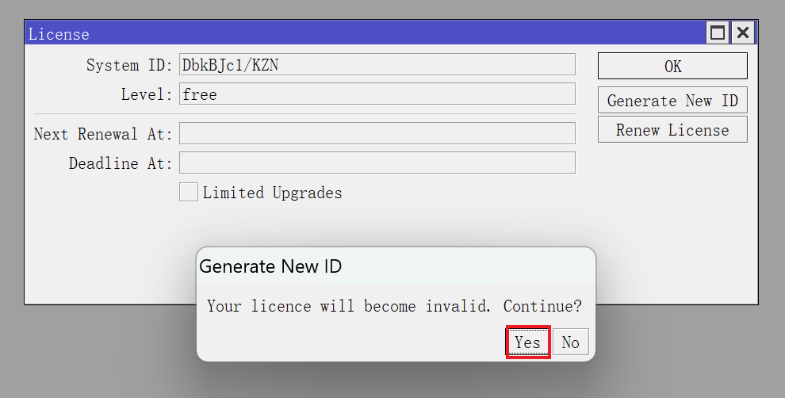

**注意：谨慎使用 `System ID` 更新功能，超过一定次数后该功能将不可用，只能重装系统。**  

更新 `System ID` 后，接下来需要更新 `License` 授权信息。  

点击 `Renew License` ，输入 Mikrotik 的账户和密码，并选择对应的授权级别（演示为 P10 授权），点击 `Start` ： 

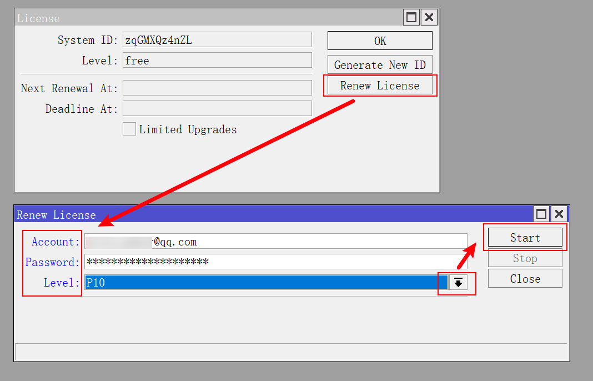

当下方提示显示为 `done` ，则表示 `License` 信息更新成功，`License` 对话框将显示授权的自动校验时间：

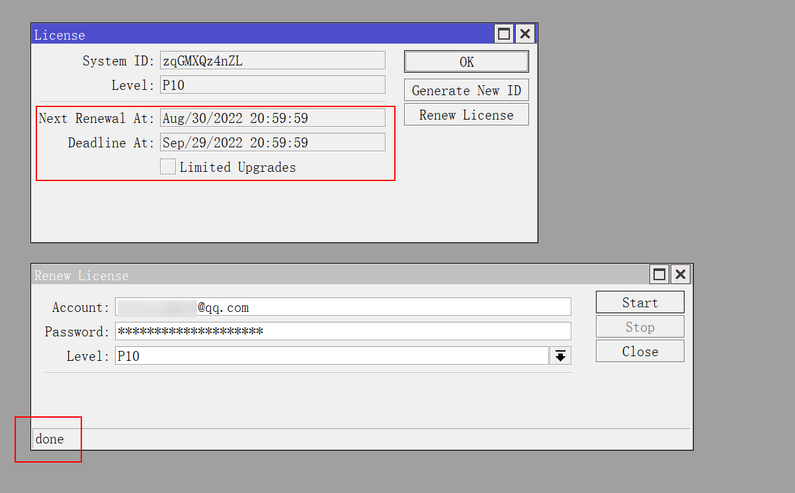

授权更新完成后，回到 `IP` 菜单的子菜单 `DHCP Client` ，将 `DHCP Client` 移除。  

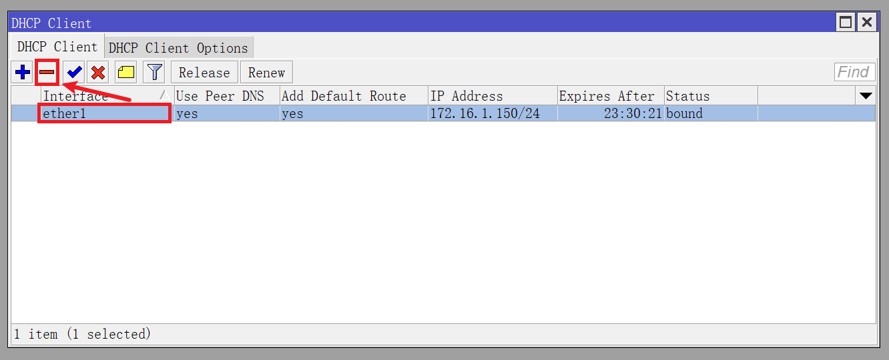

### 1.4.激活系统

再次打开 Mikrotik 的账户中心，在 `All CHR Keys` 页面，会出现刚刚刷新了 `License` 授权信息的 `System ID` 。  

接下来需要更新授权信息，点击右侧 `Upgrade` ：

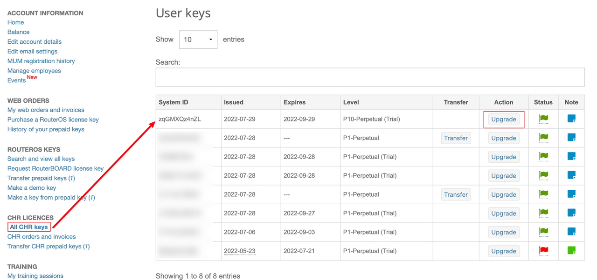

进入授权升级页面，左下角可以看到已付费 `License` 信息。  

根据使用需求，选择授权级别 `Level` （演示中为 P10 授权），并点击 `Upgrade` ：

点击 `Pay using Prepaid key` ，即可完成授权：

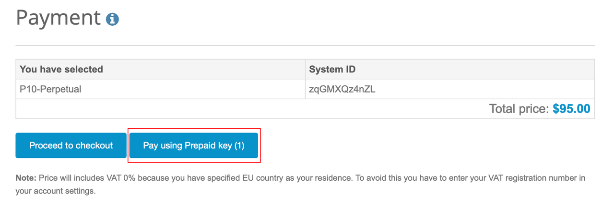

回到 `All CHR keys` 页面，可以看到系统的授权信息已经变更：

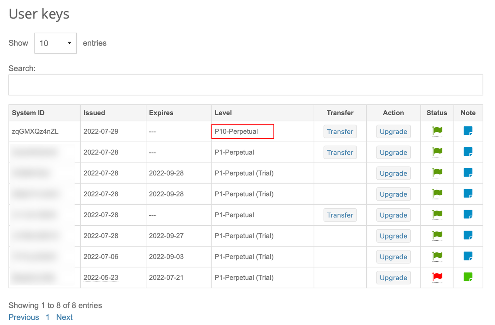

### 1.5.授权转移

由于虚拟机可能被重装，CHR 版本 RouterOS 的授权 `License` 是可以在不同虚拟机之间转移的。  

当重装了 RouterOS，或者通过前面步骤更新了 `System ID` 后，可在 Mikrotik 的账户中心中对授权进行转移。  

在 Mikrotik 账户中心的 `All CHR Keys` 页面，记住新系统的 `System ID` ，然后点击需要转移的授权的 `Transfer` ：

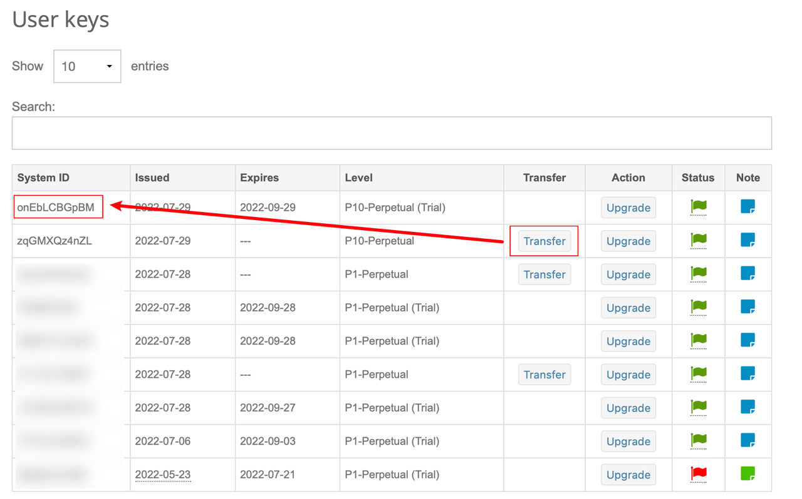

通过右侧下拉列表找到新系统的 `System ID` ，然后点击 `Transfer subscription` ，即可授权转移：  

授权转移完成：  

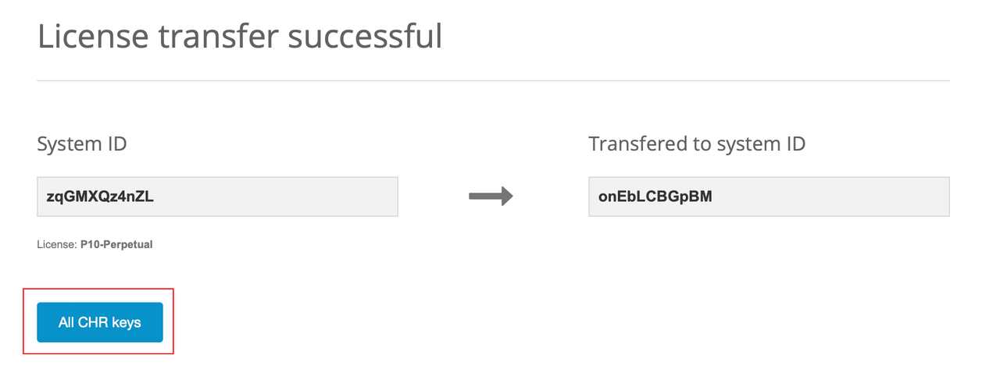

回到 `All CHR keys` 页面，可以看到新系统已被正确授权，而老系统的授权已经失效：

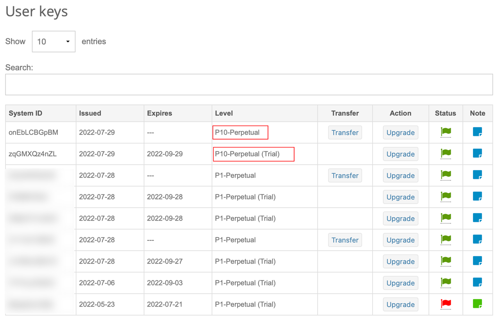

至此，RouterOS 系统激活步骤完成。  

