## 0.前期准备

RouterOS 的配置较为复杂，在设置某些参数时，更推荐使用命令行 `CLI` 来执行配置命令。  

访问 `CLI` 可使用 RouterOS 自带的 `Terminal` ，或第三方终端工具。  

近期使用的终端工具是 [Windows Terminal](https://aka.ms/terminal) ，为 Microsoft 官方终端工具。  


使用第三方终端工具时，打开工具，输入以下命令。  

**说明： `ssh` 命令中使用的参数 `172.16.1.1` 为 RouterOS 内网接口 `LAN` 的 IPv4 地址。**  

```bash
## SSH 连接 RouterOS
$ ssh admin@172.16.1.1

#### 询问是否保存秘钥
yes
```

然后输入 RouterOS `admin` 账户的密码即可登录。  

如果 `admin` 账户为 “只读” 账户，请改用具有 SSH 登录权限的 RouterOS 账户。  

输入密码时不会有输入内容的提示，密码输入完后按键盘 `Enter` 回车键即可。  

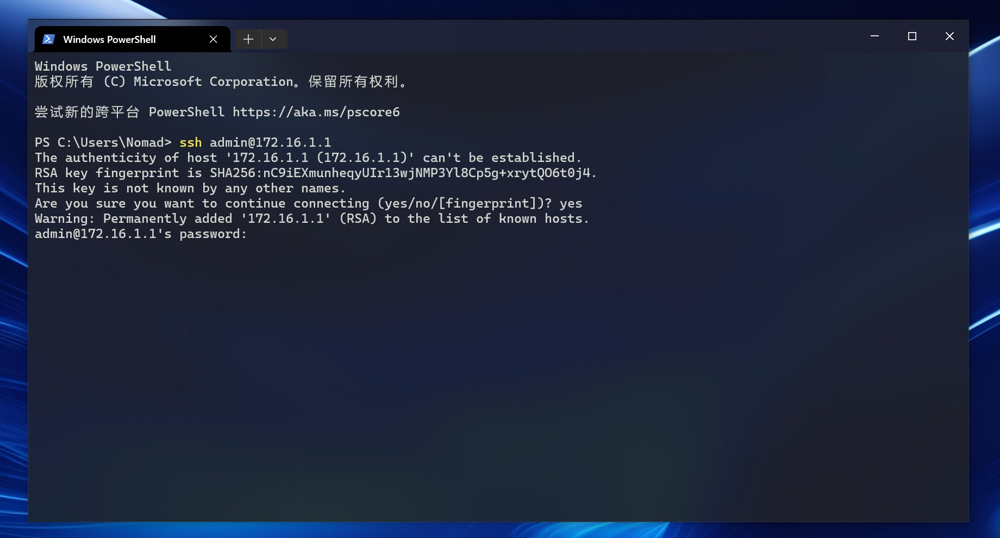

登录成功后如图所示。  

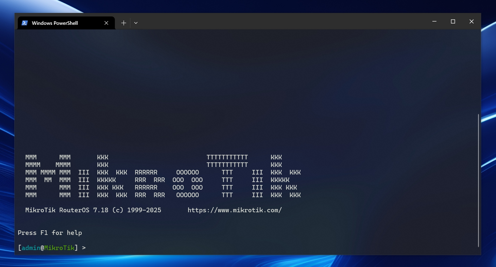

除了第三方终端工具，也可使用 Winbox 自带 `Terminal` ，只需点击左侧导航的 `New Terminal` 。  

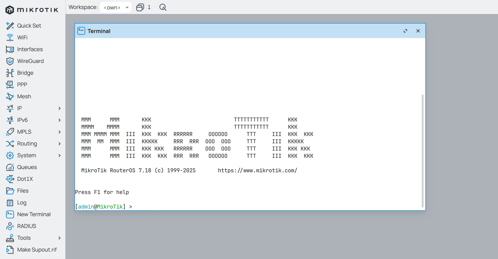

## 1.备注网口

在上一篇文章 [01.正版系统激活](./01.正版系统激活.md) 中，已经使用授权激活了 RouterOS 。  

**说明： 本系列文章适用于 CHR 版本和 MikroTik 原厂硬路由的 RouterOS 配置。**  

对于原厂硬路由，RouterOS 自带的 `Quick Set` 可以减少配置步骤，但自动配置出来的内容较为简单，且仍需调整参数。  

这里推荐 2 款 MikroTik 的硬件设备。  

- 普通家庭上网环境，`500Mbps` 以下带宽，可以使用被誉为弱电箱神器的 `hex` 系列 `E50UG`  

- 如果对网络性能有较高要求，`1000Mbps` 以上带宽，则可以使用 `RB5009UG+S+IN`  


RouterOS 及其相关系统的 IPv4 地址规划，如下图所示。  

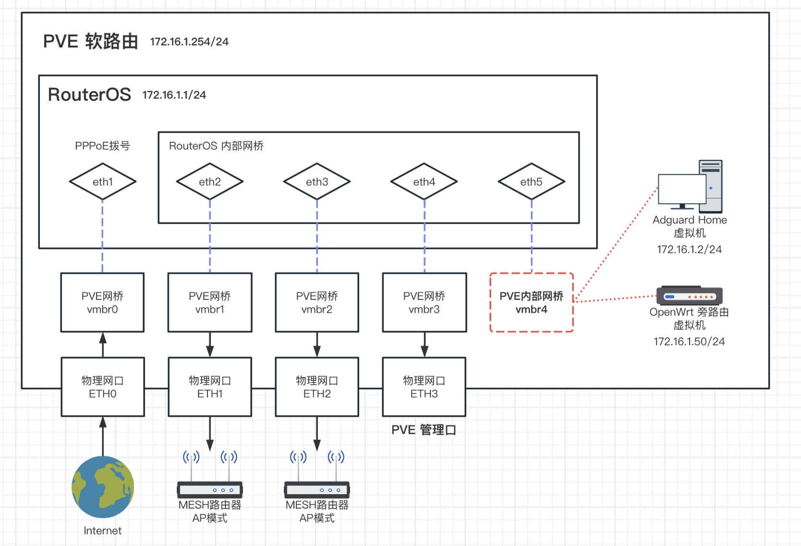  

使用 Winbox 登录 RouterOS ，点击左侧导航的 `Interfaces` 。  


检查网口，此处显示的网口数量及顺序应与 RouterOS 虚拟机中设置的保持一致。  

鼠标依次 **双击** 每个网口，进入网口配置界面，并参考表格中的内容，对每个网口进行备注。  

**注意：强烈不推荐直接修改网口名称 `Name` 。**  

|网口名称|PVE网桥编号|物理网口|作用|备注|
|--|--|--|--|--|
|ether1|vmbr0|ETH0|外网接口|`defconf: local WAN`|
|ether2|vmbr1|ETH1|内网接口|`defconf: local LAN`|
|ether3|vmbr2|ETH2|内网接口|`defconf: local LAN`|
|ether4|vmbr3|ETH3|内网接口|`defconf: local LAN`|
|ether5|vmbr4|无|内网接口|`defconf: local LAN for VMs`|
|lo|无|无|环回接口|`defconf: local Loopback`|

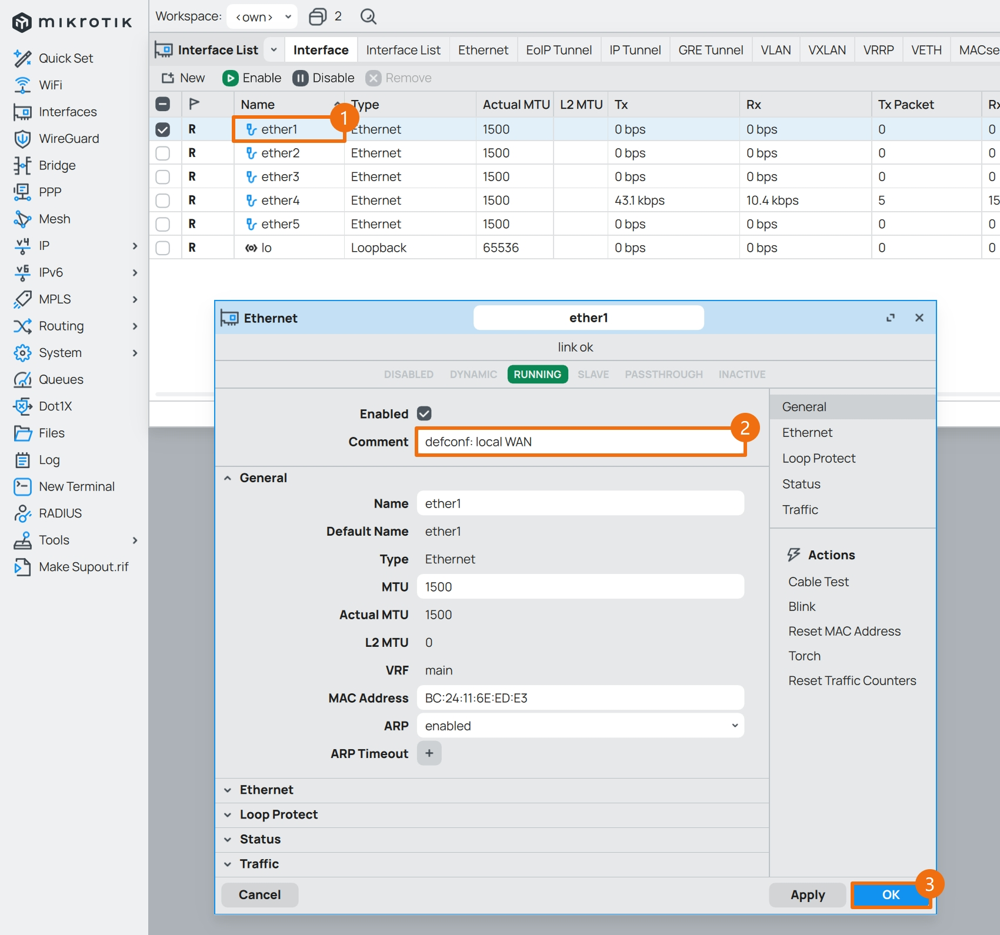

备注完成后如图所示。  

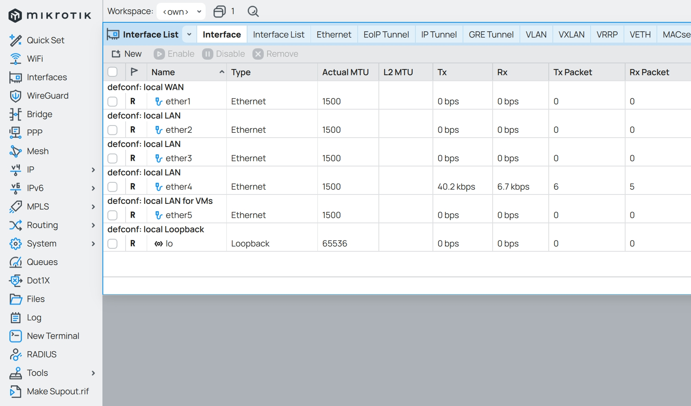

## 2.设置网桥

网桥将作为 RouterOS 的内网接口使用，若 RouterOS 只有 2 个网口，则无需设置网桥。  

### 2.1.创建网桥

点击左侧导航的 `Bridge`，点击 ` + ` 按钮。  

|参数|值|说明|
|--|--|--|
|Name|`bridge1`|网桥名称，可自由定义，但建议保持 `bridge1` ，后续配置中会用到该名称|
|Comment|`defconf: local Bridge`|备注信息|


网桥创建完成后，给该网桥添加成员网口，切换到 `Ports` 选项卡，点击 ` + ` 按钮。  

从 `Interface` 下拉列表中选中需要添加的网口，`Bridge` 下拉列表中选中刚创建的网桥 `bridge1` 。  

点击 `OK` ，即可把网口添加为网桥成员。  

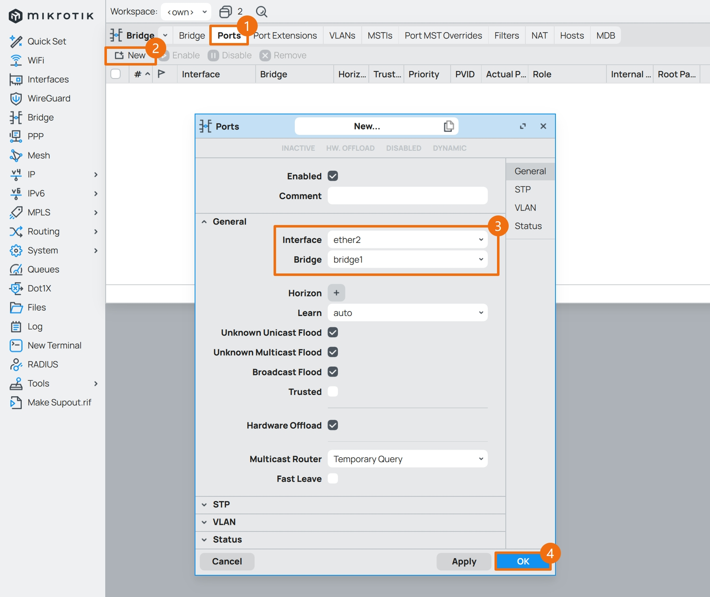

重复该操作，将所有 LAN 口都添加入该网桥，完成后如图所示。  

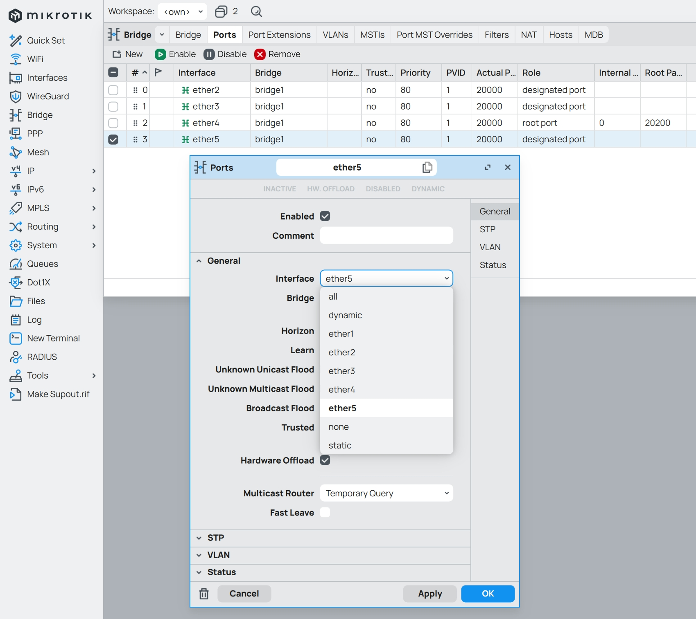

当然，除了使用 Winbox 来添加网桥以及成员接口的方法外，还可以使用 `CLI` 来创建网桥并添加成员接口，参考如下。  

```bash
/interface bridge
add name=bridge1 comment="defconf: local Bridge" auto-mac=yes

/interface bridge port
add bridge=bridge1 interface=ether2
add bridge=bridge1 interface=ether3
add bridge=bridge1 interface=ether4
add bridge=bridge1 interface=ether5
```

### 2.2.网桥 IPv4 地址

点击左侧导航 `IP` 菜单的子菜单 `Addresses` ，点击 ` + ` 按钮。  

|参数|值|
|--|--|
|Address|`172.16.1.1/24`|
|Network|`172.16.1.0`|
|Interface|`bridge1`|
|Comment|`defconf: local LAN IPv4`|


## 3. RouterOS 拨号

RouterOS 联网（访问外网）方式有多种，例如 PPPoE 、自动 DHCP 、静态 DHCP 等。  

RouterOS 进行 PPPoE 拨号前，请确认 `光猫` 处于 `桥接` 模式，否则请根据实际情况选择合适的联网模式。  

检查 `IP` 菜单的子菜单 `DHCP Client` ，并移除系统在 `ether1` 接口上自动创建的 DHCP 客户端。  


### 3.1.创建 PPPoE 客户端

点击左侧导航的 `PPP` ，点击 ` + ` 按钮，选择 `PPPoE Client` 。  

|参数|值|
|--|--|
|Name|`pppoe-out1`|
|Interfaces|`ether1`|


切换到 `Dial Out` 选项卡，填写 PPPoE 拨号需要的用户名和密码，并填写备注。  

|参数|值|说明|
|--|--|--|
|User|拨号账户|PPPoE 拨号账户|
|Password|拨号密码|PPPoE 拨号密码|
|Use Peer DNS|**不勾选**|使用运营商 DNS 服务器|
|Add Default Route|**必须勾选**|添加默认路由|
|Comment|`defconf: local PPPoE Client`|备注信息|

无需勾选 `Use Peer DNS` 选项，后续会单独设置 RouterOS 所使用的 `DNS` 服务器。  


此时回到 `Interfaces` 页面，暂时将 PPPoE 拨号禁用。  

因为现在系统暂未设置防火墙，为了避免外网某些流量意外访问到 RouterOS，安全起见，先禁用 PPPoE 拨号。  

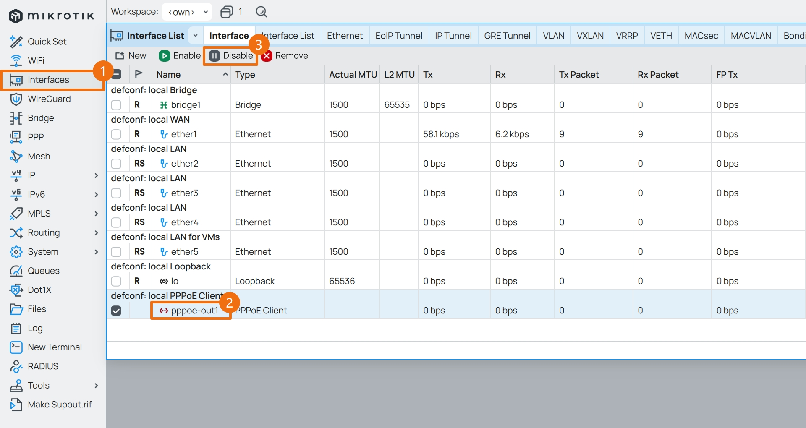

### 3.2.设置光猫访问

RouterOS 拨号时，参考之前的网络规划：  

- 光猫地址：`192.168.1.1/24`
- RouterOS 地址：`172.16.1.1/24`

在希望能通过 RouterOS 访问光猫时，需要给 `ether1` 分配一个和光猫同网段的地址 `192.168.1.2/24` 。  

|参数|值|
|--|--|
|Address|`192.168.1.2/24`|
|Network|`192.168.1.0`|
|Interface|`ether1`|
|Comment|`onuconf: link IPv4 for ONU`|

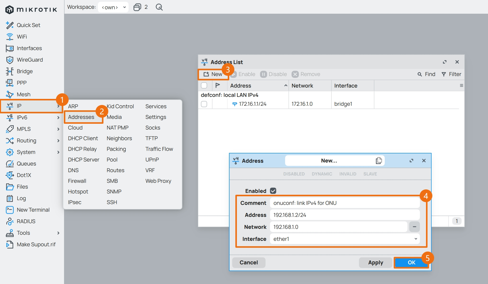

接口地址设置完成后如图所示。  

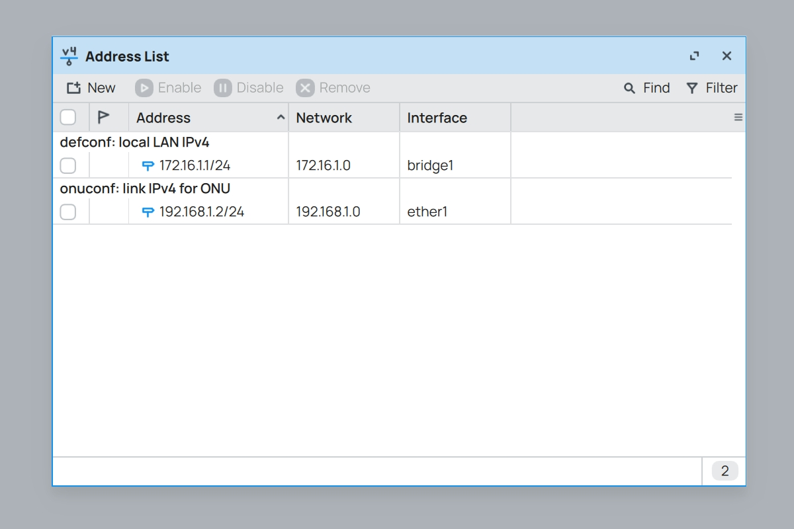

### 3.3.定义 PPPoE 接口组

接口组可以简化防火墙的配置，并且在后续使用 RouterOS 的过程中如果对接口进行了修改而不必更新防火墙条目。  

当前已经设置好的接口有 `pppoe-out1` 、`bridge1` 和 `ether1` 。  

分别代表连接互联网的接口 `WAN`、内网接口 `LAN` 以及访问光猫接口 `ONU` 。  

RouterOS 拨号时，将以下命令一次性全部粘贴到 `CLI` 中执行即可。  

如果不便复制代码，请查阅文件 [ros_define_interfaces.pppoe.conf](./src/interfaces/ros_define_interfaces.pppoe.conf) 。  

```bash
/interface list
add name=WAN comment="defconf: WAN list"
add name=LAN comment="defconf: LAN list"
add name=ONU comment="onuconf: ONU list"

/interface list member
add list=WAN comment="defconf: WAN member" interface=pppoe-out1
add list=LAN comment="defconf: LAN member" interface=bridge1
add list=ONU comment="onuconf: ONU member" interface=ether1
```

在复制粘贴命令到 `CLI` 中并执行时，有时候会出现 **光标** 停留在全部命令 **“最后一行”** 的情况。  

这种情况下，命令的 **“最后一行”** 其实 **并未执行** 。  

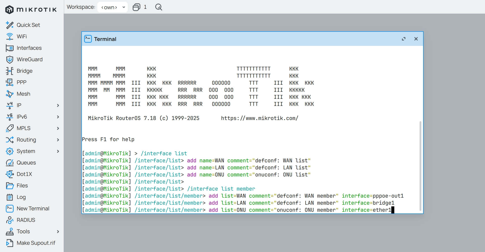

此时需要手动按下 `Enter` 键（多按几次也可以），以保证命令执行完整 （ **该方法后文部分将不再赘述** ）。  

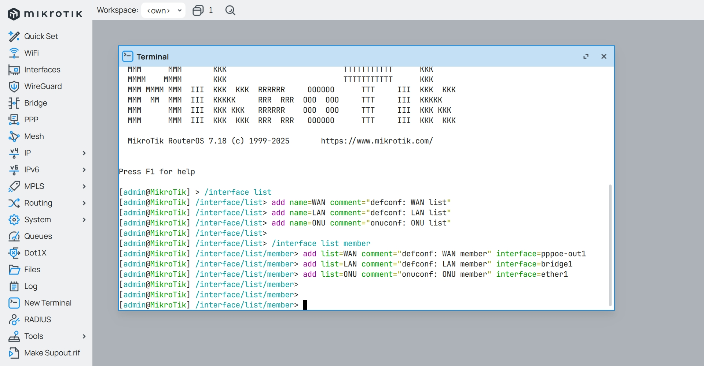

命令执行完毕后，打开 Winbox 并点击左侧导航的 `Interfaces` ，切换到 `Interface List` 选项卡，查看接口组内容。  

其中 `pppoe-out1` 显示为斜体，这是因为该接口此时处于 “禁用” 状态，无需担心。  

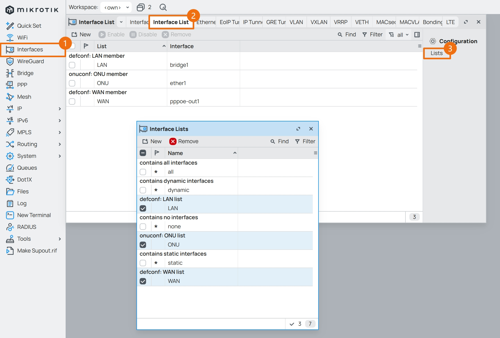

## 4.光猫拨号

**注意：如果已经使用 RouterOS PPPoE 拨号联网，说明光猫处于 `桥接` 模式，应跳过本段内容。**  

### 4.1.创建 DHCPv4 Client

光猫拨号时，RouterOS 应启用 `DHCPv4 Client` ，`ether1` 的地址将通过光猫的 DHCPv4 来分配。  

点击左侧导航 `IP` 菜单的子菜单 `DHCP Client` ，点击 ` + ` 按钮。  

|参数|值|说明|
|--|--|--|
|Interface|`ether1`|DHCP 接口|
|Use Peer DNS|取消勾选|使用运营商 DNS 服务器|
|Use Peer NTP|取消勾选|使用运营商 NTP 服务器|
|Add Default Route|**必须为 yes**|添加默认路由|
|Comment|`defconf: DHCPv4 for WAN`|备注信息|


创建完成后，如果获取到了 IPv4 地址则表示设置正确，如图所示。  

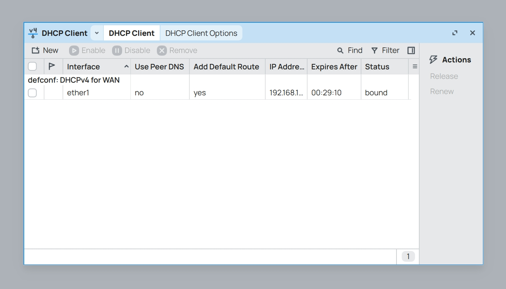

### 4.2.定义 DHCPv4 接口组

光猫拨号时，`ether1` 为 `WAN` ，将以下命令一次性全部粘贴到 `CLI` 中执行即可。  

如果不便复制代码，请查阅文件 [ros_define_interfaces.dhcp.conf](./src/interfaces/ros_define_interfaces.dhcp.conf) 。  

```bash
/interface list
add name=WAN comment="defconf: WAN list"
add name=LAN comment="defconf: LAN list"

/interface list member
add list=WAN comment="defconf: WAN member" interface=ether1
add list=LAN comment="defconf: LAN member" interface=bridge1
```

至此，RouterOS 设置网络接口步骤完成。  

