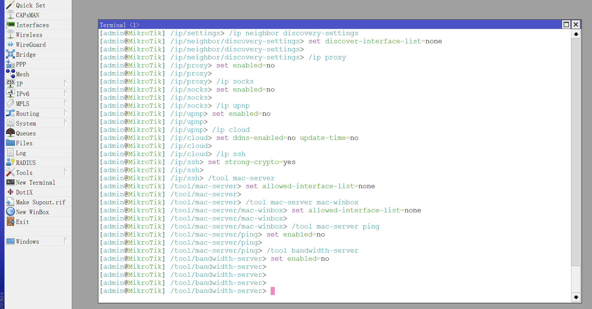
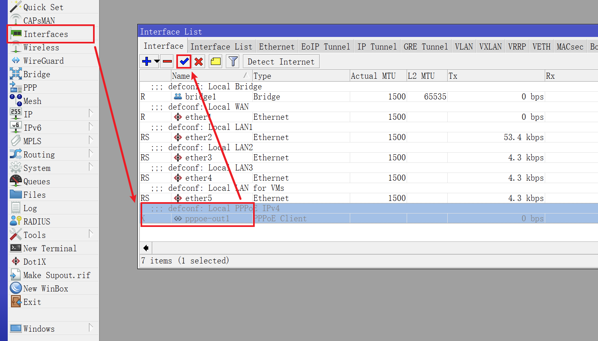
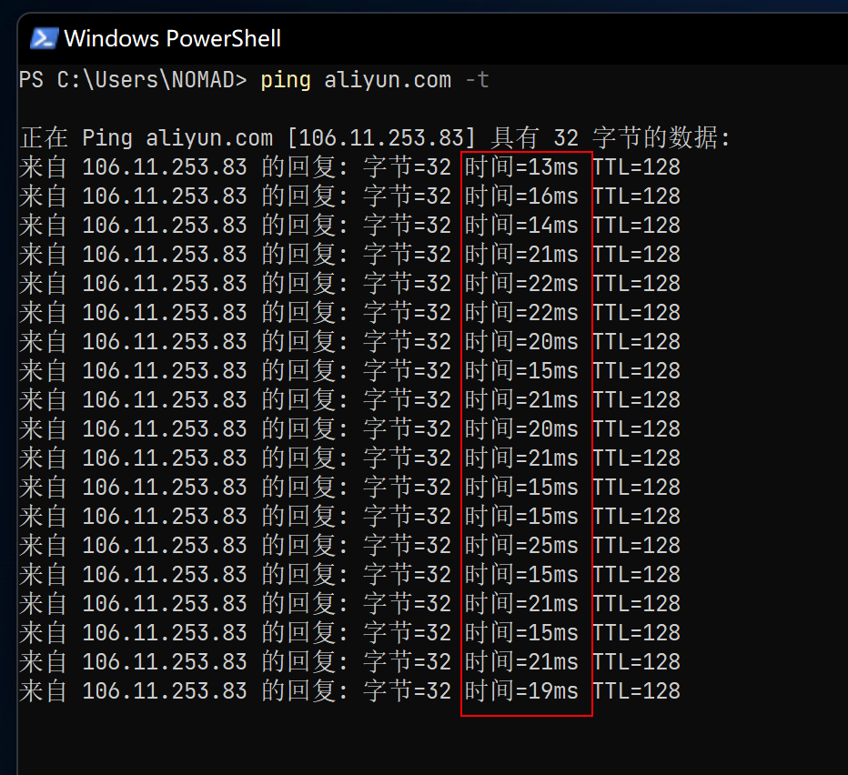
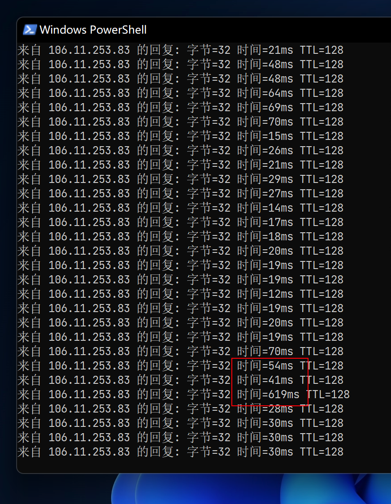
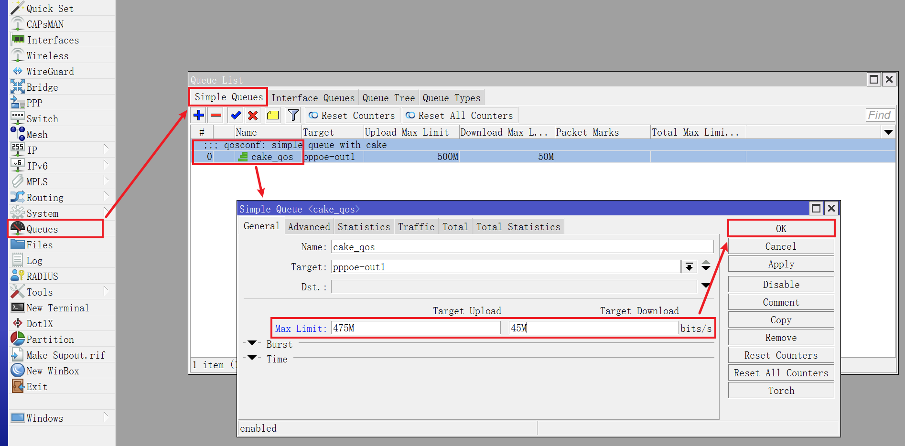
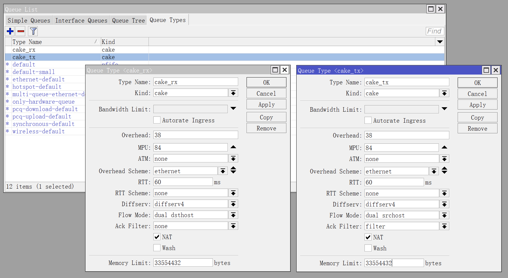
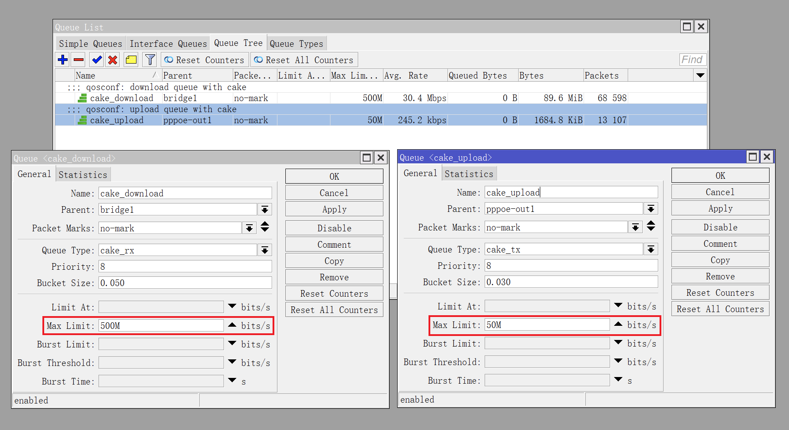
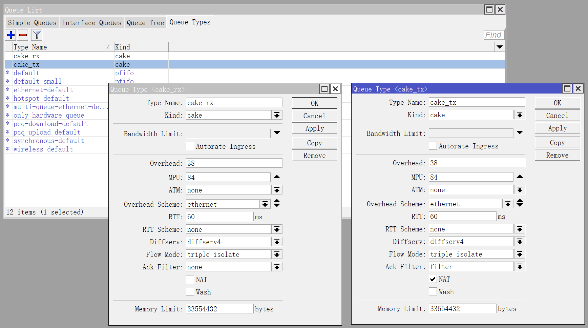

## 0.前景提要

在上一篇文章《[01.定义网络接口和基础配置](./01.定义网络接口和基础配置.md)》中，我们已经配置好了 RouterOS 的网络接口、DHCPv4、DNS 等内容。  

此时，连接上 RouterOS 的设备可以正常获取到 IPv4 地址，但还不能正常访问外网。  

因为此时的 RouterOS 不仅关闭了 PPPoE 连接，而且还未设置防火墙。  

## 1.工具准备

防火墙和流量整形的配置较为复杂，因此更推荐使用命令行（ CLI ）来执行配置命令。

访问 CLI 可使用 RouterOS 自带的 `Terminal` ，或第三方 SSH 工具。

近期使用的 SSH 工具是 [Tabby](https://github.com/Eugeny/tabby)，一个基于 Electron 开发的开源跨平台终端工具。  


在无法下载该软件时，Windows11 自带的工具 `Windows 终端` 也能一用。  

使用第三方 SSH 工具时，打开工具，输入以下命令：  

```bash
## SSH 连接 RouterOS
ssh admin@172.16.1.1

## 询问是否保存秘钥
yes
```

然后输入 RouterOS `admin` 账户的密码即可登录。  


如果 `admin` 账户为 “只读” 账户，请改用具有 SSH 登录权限的 RouterOS 账户。  

输入密码时不会有输入内容的提示，密码输入完后按键盘 `Enter` 回车键即可。  

登录成功后如图所示：  


使用 RouterOS 自带 `Terminal` ，只需点击 Winbox 左侧导航的 `New Terminal` ：  


## 2.定义接口组

在配置防火墙之前，需要定义接口组。接口组可以简化防火墙的配置，并且在后续使用 RouterOS 的过程中如果对接口进行了修改而不必更新防火墙条目。  

在之前的文章中已经设置好的接口有 `pppoe-out1` 、`bridge1` 和 `ether1` ，分别代表连接互联网的接口 `WAN`、内网接口 `LAN` 以及访问光猫接口 `ONU` 。  

### 2.1.RouterOS 拨号时

对于 **RouterOS 拨号** 场景，将以下命令一次性全部粘贴到终端工具中执行即可：

```bash
/interface list
add name=WAN comment="defconf: Connect To Global"
add name=LAN comment="defconf: Local Bridge"
add name=ONU comment="onuconf: Access To ONU"

/interface list member
add interface=pppoe-out1 list=WAN comment="defconf: Connect To Global"
add interface=bridge1 list=LAN comment="defconf: Local Bridge"
add interface=ether1 list=ONU comment="onuconf: Access To ONU"
```

如果这段代码不好复制，请查阅文件 [ros_define_interfaces.conf](./src/interfaces/ros_define_interfaces.conf) 进行复制。  

在复制粘贴命令到终端工具并执行时，有时候会出现 **光标** 停留在全部命令 **“最后一行”** 的情况。  

这种情况下，命令的 **“最后一行”** 其实 **并未执行** 。  


此时需要手动按下 `Enter` 键（多按几次也可以），以保证命令执行完整 （ **该方法后文部分将不再赘述** ）。  


命令执行完毕后，打开 Winbox 并点击左侧导航的 `Interfaces` ，切换到 `Interface List` 选项卡，查看接口组内容。  

其中 `pppoe-out1` 显示为斜体，这是因为该接口此时处于 “禁用” 状态，无需担心。  


### 2.2.光猫拨号时

对于 **光猫拨号** 场景，则 `ether1` 为 `WAN` ，则改用以下命令：

```bash
/interface list
add name=WAN comment="defconf: Connect To Global"
add name=LAN comment="defconf: Local Bridge"

/interface list member
add interface=ether1 list=WAN comment="defconf: Connect To Global"
add interface=bridge1 list=LAN comment="defconf: Local Bridge"
```

## 3.配置防火墙

防火墙配置内容包括 `address-list` 、`filter` 、`nat` 、`mangle` 、`raw` 以及一些和防火墙相关的系统参数。  

防火墙配置命令是基于 RouterOS 官方 Wiki 中有关 IPv4 [高级防火墙设置](https://help.mikrotik.com/docs/display/ROS/Building+Advanced+Firewall) 经过少许修改而来。  

主要修改了 `DDoS` 、 `RAW ICMP` 、 `DNS Redirect` 等规则，但尽可能的保证了和官方文档的一致性。  

同样是复制防火墙配置命令，一次性全部粘贴到 CLI 中执行，即可完成 **“一键配置”** 。  

**需要注意的是，防火墙配置命令中的部分 IPv4 地址，需要根据实际情况进行调整。**   

- 光猫的 IPv4 地址 `192.168.100.1`
- 如果使用光猫拨号，则无需使用与光猫相关的防火墙条目
  - 每条防火墙均有备注 `comment` 信息，去掉包含 `onuconf` 的相关防火墙条目
- 内网使用的 IPv4 地址段 `172.16.1.0/24`
  - RouterOS 的 IPv4 地址 `172.16.1.1`
- 自建 DNS 的 IPv4 地址 `172.16.1.2` 、 `172.16.1.3`
  - （相关文章将记录使用 `Adguard Home` 作为内网 DNS 服务器的过程）

需要分别修改 `address-list` 表中的 `onu_ipv4` 、 `local_subnet_ipv4` 、 `local_dns_ipv4` 这几个地址参数。  

由于防火墙的配置命令很长，因此请查阅文件 [ros_firewall_ipv4.conf](./src/firewall/ros_firewall_ipv4.conf) 进行复制。  

  

再次回到 Winbox，点击左侧导航 `IP` 菜单的子菜单 `Firewall` 并查看防火墙各个选项卡中内容：

  

确认防火墙条目与命令中的条目一致后，便可在 `Interfaces` 中启用 PPPoE 拨号。  

启用后， PPPoE 拨号前面的状态显示为 ` R ` ，则表示 PPPoE 已连接。  

此时打开电脑浏览器，尝试对常用的网站进行访问，检查网络是否可用。  



## 4.配置流量整形

### 4.1.取舍 Fasttrack

可能细心的小伙伴已经察觉到，在防火墙中有个非常重要功能没有打开，那就是 RouterOS 的 `Fasttrack` 功能。


这个功能的作用是跟踪已建立的连接，并让这些流量走 **“快速通道”** 来降低设备 CPU 使用率。  

但 RouterOS 在配置流量整形时，如果使用了 `Simple Queues` 功能，且 `Fasttrack` 为启用状态时，会使 `Simple Queues` 队列功能失效。  

对于如何取舍 `Fasttrack` 和 `Simple Queues` ，我提供这么几个思路：  

- 如果使用的是 CPU 较弱的硬路由（比如 `RB750Gr3` ），请选择开启 `Fasttrack`
- 如果路由器 CPU 资源已达上限，在测速时仍无法跑满带宽，请选择开启 `Fasttrack`
- 如果路由器在配置了流量整形后，在测速时反而无法跑满带宽，请选择开启 `Fasttrack`

根据实际测试，QoS 的处理性能与 RouterOS 网卡的 `Multiqueue` 参数（参阅：[00.PVE下RouterOS安装](./00.PVE下RouterOS安装.md#17网络)）以及 CPU 的单核性能有一定关系。   

当 **未设置** 网卡 `Multiqueue` 参数时，`Simple Queues` 在带宽测速时只会使用 **4** 个 CPU 核心中的 **1** 个核心，`Queue Tree` 情况类似。  

具体原因与 `Simple Queues` 和 `Queue Tree` 的设计逻辑有关，也与其设置方法有关，这里不展开说明。

因此，在未设置网卡 `Multiqueue` 且使用了 `Simple Queues` 或  `Queue Tree` 但无法跑满 QoS 限速的情况下，说明当前设备的单核性能不足，建议开启 RouterOS 网卡的 `Multiqueue` （虽然开启 `Multiqueue` 后会略微降低 QoS 效果），再酌情设置 `Fasttrack` 、 `Simple Queues` 或 `Queue Tree` ，将性能影响降至最低。  

制约因素总结如下：  
- `Multiqueue` 可让流量更加“均衡”的负载在多个 CPU 核心上，但会略微降低 QoS 效果。
- `Simple Queues` 和 `Queue Tree` 均工作在单个 CPU 核心上，CPU 的单核性能将制约 QoS 能处理的最大带宽，需要与 `Multiqueue` 配合来均衡 CPU 负载。
- `Fasttrack` 可有效降低 CPU 的工作负载，但会让 `Simple Queues` 失效，只能与 `Interface` 上的 `Queue Tree` 协同工作。
- `CAKE` 算法相对而言比 `Fq_CoDel` 算法能更好的控制缓冲区肿胀，但 `CAKE` 算法更消耗 CPU 资源。

### 4.2.确定带宽上限

在执行配置命令之前，有一个十分重要的指标需要依托真实网络环境实测得出，那就是当前外网的 **实际带宽** 。  

目前国内运营商给用户的带宽一般会存在 20% 左右的余量，即如果您的宽带签约值为 `500Mbps` ，那么实际测速可能到达 `600Mbps` 左右，而且家用上下行的带宽并不对等， `500Mbps` 的下行带宽运营商可能只会给 `30~50Mbps` 的上行带宽。  

而我们常遇到，当下行带宽跑满时，比如使用下载程序下载学习资料，此时其他网络用户在看在线视频或者打网络游戏时就会遇到延迟上升，甚至卡顿，这个现象在上行带宽跑满时尤为明显。  

简单来说，这是因为内网设备对带宽的大量占用，触发了运营商的 QoS ，也就是运营商的限速，再加上数据包拥塞等一系列原因导致。  

而设置 RouterOS 流量整形的目的就是尽可能的不触发运营商的 QoS。设置思路也很简单，首先在 RouterOS 中设置一个合理的带宽用量上限，然后通过 RouterOS 的流量整形算法，根据不同内网设备的流量需求，均衡合理的动态分配内网带宽，以保证整体内网的网络服务质量，也就是内网的 QoS。  

参考 OpenWrt 官方文档《[SQM (Smart Queue Management)](https://openwrt.org/docs/guide-user/network/traffic-shaping/sqm)》 和《[SQM Details](https://openwrt.org/docs/guide-user/network/traffic-shaping/sqm-details)》，里面详细介绍了如何微调参数。我这里结合实际情况，将带宽部分总结如下：


一句话说明：签约带宽比物理接口速率高，则带宽上限取物理接口速率；签约带宽比物理接口速率低，且完全可以跑出超过签约带宽的实际速率，则带宽上限取实际速率的平均值。  

**注意：**  
**带宽测速一定要使用网线连接路由器，并且断开其他连接路由器的用网设备，以保证带宽测速的准确性。**  

如果实际带宽速率比签约带宽要低，建议检查光猫性能、光衰情况、网线质量、软路由的 CPU 分配，如果这些都没问题，那就是运营商问题，可以打电话给运营商并要求上门维修。  

**当然，为了省事，也可以直接取签约带宽的速率值为带宽上限值。**  

在拿到带宽上限后，分别乘以 `95%` 、 `90%` 、 `85%` ，得到包含带宽上限在内的共计四个档位的速率，留下备用，比如：  

下行带宽上限为 `500Mbps`，得到 `475Mbps` 、 `450Mbps` 、 `425Mbps` 共四个档位的速率。  

上行带宽上限为 `50Mbps`，得到 `48Mbps` 、 `45Mbps` 、 `43Mbps` 共四个档位的速率。  

### 4.3.配置 Simple Queues

RouterOS 的流量整形设置中，使用了在 Linux 下比较流行的 `CAKE` 算法。  

经过测试，`CAKE` 算法相比经典的 `Fq_CoDel` 算法能更好的控制缓冲区肿胀（Bufferbloat）。  

在使用流量整形命令时，请根据网络环境自行调整相关参数：
- 带宽 `max-limit=下行带宽M/上行带宽M` 参数
- 如果是 **光猫拨号** 环境，还需额外调整以下参数
    - 外网接口 `target=外网接口` 参数
    - 网络开销方案 `cake-overhead-scheme=开销方案` 参数

**注意：**  
**配置流量整形和调整参数时，建议使用网线连接路由器，并且断开其他连接路由器的用网设备，以保证结果的可靠性。**  

回到之前的终端工具，保留登录了 RouterOS 的终端窗口，新开启一个终端窗口，并使用如下命令：  

```bash
## Linux 和 macOS 系统下
ping aliyun.com

## Windows 系统 PowerShell 下
ping aliyun.com -t
```

观察 `ping` 命令的响应时间，粗略估计一个时延水平，但 **不要关闭该命令** ：



然后，将之前测得的上行、下行带宽第一档位速率（也就是上下行带宽上限速率值，演示值为 `500Mbps/50Mbps` ）直接带入 `max-limit=下行带宽M/上行带宽M` 命令部分进行配置，命令如下：

```bash
/queue type
add cake-diffserv=diffserv4 cake-flowmode=dual-dsthost cake-memlimit=32.0MiB cake-rtt=60ms cake-overhead-scheme=ethernet cake-nat=yes kind=cake name=cake_rx
add cake-diffserv=diffserv4 cake-flowmode=dual-srchost cake-memlimit=32.0MiB cake-rtt=60ms cake-overhead-scheme=ethernet cake-nat=yes kind=cake cake-ack-filter=filter name=cake_tx

/queue simple
add comment="qosconf: simple queue with cake" bucket-size=0.05/0.03 max-limit=500M/50M name=cake_qos queue=cake_rx/cake_tx target=pppoe-out1
```

如果这段代码不好复制，请查阅文件 [ros_qos_cake.conf](./src/qos/ros_qos_cake.conf) 进行复制。  

执行完成后，用带宽测速工具再次测速，观察测速工具将上、下行带宽跑满时， `ping` 命令的时延变化：



如果在下行（上行）带宽跑满的时候，出现了如图所示的高时延，并在带宽跑满时持续存在，说明当前下行（上行）带宽上限档位过高，需要在 Winbox 中将 `Simple Queue` 的带宽速率值下调档位，直到 `ping` 命令的时延不会因为带宽测速而受到影响为止。  



因为使用的是 `pppoe-out1` 接口，所以此处的上下行带宽与 Winbox 中的上下行英文相反。  

 

### 4.4.配置 Queue Tree

通过研究官方文档，发现还有一种流量整形的配置方法可以与 `Fasttrack` 功能搭配使用，那就是配置 RouterOS 的“队列树” `Queue Tree` 。  

根据官方文档有关 [Queues](https://help.mikrotik.com/docs/display/ROS/Queues) 的介绍：  

> If you are using the default configuration, be sure the FastTrack rule is disabled for this particular traffic, otherwise, it will bypass Simple Queues and they will not work.  

> The queue tree creates only a one-directional queue in one of the HTBs. It is also the only way how to add a queue on a separate interface. This way it is possible to ease mangle configuration - you don't need separate marks for download and upload - only the upload will get to the Public interface and only the download will get to a Private interface. The main difference from Simple Queues is that the Queue tree is not ordered - all traffic passes it together.  

根据实际测试，当 `Fasttrack` 开启时，如果 `Queue Tree` 应用于网络接口，比如 `pppoe-out1` 或 `bridge1` ，队列树仍然可以生效。  

回到 Winbox，点击左侧导航 `IP` 菜单的子菜单 `Firewall` ，将 `Fasttrack` 启用：  


此时防火墙中会出现用于显示 `Fasttrack` 数据的条目：  


然后，将之前测得的上行、下行带宽第一档位速率（也就是上下行带宽上限速率值，演示值为 `500Mbps/50Mbps` ）直接带入 `max-limit=下行带宽M(上行带宽M)` 命令部分进行配置，命令如下：

```bash
/queue type
add cake-diffserv=diffserv4 cake-flowmode=triple-isolate cake-memlimit=32.0MiB cake-rtt=60ms cake-overhead-scheme=ethernet cake-nat=no kind=cake name=cake_rx
add cake-diffserv=diffserv4 cake-flowmode=triple-isolate cake-memlimit=32.0MiB cake-rtt=60ms cake-overhead-scheme=ethernet cake-nat=yes kind=cake cake-ack-filter=filter name=cake_tx

/queue tree
add comment="qosconf: download queue with cake" bucket-size=0.05 max-limit=500M name=cake_download packet-mark=no-mark parent=bridge1 queue=cake_rx
add comment="qosconf: upload queue with cake" bucket-size=0.03 max-limit=50M name=cake_upload packet-mark=no-mark parent=pppoe-out1 queue=cake_tx
```

如果这段代码不好复制，请查阅文件 [ros_qos_cake_fasttrack.conf](./src/qos/ros_qos_cake_fasttrack.conf) 进行复制。  

**注意：`CAKE` 的相关参数与 `Simple Queues` 中的略有不同。**   

执行完成后，用带宽测速工具再次测速，同样观察测速工具将上、下行带宽跑满时， `ping` 命令的时延变化。  

如果出现了高时延，则需要将对应的带宽速率值下调档位，直到 `ping` 命令的时延不会因为带宽测速而受到影响为止。  

  

以下为 `CAKE` 在 `Queue Tree` 中使用的参数，方便与之前的对比：  



最后留下一位高手使用 `Fq_CoDel` 算法配置 `Queue Tree` 的方法，以及我在 RB750Gr3 中的配置方法，供大家参考。  

高手原版配置命令：  

```bash
/queue type
add fq-codel-limit=1000 fq-codel-quantum=300 fq-codel-target=12ms kind=fq-codel name=fq-codel

/queue tree
add bucket-size=0.01 max-limit=500M name=download packet-mark=no-mark parent=bridge1 queue=fq-codel
add bucket-size=0.01 max-limit=50M name=upload packet-mark=no-mark parent=ether1 queue=fq-codel
```

硬路由 RB750Gr3 配置命令：

```bash
/queue type
add fq-codel-ecn=yes fq-codel-interval=60ms fq-codel-limit=1000 fq-codel-quantum=500 fq-codel-memlimit=16.0MiB kind=fq-codel name=fq_codel_rx
add fq-codel-ecn=no fq-codel-interval=60ms fq-codel-limit=800 fq-codel-quantum=300 fq-codel-memlimit=16.0MiB kind=fq-codel name=fq_codel_tx

/queue tree
add comment="qosconf: download queue with fq-codel" bucket-size=0.05 max-limit=500M name=fq_codel_download packet-mark=no-mark parent=bridge1 queue=fq_codel_rx
add comment="qosconf: upload queue with fq-codel" bucket-size=0.03 max-limit=50M name=fq_codel_upload packet-mark=no-mark parent=pppoe-out1 queue=fq_codel_tx
```

感兴趣的小伙伴可以在此基础上进一步调试。  

根据官方文档的说明，虽然在 `Fasttrack` 关闭的情况下支持将 `Simple Queues` 和 `Queue Tree` 同时使用，以达到“双重流控”的效果，但本文中的配置方法示例是不支持同时使用两种流控的，如果你有强大的硬件支持“双重流控”，欢迎分享你的 QoS 配置方案。

至此，RouterOS 基本设置已经完成，后续将对 RouterOS 的系统服务、系统账户等内容进行调整。  
