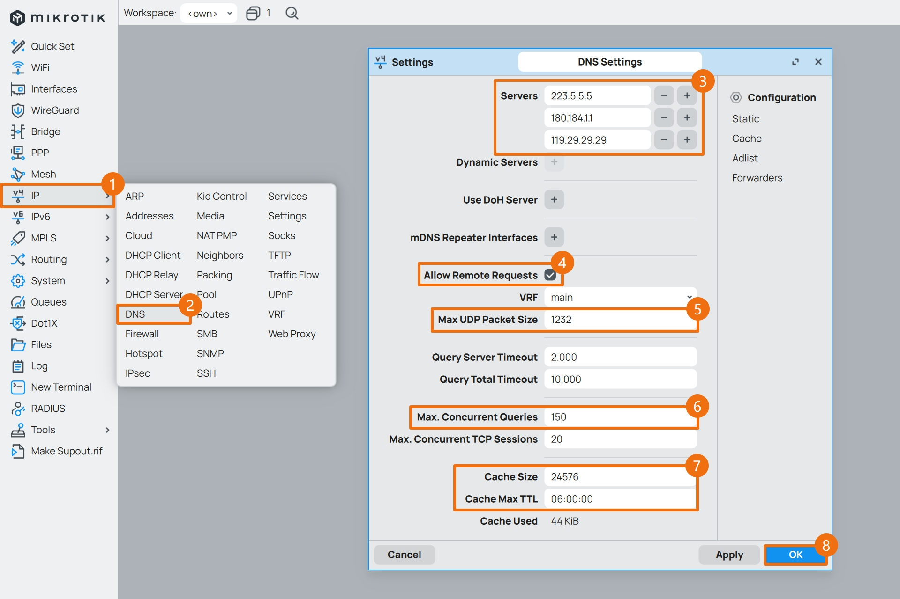
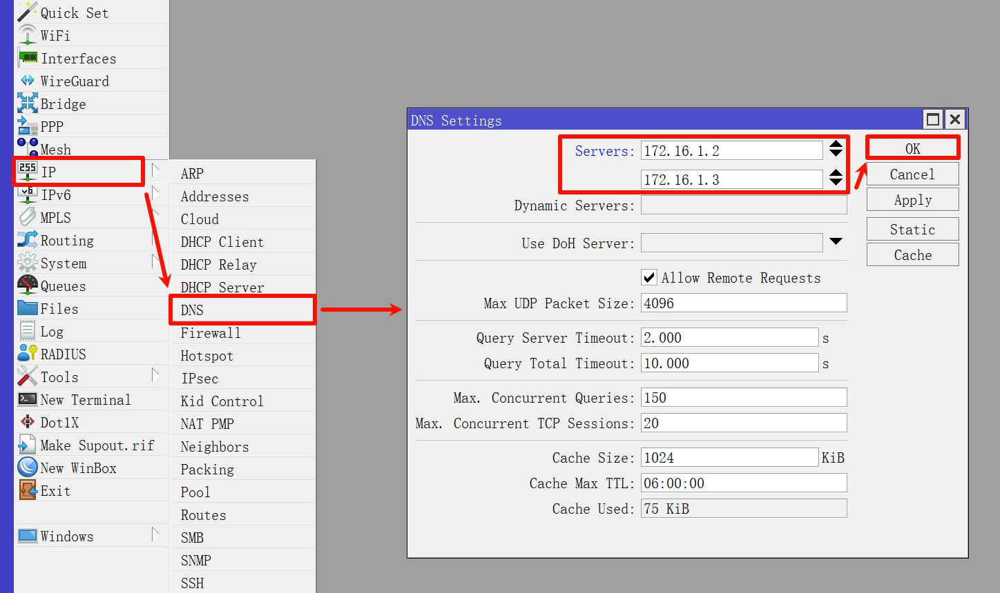
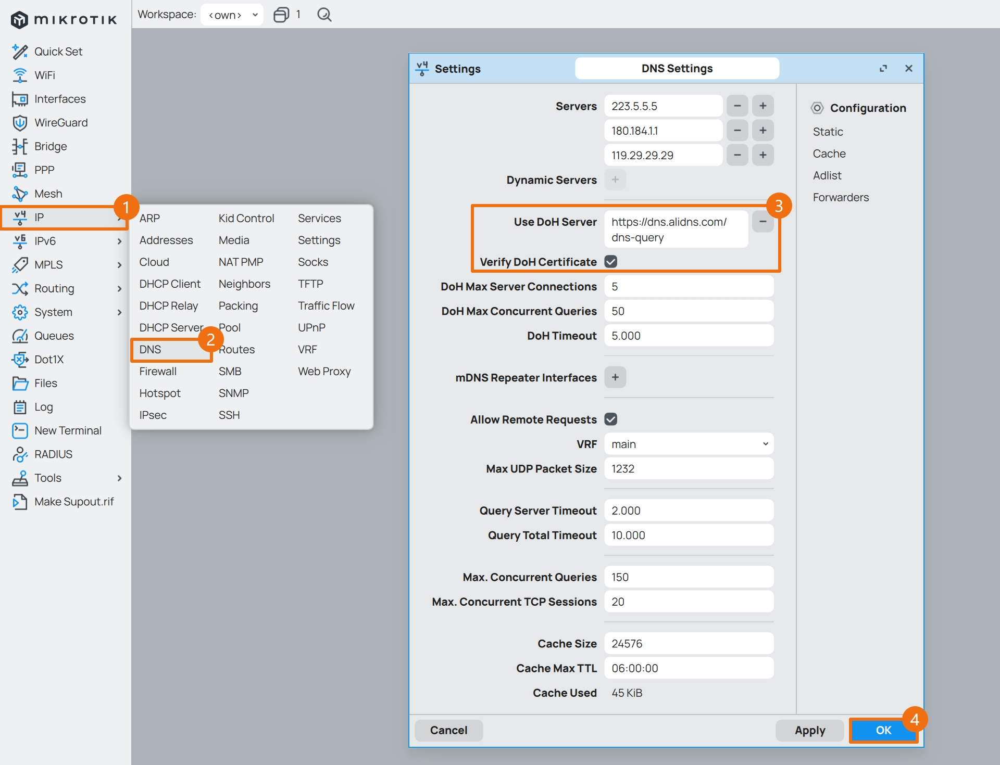
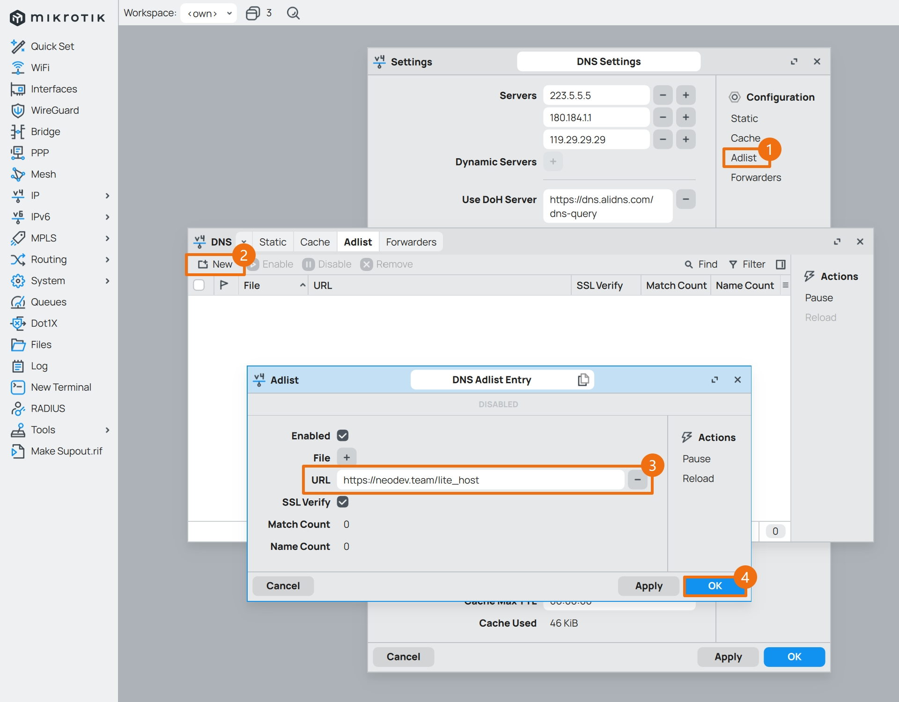

## 1.设置 DNS

在上一篇文章 [02.设置网络接口](./02.设置网络接口.md) 中，已经设置了各网络接口，现在开始设置系统 DNS 。  

### 1.1.使用公共 DNS 服务器

使用 Winbox 登录 RouterOS ，点击左侧导航 `IP` 菜单的子菜单 `DNS` ，并修改参数。  

|参数|值|
|--|--|
|Servers|`223.5.5.5` <br> `180.184.1.1` <br> `119.29.29.29`|
|Allow Remote Requests| **必须勾选** |
|Max. Concurrent Queries|`150`|
|Cache Size|`24576`|
|Cache Max TTL|`06:00:00`|

`Servers` 处可填写国内知名的 DNS 服务提供商，比如阿里云公共 DNS `223.5.5.5` 。  

`Allow Remote Requests`  **必须勾选** ，其作用是允许内网设备通过 RouterOS 地址来进行 DNS 查询。  



### 1.2.使用内网 DNS 服务器

在根据我的系列文章 [Adguard Home 折腾手记](https://gitee.com/callmer/adh_toss_notes) 安装并配置了内网 DNS 服务器后，需要调整 RouterOS 的 DNS 配置。  

点击左侧导航 `IP` 菜单的子菜单 `DNS` ，将 `Servers` 参数同样修改为内网 DNS 的 IP 地址。  



### 1.3.使用 DoH 服务器

RouterOS 中的 DNS over HTTPS (DoH) 功能有效提升了 DNS 查询的安全性，不仅增强了隐私保护，还有效防止了 DNS 劫持和篡改。  

根据官方文档有关 [DNS](https://help.mikrotik.com/docs/display/ROS/DNS) 的介绍：  

> Currently, DoH is not compatible with FWD-type static entries, in order to utilize FWD entries, DoH must not be configured.  

> It is strongly recommended to import the root CA certificate of the DoH server you have chosen to use for increased security. We strongly suggest not using third-party download links for certificate fetching. Use the Certificate Authority's own website.  

> If DoH server is being used (DoH DNS name can be resolved) then it will be the only DNS service working at the time and standard DNS servers from IP/DNS servers list will not be used.  

> Note that you need at least one regular DNS server configured for the router to resolve the DoH hostname itself. If you do not have any dynamical or static DNS server configured, add a static DNS entry for the DoH server domain name.  

因此，正确使用 DoH 的相关条件总结如下：

- 若需使用 DNS 中 `FWD` 类型的 DNS 记录，则不能使用 DoH 功能。  

- 当 DoH 为开启状态，日常解析时，传统 DNS 将不再被使用。  

- 若 DoH 服务器地址为域名，则需至少保留一个传统 DNS 条目，或使用静态 DNS 条目对 DoH 域名的 IP 地址进行设置。  

- 强烈建议开启 DoH 的证书校验功能 `verify-doh-cert` ，但前提是 RouterOS 已经下载了相关根证书。  

使用以下命令手动下载 RouterOS 所需的根证书，并根据 [07.设置定时任务](./07.设置定时任务.md) 中相关内容设置 RouterOS 证书自动更新。  

**注意：下载证书时要求 RouterOS 联网且能正确解析域名，证书下载可能较为缓慢，执行命令过程中需耐心等待。**  

```bash
/tool
fetch url=https://letsencrypt.org/certs/isrgrootx1.pem check-certificate=no dst-path=isrgrootx1_unsafe ## Waiting

/certificate
import name=isrgrootx1_unsafe passphrase="" file-name=isrgrootx1_unsafe

/tool
fetch url=https://letsencrypt.org/certs/isrgrootx1.pem check-certificate=yes dst-path=isrgrootx1_safe ## Waiting

/certificate
remove [ find where name ~ "isrg*" ]
import name=isrgrootx1_safe passphrase="" file-name=isrgrootx1_safe

/tool
fetch url=https://mkcert.org/generate/all/except/nothing check-certificate=yes dst-path=mkcert ## Waiting

/certificate
import name=mkcert passphrase="" file-name=mkcert
```

根证书下载并导入完成后，即可添加 DoH 服务器，目前国内常用的 DoH 服务器如下：

```bash
## 阿里云公共DNS
https://dns.alidns.com/dns-query

## DNSPod Public DNS
https://doh.pub/dns-query
```



### 1.4.使用 Adlist 广告列表

RouterOS 支持 `Domain` 格式的广告屏蔽列表，该列表将加载至 DNS Cache 中，对于命中列表的 DNS 请求将返回 `0.0.0.0` 解析结果。  

建议开启 Adlist 的证书校验功能 `ssl-verify` ，该功能与 DoH 一样需要 RouterOS 已经下载了相关根证书。  

根据实际测试，Adlist 对 Cache 容量要求较高，因此建议 RouterOS 的 DNS Cache 不低于 `24MiB` 。  

点击 `DNS` 设置中的 `Adlist` ，进入广告列表配置界面，在 `URL` 处填入广告列表的链接地址，目前常用的 Adlist 列表如下：

```txt
## 列表名称
Anti-AD - 用于拦截广告域名

## 黑名单链接
https://anti-ad.net/domains.txt
```

```txt
## 列表名称
Neodevhost - 用于拦截广告域名

## 黑名单链接
https://neodev.team/lite_host
```

```txt
## 列表名称
Malware Filter - 用于拦截病毒域名

## 黑名单链接
https://malware-filter.gitlab.io/malware-filter/urlhaus-filter-hosts.txt
```



### 1.5.设置 DNS 黑洞

DNS 黑洞是一组静态解析地址，基于 [RFC6303 - Locally Served DNS Zones](https://www.rfc-editor.org/rfc/rfc6303) 和 [RFC6761 - Special-Use Domain Names](https://www.rfc-editor.org/rfc/rfc6761.html) 创建。  

由于 RouterOS 暂不支持 `rDNS` 和 `mDNS` 查询，使用 DNS 黑洞可一定程度上避免将内网数据意外泄露给公共 DNS 服务器。  

配置 DNS 黑洞时，将以下命令一次性全部粘贴到 `CLI` 中执行即可。  

```bash
/ip dns static

add comment="defconf: suppress special-use domain names" match-subdomain=yes type=NXDOMAIN name=alt
add comment="defconf: suppress special-use domain names" match-subdomain=yes type=NXDOMAIN name=home.arpa
add comment="defconf: suppress special-use domain names" match-subdomain=yes type=NXDOMAIN name=example
add comment="defconf: suppress special-use domain names" match-subdomain=yes type=NXDOMAIN name=bind
add comment="defconf: suppress special-use domain names" match-subdomain=yes type=NXDOMAIN name=invalid
add comment="defconf: suppress special-use domain names" match-subdomain=yes type=NXDOMAIN name=lan
add comment="defconf: suppress special-use domain names" match-subdomain=yes type=NXDOMAIN name=local
add comment="defconf: suppress special-use domain names" match-subdomain=yes type=NXDOMAIN name=localhost
add comment="defconf: suppress special-use domain names" match-subdomain=yes type=NXDOMAIN name=onion
add comment="defconf: suppress special-use domain names" match-subdomain=yes type=NXDOMAIN name=test

add comment="defconf: suppress special-use domain names" match-subdomain=yes type=NXDOMAIN name=10.in-addr.arpa
add comment="defconf: suppress special-use domain names" match-subdomain=yes type=NXDOMAIN name=16.172.in-addr.arpa
add comment="defconf: suppress special-use domain names" match-subdomain=yes type=NXDOMAIN name=17.172.in-addr.arpa
add comment="defconf: suppress special-use domain names" match-subdomain=yes type=NXDOMAIN name=18.172.in-addr.arpa
add comment="defconf: suppress special-use domain names" match-subdomain=yes type=NXDOMAIN name=19.172.in-addr.arpa
add comment="defconf: suppress special-use domain names" match-subdomain=yes type=NXDOMAIN name=20.172.in-addr.arpa
add comment="defconf: suppress special-use domain names" match-subdomain=yes type=NXDOMAIN name=21.172.in-addr.arpa
add comment="defconf: suppress special-use domain names" match-subdomain=yes type=NXDOMAIN name=22.172.in-addr.arpa
add comment="defconf: suppress special-use domain names" match-subdomain=yes type=NXDOMAIN name=23.172.in-addr.arpa
add comment="defconf: suppress special-use domain names" match-subdomain=yes type=NXDOMAIN name=24.172.in-addr.arpa
add comment="defconf: suppress special-use domain names" match-subdomain=yes type=NXDOMAIN name=25.172.in-addr.arpa
add comment="defconf: suppress special-use domain names" match-subdomain=yes type=NXDOMAIN name=26.172.in-addr.arpa
add comment="defconf: suppress special-use domain names" match-subdomain=yes type=NXDOMAIN name=27.172.in-addr.arpa
add comment="defconf: suppress special-use domain names" match-subdomain=yes type=NXDOMAIN name=28.172.in-addr.arpa
add comment="defconf: suppress special-use domain names" match-subdomain=yes type=NXDOMAIN name=29.172.in-addr.arpa
add comment="defconf: suppress special-use domain names" match-subdomain=yes type=NXDOMAIN name=30.172.in-addr.arpa
add comment="defconf: suppress special-use domain names" match-subdomain=yes type=NXDOMAIN name=31.172.in-addr.arpa
add comment="defconf: suppress special-use domain names" match-subdomain=yes type=NXDOMAIN name=168.192.in-addr.arpa
add comment="defconf: suppress special-use domain names" match-subdomain=yes type=NXDOMAIN name=0.in-addr.arpa
add comment="defconf: suppress special-use domain names" match-subdomain=yes type=NXDOMAIN name=127.in-addr.arpa
add comment="defconf: suppress special-use domain names" match-subdomain=yes type=NXDOMAIN name=254.169.in-addr.arpa
add comment="defconf: suppress special-use domain names" match-subdomain=yes type=NXDOMAIN name=2.0.192.in-addr.arpa
add comment="defconf: suppress special-use domain names" match-subdomain=yes type=NXDOMAIN name=100.51.198.in-addr.arpa
add comment="defconf: suppress special-use domain names" match-subdomain=yes type=NXDOMAIN name=113.0.203.in-addr.arpa
add comment="defconf: suppress special-use domain names" match-subdomain=yes type=NXDOMAIN name=255.255.255.255.in-addr.arpa

add comment="defconf: suppress special-use domain names" match-subdomain=yes type=NXDOMAIN name=0.0.0.0.0.0.0.0.0.0.0.0.0.0.0.0.0.0.0.0.0.0.0.0.0.0.0.0.0.0.0.0.ip6.arpa
add comment="defconf: suppress special-use domain names" match-subdomain=yes type=NXDOMAIN name=1.0.0.0.0.0.0.0.0.0.0.0.0.0.0.0.0.0.0.0.0.0.0.0.0.0.0.0.0.0.0.0.ip6.arpa
add comment="defconf: suppress special-use domain names" match-subdomain=yes type=NXDOMAIN name=d.f.ip6.arpa
add comment="defconf: suppress special-use domain names" match-subdomain=yes type=NXDOMAIN name=8.e.f.ip6.arpa
add comment="defconf: suppress special-use domain names" match-subdomain=yes type=NXDOMAIN name=9.e.f.ip6.arpa
add comment="defconf: suppress special-use domain names" match-subdomain=yes type=NXDOMAIN name=a.e.f.ip6.arpa
add comment="defconf: suppress special-use domain names" match-subdomain=yes type=NXDOMAIN name=b.e.f.ip6.arpa
add comment="defconf: suppress special-use domain names" match-subdomain=yes type=NXDOMAIN name=8.b.d.0.1.0.0.2.ip6.arpa
```

至此，RouterOS 设置系统 DNS 步骤完成。  

