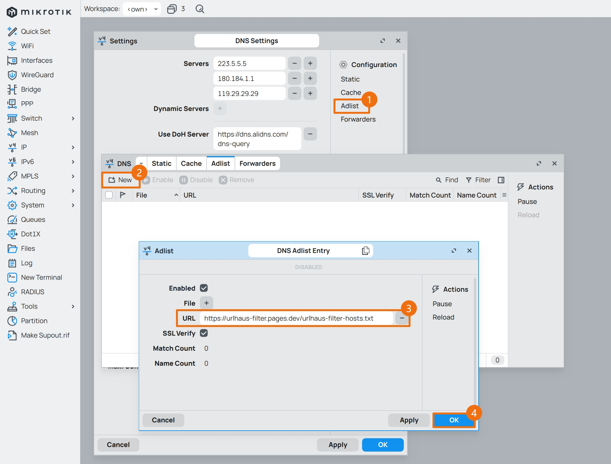

## 1.设置 DNS

在上一篇文章 [02.设置网络接口](./02.设置网络接口.md) 中，已经设置了各网络接口，现在开始设置系统 DNS 。  

### 1.1.设置 DNS 服务器

使用 Winbox 登录 RouterOS ，点击左侧导航 `IP` 菜单的子菜单 `DNS` ，并修改参数。  

当 PPPoE 拨号成功后，若之前步骤中勾选了 `Use Peer DNS` 选项，运营商下发的 DNS 服务器将在 `Dynamic Servers` 中展示。  

此时，无需额外手动配置自定义 DNS 服务器。  


若之前步骤中未勾选 `Use Peer DNS` 选项，则需在 `Servers` 处填写自定义 DNS 服务器。  

|参数|值|
|--|--|
|Servers|`223.5.5.5`<br>`180.184.1.1`<br>`119.29.29.29`|


### 1.2.设置 DNS 其他参数

`Allow Remote Requests`  **必须勾选** ，其作用是允许内网设备通过 RouterOS 地址来进行 DNS 查询。  

|参数|值|
|--|--|
|Allow Remote Requests| **必须勾选** |
|Max UDP Packet Size|`1232`|
|Max. Concurrent Queries|`150`|
|Cache Size|`24576`|
|Cache Max TTL|`06:00:00`|


### 1.3.使用内网 DNS 服务器

在根据文章 [Proxmox VE 折腾手记 - 06.PVE制作DNS服务器](https://gitee.com/callmer/pve_toss_notes/blob/master/06.PVE%E5%88%B6%E4%BD%9CDNS%E6%9C%8D%E5%8A%A1%E5%99%A8.md) 创建了内网 DNS 服务器后，需调整 RouterOS 的 DNS 配置。  

点击左侧导航 `IP` 菜单的子菜单 `DNS` ，将 `Servers` 参数修改为内网 DNS 服务器的 IP 地址。  


### 1.4.使用 DoH 服务器

RouterOS 中的 DNS over HTTPS (DoH) 功能提升了 DNS 查询的安全性，增强了隐私保护并有效防止 DNS 劫持和篡改。  

根据官方文档有关 [DNS](https://help.mikrotik.com/docs/display/ROS/DNS) 的介绍：  

> It is strongly recommended to import the root CA certificate of the DoH server you have chosen to use for increased security.  
> We strongly suggest not using third-party download links for certificate fetching. Use the Certificate Authority's own website.  

> Note that you need at least one regular DNS server configured for the router to resolve the DoH hostname itself.  
> If you do not have any dynamical or static DNS server configured, add a static DNS entry for the DoH server domain name.  

> If DoH server is being used (DoH DNS name can be resolved) then it will be the only DNS service working at the time and standard DNS servers from IP/DNS servers list will not be used.  

因此，正确使用 DoH 的相关条件总结如下：

- 若 DoH 服务器地址为域名，则需至少保留一个传统 DNS 条目，或使用静态 DNS 条目对 DoH 域名的 IP 地址进行设置。  

- 当 DoH 为开启状态，日常解析时，传统 DNS 将不再被使用。  

- 强烈建议开启 DoH 的证书校验功能 `verify-doh-cert` 。  

目前国内常用的 DoH 服务器如下：

```bash
## 阿里云公共DNS
https://dns.alidns.com/dns-query

## 360 安全DNS
https://doh.360.cn/dns-query

## DNSPod Public DNS
https://doh.pub/dns-query
```


### 1.5.使用 Adlist 广告列表

RouterOS 支持 `Domains` 和 `Hosts` 格式的广告屏蔽列表，对于命中列表的 DNS 请求将返回 `0.0.0.0` 解析结果。  

根据实际测试，Adlist 对 Cache 容量要求较高，因此建议 RouterOS 的 DNS Cache 不低于 `24MiB` 。  

点击 `DNS` 设置中的 `Adlist` ，进入广告列表配置界面，在 `URL` 处填入广告列表的链接地址，目前常用的 Adlist 列表如下：

```txt
## 列表名称
Anti-AD - 用于拦截广告域名

## 黑名单链接
https://anti-ad.net/domains.txt
```

```txt
## 列表名称
Neodevhost - 用于拦截广告域名

## 黑名单链接
https://neodev.team/host
```

```txt
## 列表名称
AdBlock DNS Filters - 用于拦截广告域名

## 黑名单链接
https://raw.githubusercontent.com/217heidai/adblockfilters/main/rules/adblockhosts.txt
```

```txt
## 列表名称
Malicious URL Blocklist - 用于拦截恶意域名

## 黑名单链接
https://urlhaus-filter.pages.dev/urlhaus-filter-hosts.txt
```



### 1.6.设置 DNS 黑洞

DNS 黑洞是一组静态解析地址，基于 [RFC6303 - Locally Served DNS Zones](https://www.rfc-editor.org/rfc/rfc6303) 和 [RFC6761 - Special-Use Domain Names](https://www.rfc-editor.org/rfc/rfc6761.html) 创建。  

由于 RouterOS 暂不支持 `rDNS` 和 `mDNS` 查询，使用 DNS 黑洞可一定程度上避免将内网数据意外泄露给公共 DNS 服务器。  

配置 DNS 黑洞时，将以下命令一次性全部粘贴到 `CLI` 中执行即可。  

```bash
/ip dns static

add comment="defconf: suppress special-use domains" match-subdomain=yes type=NXDOMAIN name=alt
add comment="defconf: suppress special-use domains" match-subdomain=yes type=NXDOMAIN name=bind
add comment="defconf: suppress special-use domains" match-subdomain=yes type=NXDOMAIN name=example
add comment="defconf: suppress special-use domains" match-subdomain=yes type=NXDOMAIN name=home.arpa
add comment="defconf: suppress special-use domains" match-subdomain=yes type=NXDOMAIN name=internal
add comment="defconf: suppress special-use domains" match-subdomain=yes type=NXDOMAIN name=invalid
add comment="defconf: suppress special-use domains" match-subdomain=yes type=NXDOMAIN name=lan
add comment="defconf: suppress special-use domains" match-subdomain=yes type=NXDOMAIN name=local
add comment="defconf: suppress special-use domains" match-subdomain=yes type=NXDOMAIN name=localhost
add comment="defconf: suppress special-use domains" match-subdomain=yes type=NXDOMAIN name=onion
add comment="defconf: suppress special-use domains" match-subdomain=yes type=NXDOMAIN name=test

add comment="defconf: suppress special-use domains" match-subdomain=yes type=NXDOMAIN name=10.in-addr.arpa
add comment="defconf: suppress special-use domains" match-subdomain=yes type=NXDOMAIN name=16.172.in-addr.arpa
add comment="defconf: suppress special-use domains" match-subdomain=yes type=NXDOMAIN name=17.172.in-addr.arpa
add comment="defconf: suppress special-use domains" match-subdomain=yes type=NXDOMAIN name=18.172.in-addr.arpa
add comment="defconf: suppress special-use domains" match-subdomain=yes type=NXDOMAIN name=19.172.in-addr.arpa
add comment="defconf: suppress special-use domains" match-subdomain=yes type=NXDOMAIN name=20.172.in-addr.arpa
add comment="defconf: suppress special-use domains" match-subdomain=yes type=NXDOMAIN name=21.172.in-addr.arpa
add comment="defconf: suppress special-use domains" match-subdomain=yes type=NXDOMAIN name=22.172.in-addr.arpa
add comment="defconf: suppress special-use domains" match-subdomain=yes type=NXDOMAIN name=23.172.in-addr.arpa
add comment="defconf: suppress special-use domains" match-subdomain=yes type=NXDOMAIN name=24.172.in-addr.arpa
add comment="defconf: suppress special-use domains" match-subdomain=yes type=NXDOMAIN name=25.172.in-addr.arpa
add comment="defconf: suppress special-use domains" match-subdomain=yes type=NXDOMAIN name=26.172.in-addr.arpa
add comment="defconf: suppress special-use domains" match-subdomain=yes type=NXDOMAIN name=27.172.in-addr.arpa
add comment="defconf: suppress special-use domains" match-subdomain=yes type=NXDOMAIN name=28.172.in-addr.arpa
add comment="defconf: suppress special-use domains" match-subdomain=yes type=NXDOMAIN name=29.172.in-addr.arpa
add comment="defconf: suppress special-use domains" match-subdomain=yes type=NXDOMAIN name=30.172.in-addr.arpa
add comment="defconf: suppress special-use domains" match-subdomain=yes type=NXDOMAIN name=31.172.in-addr.arpa
add comment="defconf: suppress special-use domains" match-subdomain=yes type=NXDOMAIN name=168.192.in-addr.arpa
add comment="defconf: suppress special-use domains" match-subdomain=yes type=NXDOMAIN name=0.in-addr.arpa
add comment="defconf: suppress special-use domains" match-subdomain=yes type=NXDOMAIN name=127.in-addr.arpa
add comment="defconf: suppress special-use domains" match-subdomain=yes type=NXDOMAIN name=254.169.in-addr.arpa
add comment="defconf: suppress special-use domains" match-subdomain=yes type=NXDOMAIN name=2.0.192.in-addr.arpa
add comment="defconf: suppress special-use domains" match-subdomain=yes type=NXDOMAIN name=100.51.198.in-addr.arpa
add comment="defconf: suppress special-use domains" match-subdomain=yes type=NXDOMAIN name=113.0.203.in-addr.arpa
add comment="defconf: suppress special-use domains" match-subdomain=yes type=NXDOMAIN name=255.255.255.255.in-addr.arpa

add comment="defconf: suppress special-use domains" match-subdomain=yes type=NXDOMAIN name=0.0.0.0.0.0.0.0.0.0.0.0.0.0.0.0.0.0.0.0.0.0.0.0.0.0.0.0.0.0.0.0.ip6.arpa
add comment="defconf: suppress special-use domains" match-subdomain=yes type=NXDOMAIN name=1.0.0.0.0.0.0.0.0.0.0.0.0.0.0.0.0.0.0.0.0.0.0.0.0.0.0.0.0.0.0.0.ip6.arpa
add comment="defconf: suppress special-use domains" match-subdomain=yes type=NXDOMAIN name=d.f.ip6.arpa
add comment="defconf: suppress special-use domains" match-subdomain=yes type=NXDOMAIN name=8.e.f.ip6.arpa
add comment="defconf: suppress special-use domains" match-subdomain=yes type=NXDOMAIN name=9.e.f.ip6.arpa
add comment="defconf: suppress special-use domains" match-subdomain=yes type=NXDOMAIN name=a.e.f.ip6.arpa
add comment="defconf: suppress special-use domains" match-subdomain=yes type=NXDOMAIN name=b.e.f.ip6.arpa
add comment="defconf: suppress special-use domains" match-subdomain=yes type=NXDOMAIN name=8.b.d.0.1.0.0.2.ip6.arpa
```

至此，RouterOS 设置系统 DNS 步骤完成。  

