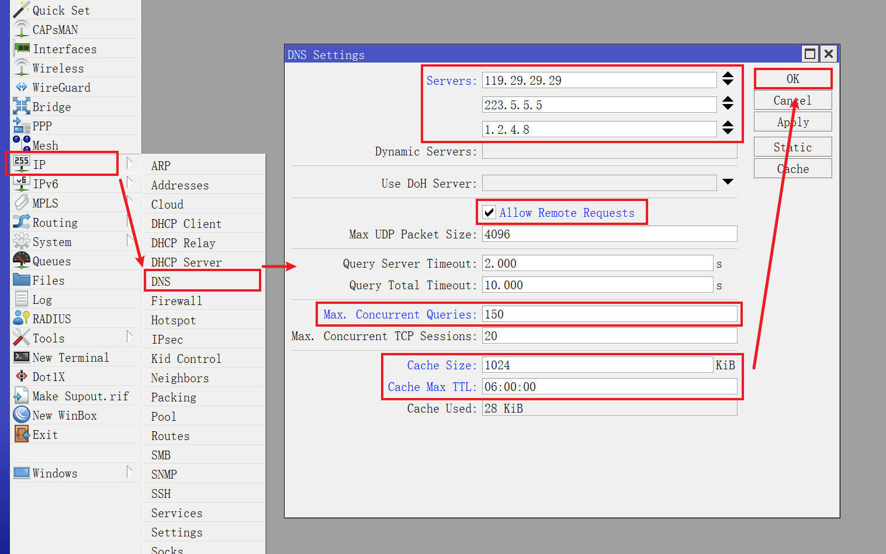
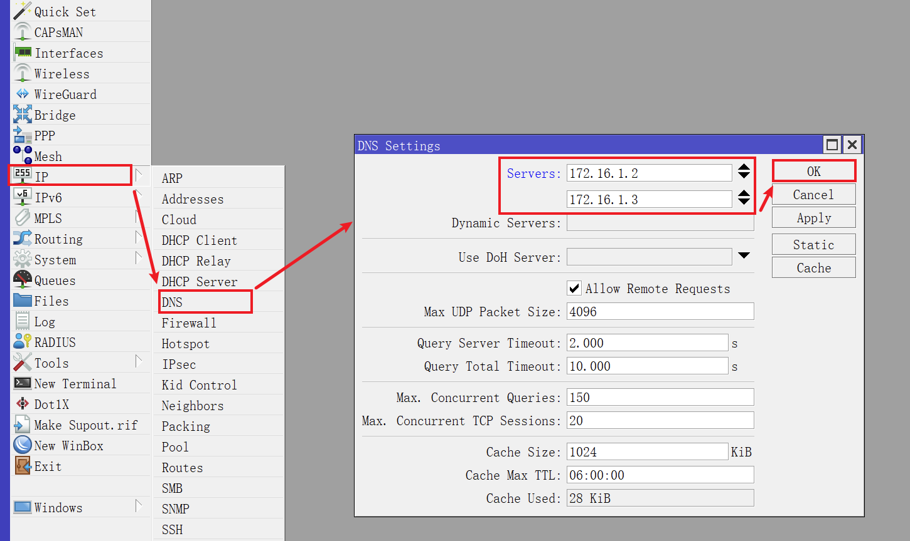

## 1.设置 DNS

在上一篇文章 [02.设置网络接口](./02.设置网络接口.md) 中，已经设置了各网络接口，现在开始设置系统 DNS 。  

## 1.1.使用公共 DNS 服务器

使用 Winbox 登录 RouterOS ，点击左侧导航 `IP` 菜单的子菜单 `DNS` ，并修改参数：

|参数|值|
|--|--|
|Servers|`223.5.5.5`   `119.29.29.29`|
|Allow Remote Requests| **必须勾选** |
|Max. Concurrent Queries|`150`|
|Cache Size|`1024`|
|Cache Max TTL|`06:00:00`|

`Servers` 处可填写国内知名的 DNS 服务提供商，比如腾讯云的 `119.29.29.29` 。  

`Allow Remote Requests`  **必须勾选** ，其作用是允许内网设备通过 RouterOS 地址来进行 DNS 查询。  

## 1.2.使用内网 DNS 服务器

在根据我的系列文章 [Adguard Home 折腾手记](https://gitee.com/callmer/adh_toss_notes) 安装并配置了内网 DNS 服务器后，需要调整 RouterOS 的 DNS 配置。  

点击左侧导航 `IP` 菜单的子菜单 `DNS` ，将 `Servers` 参数同样修改为内网 DNS 的 IP 地址：

至此，RouterOS 设置系统 DNS 步骤完成。  

