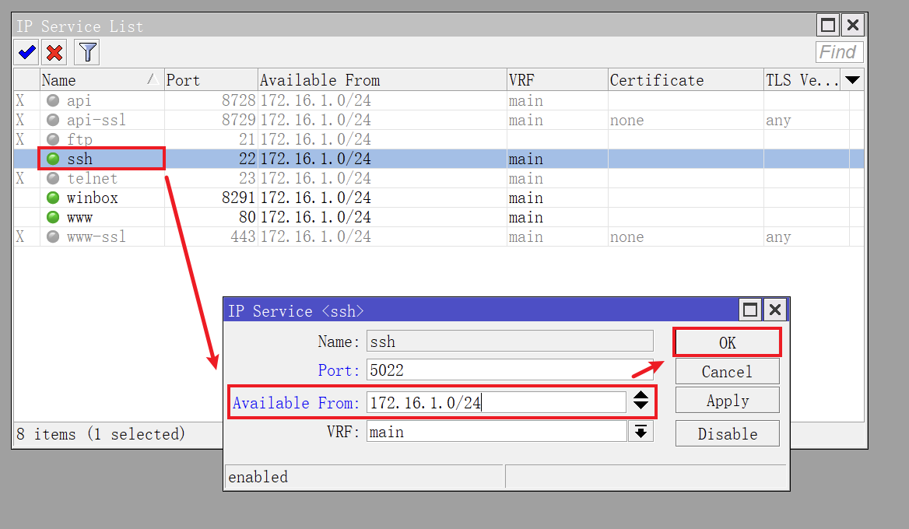
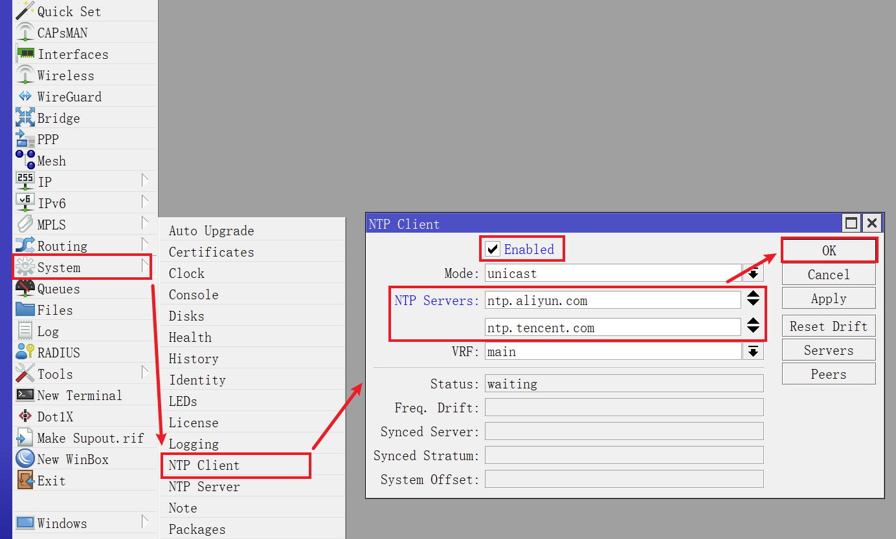
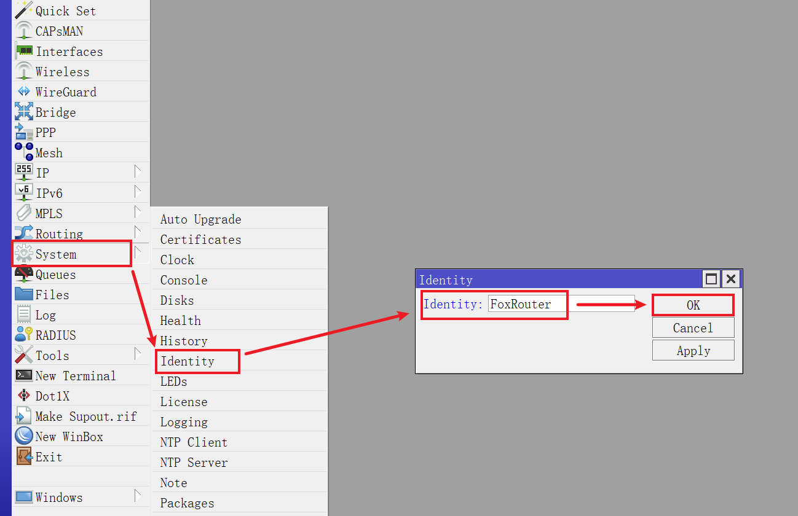
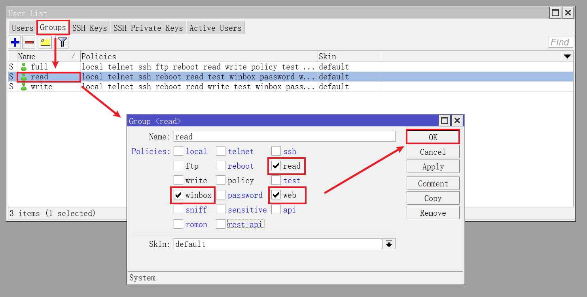
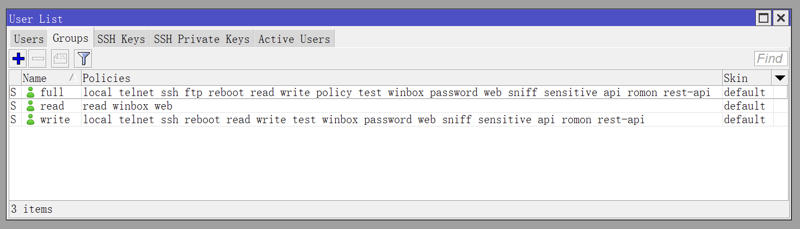
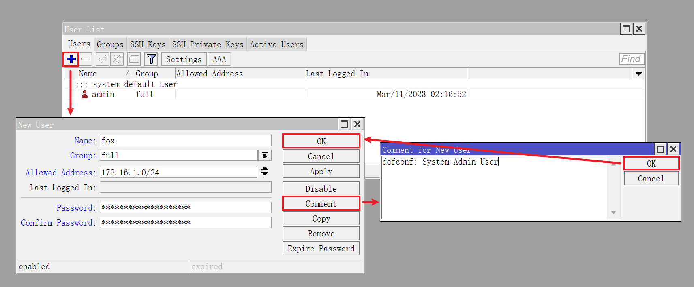
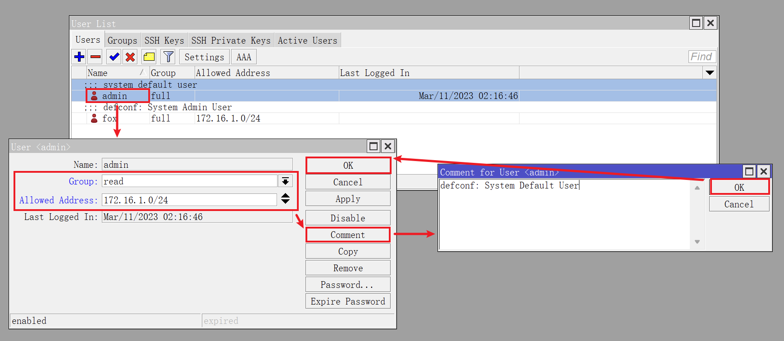

## 0.前景提要

在上一篇文章《[03.RouterOS正版系统激活](./03.RouterOS正版系统激活.md)》中，我们激活了正版 RouterOS 系统。  

接下来需要对 RouterOS 的一些系统参数进行调整。

## 1.关闭 IPv6

由于我目前没有使用 IPv6 网络，因此需要关闭 RouterOS 有关 `IPv6` 的功能。  

打开 Winbox 并点击左侧导航 `IPv6` 菜单的子菜单 `Settings` ，勾选 `Disable IPv6` ：

## 2.调整系统服务

RouterOS 默认开启了 `api` 、`ftp` 等系统服务，这些服务日常使用中并不会用到，可以选择关闭。  

对于日常会使用到的系统服务，比如 `ssh` 、 `winbox` 等，需要限制可访问的 `IP` 地址段。  

点击左侧导航 `IP` 菜单的子菜单 `Settings` ，进入 RouterOS 系统服务管理界面。  

鼠标 **单击** 选中需要关闭的服务，点击 `Disable` 按钮，即可关闭服务：

在之前的 RouterOS 设置中我们规划了内网的网段为 `172.16.1.0/24` ，因此系统服务的 “可访问来源地址” 保持与内网网段相同。  

鼠标 **双击** 某项服务，进入该服务的配置界面，在 `Available From` 处填写 `172.16.1.0/24` 即可：  

RouterOS 系统服务的 “可访问来源地址” 和 “服务端口” 设置完成后，如下图所示：

## 3.设置时区 NTP

点击左侧导航 `System` 菜单的子菜单 `Clock` ，进入 RouterOS 系统时间管理界面。  

确保 `Time Zone Autodetect` 为勾选状态，`Time Zone Name` 为 `Asia/Shanghai` ：  

点击左侧导航 `System` 菜单的子菜单 `NTP Client` ，进入 RouterOS 系统 NTP 管理界面。  

勾选 `Enabled` ，在 `NTP Servers` 处填写国内常用 NTP 服务器地址 `ntp.tencent.com` 和 `ntp.aliyun.com` 。

## 4.设置系统名称

点击左侧导航 `System` 菜单的子菜单 `Identity` ，进入 RouterOS 系统名称管理界面。  

在 `Identity` 处使用英文填写系统名称：  

## 5.设置系统账户

点击左侧导航 `System` 菜单的子菜单 `Users` ，进入 RouterOS 系统账户管理界面。  

默认情况下，RouterOS 会有一个内建管理员 `admin` ，权限为 `full` ：

安全起见，建议新建一个管理员账号，权限设置为 `full` ，并将默认管理员 `admin` 的权限设置为“只读” `read` 。

切换到 `Groups` 选项卡，鼠标双击 `read` 权限组，仅保留 `read` 、 `winbox` 、`web` 权限：

修改完成后如图所示：

返回 `Users` 选项卡，新建一个管理员账户：

|参数|值|说明|
|--|--|--|
|Name|fox|账户名，需要用英文|
|Group|full|账户权限组|
|Allowed Address|172.16.1.0/24|可访问来源地址，与内网网段相同|
|Password|************|账户的密码，设置一个高强度密码|
|Comment|system admin user|账户备注信息|

设置完成后，如图所示：

登出 Winbox，并用 **新创建的** 管理员账户进行登录，以确保新管理员账户可正常使用。  

鼠标 **双击** 管理员 `admin` 条目，修改其权限和可访问来源地址：

修改完成后，如图所示：

后续再使用 RouterOS 的过程中，如果不涉及对系统参数的调整，可以仅使用 `read` 权限下的 `admin` 账户。避免在日常检查系统运行状态时，意外调整了系统参数导致系统异常。

## 6.备份系统设置

及时备份系统配置，有助于在系统异常时快速将系统恢复到正常状态。  

点击左侧导航 `Files` 菜单，在 `File List` 页面点击 `Backup` 按钮，输入备份的名称以及备份密码，即可对系统配置进行备份：

- Name：备份文件的名称，全英文字符，参考规则为 `路由器名称_修改内容_修改时间`
- Password：备份文件的密码，可与管理员登录密码不同，需牢记

备份完成后，如图所示：

建议将备份文件下载到本地，进行多副本额外保存。  

至此，RouterOS 的主体设置已经完成，后续将使用 RouterOS 的脚本和定时器功能实现定时重播 PPPoE 、定时发送系统资源状态以及系统日志到指定邮箱的功能。  
