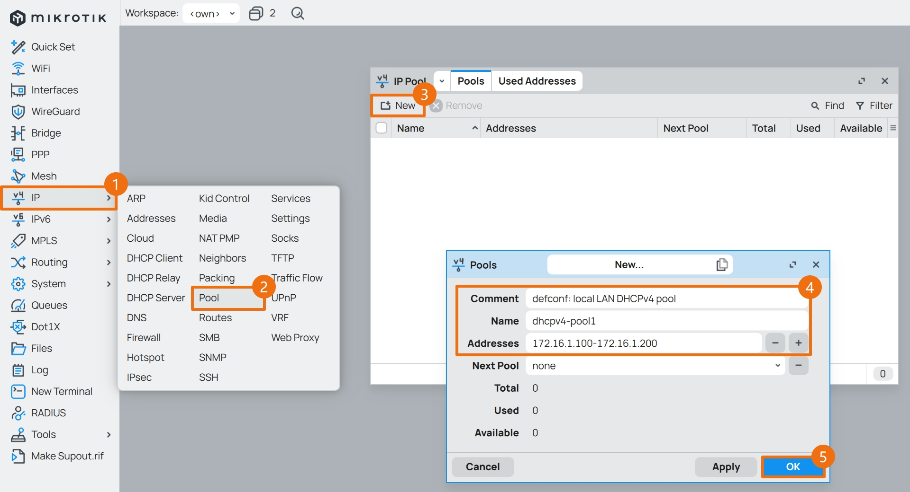
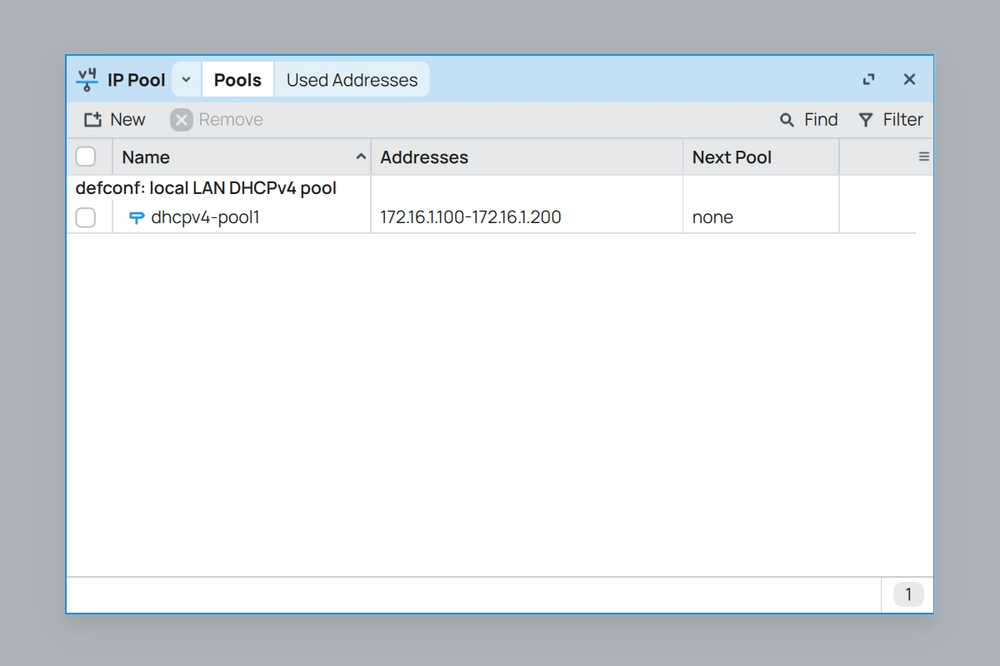
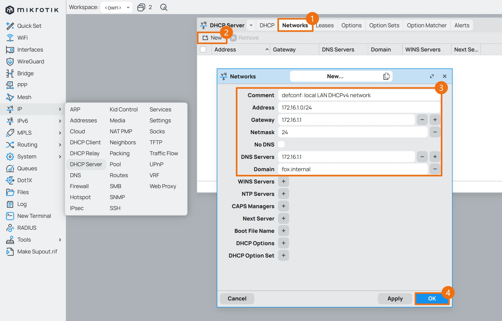
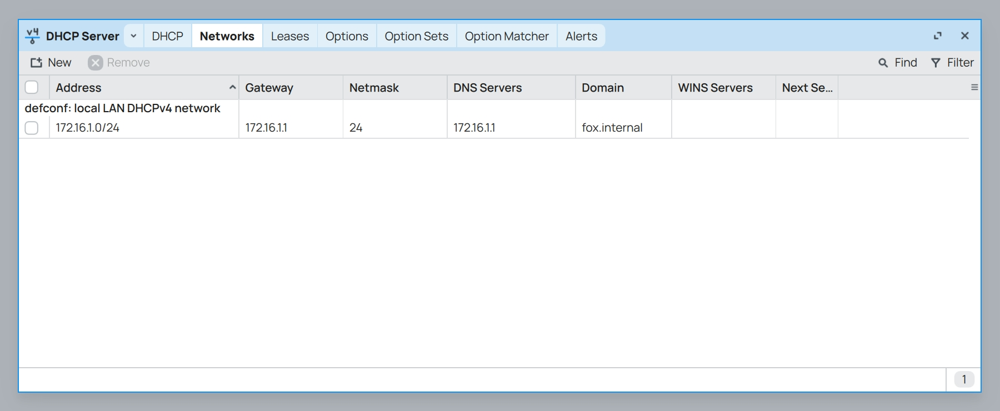
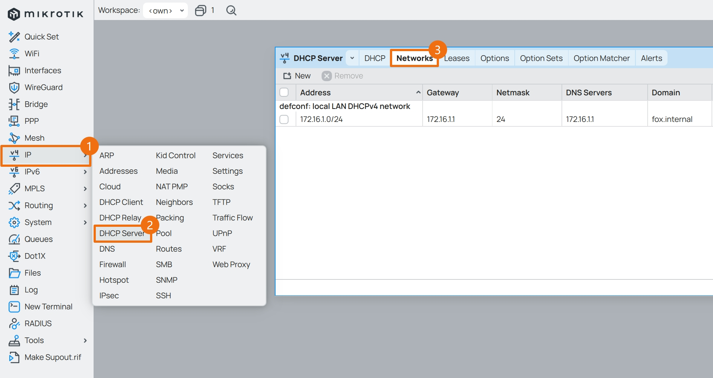
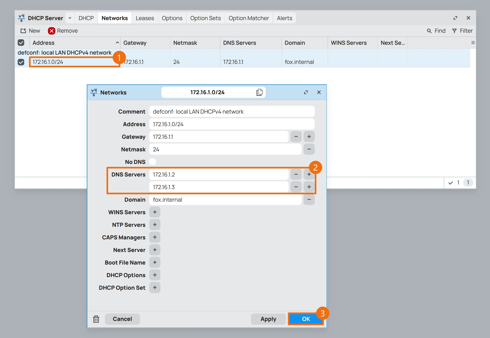
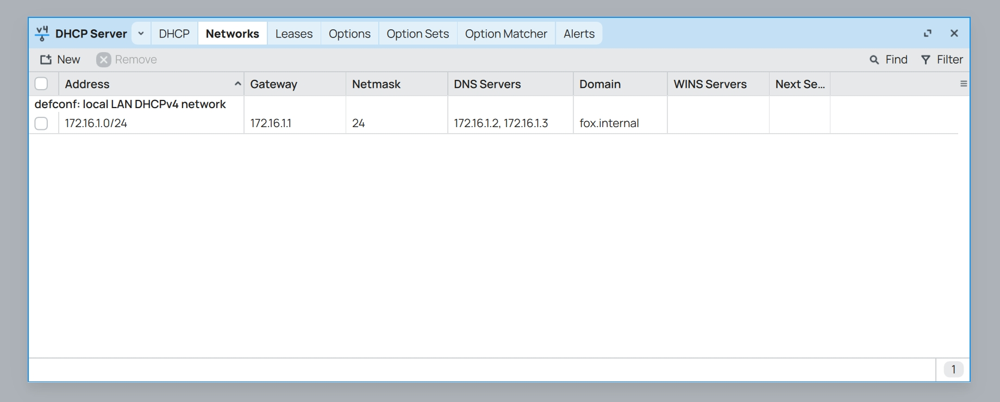

## 1.设置 DHCPv4

在上一篇文章 [03.设置DNS](./03.设置DNS.md) 中，已经设置了系统 DNS ，现在开始设置系统 DHCPv4 。  

设置 IPv4 DHCP 服务器包括两个部分，创建 DHCPv4 的地址池和创建 DHCPv4 服务器。  

### 1.1.创建 DHCPv4 地址池

先创建 DHCPv4 地址池，点击左侧导航 `IP` 菜单的子菜单 `Pool` ，点击 ` + ` 按钮。  

|参数|值|
|--|--|
|Name|`dhcpv4-pool1`|
|Addresses|`172.16.1.100-172.16.1.200`|
|Comment|`defconf: local LAN DHCPv4 pool`|

**说明：**  

在 `Addresses` 处填写的地址段为 `172.16.1.100-172.16.1.200` ，表示该地址池有 `101` 个可用 IPv4 地址。  

预留地址部分将用于内网设备的静态 IPv4 地址设置，在内网设备较多的情况下，可根据实际需求加大该地址池的容量。  

当前子网掩码为 `/24` 即 `255.255.255.0` ，因此该地址池最大的地址空间为 `172.16.1.2-172.16.1.254` 。  

地址池创建完成后，如图所示。  

### 1.2.创建 DHCPv4 服务器

接下来创建 DHCPv4 服务器， 点击左侧导航 `IP` 菜单的子菜单 `DHCP Server` ，点击 ` + ` 按钮。  

|参数|值|
|--|--|
|Name|`dhcpv4-server1`|
|Interface|`bridge1`|
|Lease Time|`1d 00:00:00`|
|Address Pool|`dhcpv4-pool1`|
|Bootp Support|`none`|
|Comment|`defconf: local LAN DHCPv4 server`|

DHCPv4 服务器创建完成后如图所示。  

接下来设置 DHCPv4 服务器网络参数，切换到 `Networks` 选项卡，点击 ` + ` 按钮。  

|参数|值|
|--|--|
|Address|`172.16.1.0/24`|
|Gateway|`172.16.1.1`|
|Netmask|`24`|
|DNS Server|`172.16.1.1`|
|Domain|`fox.home.arpa` (可选)|
|Comment|`defconf: local LAN DHCPv4 network`|

DHCPv4 服务器网络参数设置完成后，如图所示。  

此时重连一次电脑的网络，电脑将能够从 RouterOS 获取到 IPv4 地址。  

## 2. DHCPv4 使用内网 DNS

在根据我的系列文章 [Adguard Home 折腾手记](https://gitee.com/callmer/agh_toss_notes) 安装并配置了内网 DNS 服务器后，需要调整 DHCPv4 服务器的参数。  

点击左侧导航 `IP` 菜单的子菜单 `DHCP Server` ，切换到 `Networks` 选项卡。  

鼠标 **双击** 下方的网络参数条目，进入配置界面。

在配置界面中，修改 `DNS Servers` 参数为内网两台 DNS 服务器的 IPv4 地址。  

演示中，内网的 DNS 服务器 IPv4 地址为 `172.16.1.2` 和 `172.16.1.3` 。  

DHCPv4 服务器网络参数修改完成后，如图所示。  

## 3. DHCPv4 Options

通过设置 DHCPv4 的 `Options` 参数，可以让内网设备从 DHCPv4 服务器中获取指定的 `网关地址` 和 `DNS 地址` 。  

演示用的 IPv4 地址均为 `172.16.1.50` 。  

使用 Winbox 登录 RouterOS ，点击左侧导航 `IP` 菜单的子菜单 `DHCP Server` 。  

切换到 `Options` 选项卡，点击 ` + ` 按钮。  

在弹出的 `New DHCP Options` 对话框中修改 `Name` 、 `Code` 、 `Value` 三个参数。  

|参数|值1|值2|说明|
|--|--|--|--|
|Name|`opt-bypass-gw`|`opt-bypass-dnsv4`|参数名称，可自定义|
|Code|`3`|`6`|`3` 表示设置网关地址，`6` 表示设置 DNS 地址|
|Value|`'172.16.1.50'`|`'172.16.1.50'`|填入对应的 IP 地址，需要用 **单引号** 括起来|

设置完成后，如下图所示。  

切换到 `Option Sets` 选项卡，点击 ` + ` 按钮，新增一个 “参数组” 。  

在弹出的 `New DHCP Option Set` 对话框中修改 `Name` 、 `Options` 两个参数。  

通过 `Options` 条目右侧按钮，可以添加多个 `Option` 参数。  

## 4. DHCPv4 静态地址绑定

切换到 `Leases` 选项卡，点击 ` + ` 按钮，新增一个 DHCPv4 静态地址绑定。  

在 `New DHCP Lease` 对话框中修改参数，参数说明如下。  

|参数|值|说明|
|--|--|--|
|Address|`172.16.1.233`|指定的静态 IPv4 地址，需要与 DHCPv4 服务器同网段|
|MAC Address|`aa:bb:cc:dd:ee:ff`|设备的 MAC 地址|
|Server|`dhcpv4-server1`|选择 DHCPv4 服务器|
|Lease Time|`2d 00:00:00`|设备 IPv4 地址租期|
|Comment|`<your-device-name1>`|设备备注信息，用英文填写|

点击 `OK` 后，该设备的静态 IPv4 地址设置完成，让设备重新联网即可获取指定的 IPv4 地址。  

如果需要让该设备使用指定的 DHCPv4 参数，可以修改 `DHCP Option Set` 参数。  

或者，逐一修改 `DHCP Options` 参数。  

区别在于，使用了 `DHCP Option Set` 后， “参数组” 内的所有 DHCPv4 参数都将应用于该设备。  

使用 `DHCP Options` 则可以对该设备的 DHCPv4 参数进行精细化设置。  

建议 `DHCP Options` 和 `DHCP Option Set`  **不要同时使用** 。  

只有配置了 `DHCP Options` 的内网设备才能获取指定的 DHCPv4 参数，而其他设备不受影响。  

至此，RouterOS 设置系统 DHCPv4 步骤完成。  

