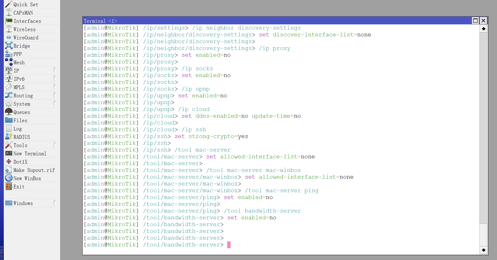
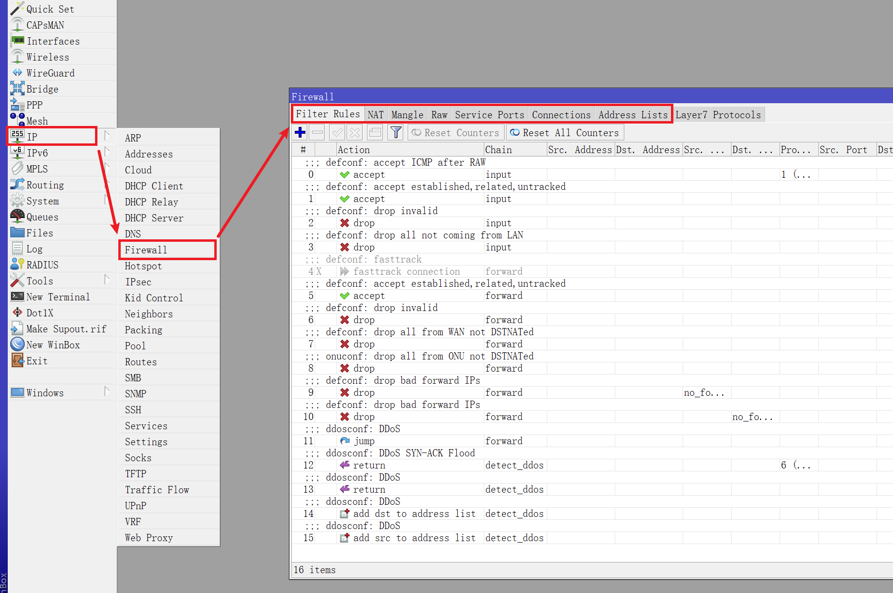
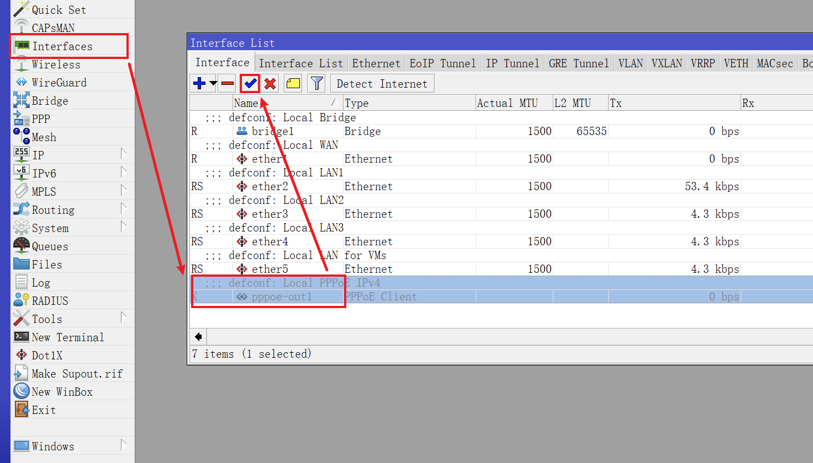
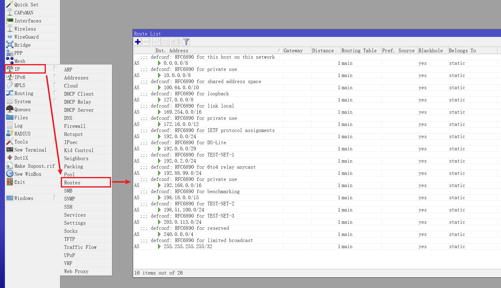

## 1.设置防火墙

在上一篇文章 [04.设置DHCPv4](./04.设置DHCPv4.md) 中，已经设置了 DHCPv4 服务器。  

此时，连接上 RouterOS 的内网设备可以正常获取到 IPv4 地址，但还不能正常访问外网。  

因为此时的 RouterOS 不仅关闭了 PPPoE 连接，而且还未设置防火墙。  

### 1.1.设置 IPv4 防火墙

在设置防火墙之前，请再次检查各 `网络接口` 以及对应的 `端口组` 是否正确。  

|联网模式|端口组名称|端口组成员|
|--|--|--|
|PPPoE|`WAN`|`pppoe-out1`|
||`LAN`|`bridge1`|
||`ONU`|`ether1`|
|DHCPv4|`WAN`|`ether1`|
||`LAN`|`bridge1`|

防火墙配置内容包括 `address-list` 、`filter` 、`nat` 、`mangle` 、`raw` 以及一些和防火墙相关的系统参数。  

防火墙配置命令是基于 RouterOS 官方文档 [Building Advanced Firewall](https://help.mikrotik.com/docs/display/ROS/Building+Advanced+Firewall) 经过少许修改而来。  

主要修改了 `DDoS` 、 `ICMP` 、 `DNS Redirect` 等规则，但尽可能的保证了和官方文档的一致性。  

与防火墙相关的配置项，比如路由器安全增强，在参考官方文档 [Securing your router](https://help.mikrotik.com/docs/display/ROS/Securing+your+router) 后做了如下调整：  

1. `max-neighbor-entries` 参数调整为 `1024`  

2. `rp-filter` 设置为松散模式 `loose`  

3. 启用了 `tcp-syncookies`  

4. 关闭了用于探测其他 MikroTik 路由器的 `discover-interface-list`  

5. 关闭了以下服务  
   - `ip` - `proxy` 服务  
   - `ip` - `socks` 服务  
   - `ip` - `upnp` 服务  
   - `ip` - `cloud` 服务  
   - `tool` - `bandwidth-server` 服务  

6. 启用了 `SSH` 服务的 “强加密” 模式 `strong-crypto`  

7. 对 `mac-server` 相关服务进行调整，会影响 Winbox 对 RouterOS 的探测发现  
   - 关闭了 `mac-server` 的 `allowed-interface-list`  
   - 关闭了 `mac-winbox` 的 `allowed-interface-list`  
   - 关闭了 `mac-server` 的 `ping`  

同样是复制防火墙配置命令，一次性全部粘贴到 CLI 中执行，即可完成 **“一键配置”** 。  

**需要注意的是，防火墙配置命令中的部分 IPv4 地址，需要根据实际情况进行调整。**   

- 光猫的 IPv4 地址 `192.168.100.1`
- 如果使用光猫拨号，则无需使用与光猫相关的防火墙条目
  - 每条防火墙均有备注 `comment` 信息，去掉包含 `onuconf` 的相关防火墙条目
- 内网使用的 IPv4 地址段 `172.16.1.0/24`
  - RouterOS 的 IPv4 地址 `172.16.1.1`
- 内网 DNS 服务器的 IPv4 地址 `172.16.1.2` 、 `172.16.1.3`

需要分别修改 `address-list` 表中的 `local_onu_ipv4` 、 `local_lan_ipv4` 、 `local_dns_ipv4` 这几个地址参数。  

如果 **没有** 内网 DNS 服务器，并移除了 `local_dns_ipv4` 地址列表，则需同步移除 `nat` 表中以下 2 条防火墙条目：  

```bash
add action=accept chain=dstnat comment="lanconf: accept local DNS server's query (UDP)" dst-port=53 in-interface-list=LAN protocol=udp src-address-list=local_dns_ipv4
add action=accept chain=dstnat comment="lanconf: accept local DNS server's query (TCP)" dst-port=53 in-interface-list=LAN protocol=tcp src-address-list=local_dns_ipv4 log=yes log-prefix=fw_dnsv4_tcp
```

由于防火墙的配置命令很长，因此请查阅文件 [ros_firewall_ipv4.conf](./src/firewall/ros_firewall_ipv4.conf) 进行复制。  

  

点击 Winbox 左侧导航 `IP` 菜单的子菜单 `Firewall` 并查看防火墙各个选项卡中内容：

  

确认防火墙条目与命令中的条目一致后，便可在 `Interfaces` 中启用 PPPoE 拨号。  

启用后， PPPoE 拨号前面的状态显示为 ` R ` ，则表示 PPPoE 已连接。  

此时打开电脑浏览器，尝试对常用的网站进行访问，检查网络是否可用。  



### 1.2.设置 IPv4 黑洞路由

IPv4 黑洞路由 `blackhole route` 是一组静态路由，基于 [RFC6890 - Special-Purpose IP Address Registries](https://www.rfc-editor.org/rfc/rfc6890) 创建。  

复制 IPv4 黑洞路由配置命令，一次性全部粘贴到 CLI 中执行。  

```bash
/ip route

add blackhole comment="defconf: RFC6890 for this host on this network" disabled=no dst-address=0.0.0.0/8
add blackhole comment="defconf: RFC6890 for private use" disabled=no dst-address=10.0.0.0/8
add blackhole comment="defconf: RFC6890 for shared address space" disabled=no dst-address=100.64.0.0/10
add blackhole comment="defconf: RFC6890 for loopback" disabled=no dst-address=127.0.0.0/8
add blackhole comment="defconf: RFC6890 for link local" disabled=no dst-address=169.254.0.0/16
add blackhole comment="defconf: RFC6890 for private use" disabled=no dst-address=172.16.0.0/12
add blackhole comment="defconf: RFC6890 for IETF protocol assignments" disabled=no dst-address=192.0.0.0/24
add blackhole comment="defconf: RFC6890 for DS-Lite" disabled=no dst-address=192.0.0.0/29
add blackhole comment="defconf: RFC6890 for TEST-NET-1" disabled=no dst-address=192.0.2.0/24
add blackhole comment="defconf: RFC6890 for 6to4 relay anycast" disabled=no dst-address=192.88.99.0/24
add blackhole comment="defconf: RFC6890 for private use" disabled=no dst-address=192.168.0.0/16
add blackhole comment="defconf: RFC6890 for benchmarking" disabled=no dst-address=198.18.0.0/15
add blackhole comment="defconf: RFC6890 for TEST-NET-2" disabled=no dst-address=198.51.100.0/24
add blackhole comment="defconf: RFC6890 for TEST-NET-3" disabled=no dst-address=203.0.113.0/24
add blackhole comment="defconf: RFC6890 for reserved" disabled=no dst-address=240.0.0.0/4
add blackhole comment="defconf: RFC6890 for limited broadcast" disabled=no dst-address=255.255.255.255/32
```

如果这段代码不好复制，请查阅文件 [ros_blackhole_ipv4.conf](./src/firewall/ros_blackhole_ipv4.conf) 进行复制。  

点击 Winbox 左侧导航 `IP` 菜单的子菜单 `Routes` 并查看防火墙各个选项卡中内容：  



至此，RouterOS 设置 IPv4 防火墙步骤完成。  

