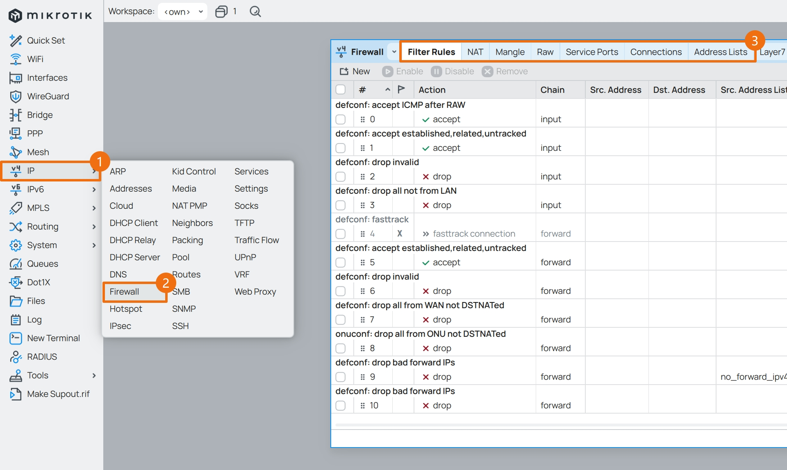
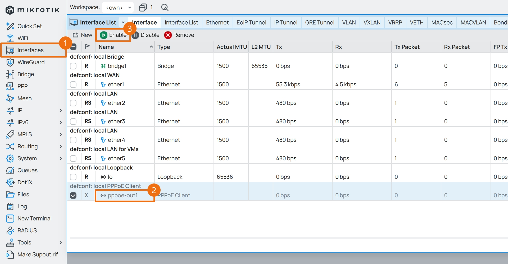
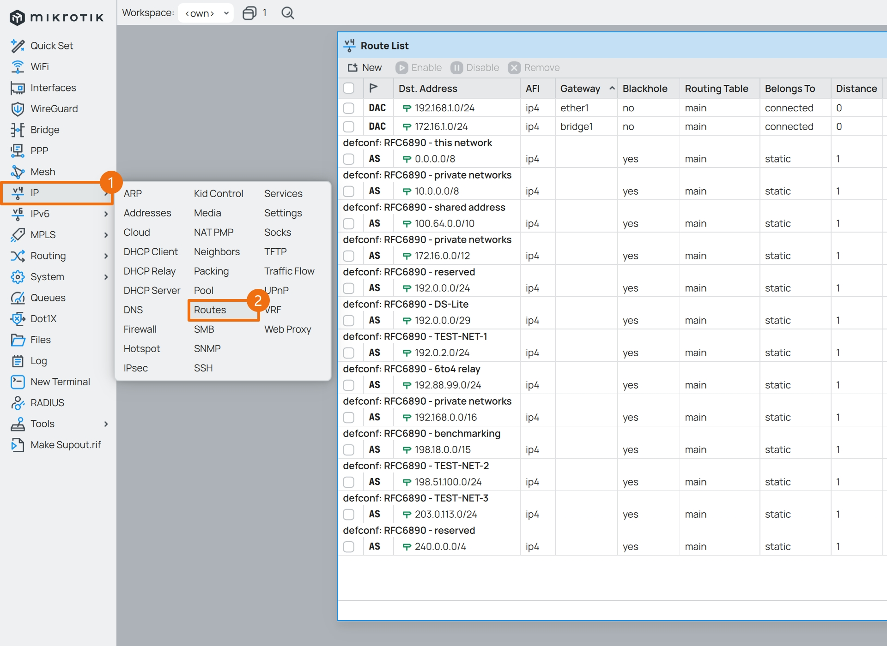

## 1.设置防火墙

在上一篇文章 [04.设置DHCPv4](./04.设置DHCPv4.md) 中，已经设置了 DHCPv4 服务器。  

此时，连接上 RouterOS 的内网设备可以正常获取到 IPv4 地址，但还不能正常访问外网。  

因为此时的 RouterOS 不仅关闭了 PPPoE 连接，而且还未设置防火墙。  

### 1.1.设置 IPv4 防火墙

在设置防火墙之前，请再次检查各 `网络接口` 以及对应的 `端口组` 是否正确。  

|联网模式|端口组名称|端口组成员|
|--|--|--|
|PPPoE|`WAN`|`pppoe-out1`|
||`LAN`|`bridge1`|
||`ONU`|`ether1`|
|DHCPv4|`WAN`|`ether1`|
||`LAN`|`bridge1`|

防火墙配置内容包括 `address-list` 、`filter` 、`nat` 、`mangle` 、`raw` 以及一些和防火墙相关的系统参数。  

防火墙配置命令是基于 RouterOS 官方文档 [Building Advanced Firewall](https://help.mikrotik.com/docs/display/ROS/Building+Advanced+Firewall) 经过少许修改而来。  

主要修改了 `DDoS` 、 `ICMP` 、 `DNS Redirect` 等规则，但尽可能的保证了和官方文档的一致性。  

与连接跟踪相关的配置项，在参考了 Linux 内核默认值以及官方文档 [Connection tracking](https://help.mikrotik.com/docs/display/ROS/Connection+tracking) 后做了如下调整：  

|参数|值|说明|
|--|--|--|
|tcp-syn-sent-timeout|`120s`|TCP SYN 发送超时，系统默认值为 `5s` |
|tcp-syn-received-timeout|`60s`|TCP SYN 接收超时，系统默认值为 `5s` |
|tcp-established-timeout|`7440s`|TCP 已建立连接超时，系统默认值为 `1d` |
|tcp-fin-wait-timeout|`120s`|TCP FIN 等待超时，系统默认值为 `10s` |
|tcp-close-wait-timeout|`60s`|TCP 关闭等待超时，系统默认值为 `10s` |
|tcp-last-ack-timeout|`30s`|TCP 最后确认超时，系统默认值为 `10s` |
|tcp-time-wait-timeout|`120s`|TCP TIME-WAIT 超时，系统默认值为 `10s` |
|tcp-close-timeout|`10s`|TCP 关闭超时，未修改|
|tcp-max-retrans-timeout|`300s`|TCP 最大重传超时，未修改|
|tcp-unacked-timeout|`300s`|TCP 未确认超时，未修改|
|udp-timeout|`30s`|UDP 超时，未修改 |
|udp-stream-timeout|`120s`|UDP 数据流超时，系统默认值为 `180s` |
|icmp-timeout|`30s`|ICMP 超时，系统默认值为 `10s` |
|generic-timeout|`600s`|通用超时，未修改 |

同样是复制防火墙配置命令，一次性全部粘贴到 `CLI` 中执行，即可完成 **“一键配置”** 。  

由于防火墙的配置命令很长，因此请根据实际情况选择对应的 IPv4 防火墙配置脚本。  

|联网模式|内网 DNS |检测 DDoS |防火墙等级|配置脚本|
|--|--|--|--|--|
|PPPoE|否|否|初级|[ros_firewall_ipv4.pppoe.basic.conf](./src/firewall/ros_firewall_ipv4.pppoe.basic.conf)|
||否|否|高级|[ros_firewall_ipv4.pppoe.advanced.conf](./src/firewall/ros_firewall_ipv4.pppoe.advanced.conf)|
||是|是|高级|[ros_firewall_ipv4.pppoe.expert.conf](./src/firewall/ros_firewall_ipv4.pppoe.expert.conf)|
|DHCP|否|否|初级|[ros_firewall_ipv4.dhcp.basic.conf](./src/firewall/ros_firewall_ipv4.dhcp.basic.conf)|
||否|否|高级|[ros_firewall_ipv4.dhcp.advanced.conf](./src/firewall/ros_firewall_ipv4.dhcp.advanced.conf)|
||是|是|高级|[ros_firewall_ipv4.dhcp.expert.conf](./src/firewall/ros_firewall_ipv4.dhcp.expert.conf)|

**需要注意的是，防火墙配置命令中的部分 IPv4 地址，需要根据实际情况进行调整。**   

- 光猫 IPv4 地址： `192.168.1.1`

- 内网 IPv4 地址段： `172.16.1.0/24`
  - RouterOS IPv4 地址： `172.16.1.1`

- 内网 DNS 服务器 IPv4 地址： `172.16.1.2` 、 `172.16.1.3` 、 `172.16.1.50`

需要对应修改 `address-list` 表中的 `local_onu_ipv4` 、 `local_lan_ipv4` 、 `local_dns_ipv4` 这几个地址参数。  


点击 Winbox 左侧导航 `IP` 菜单的子菜单 `Firewall` 并查看防火墙各个选项卡中内容。  



确认防火墙条目与命令中的条目一致后，便可在 `Interfaces` 中启用 PPPoE 拨号。  

启用后， PPPoE 拨号前面的状态显示为 ` R ` ，则表示 PPPoE 已连接。  

此时打开电脑浏览器，尝试对常用的网站进行访问，检查网络是否可用。  



### 1.2.设置 IPv4 黑洞路由

IPv4 黑洞路由 `blackhole route` 是一组静态路由，基于 [RFC6890 - Special-Purpose IP Address Registries](https://www.rfc-editor.org/rfc/rfc6890) 创建，本段内容为可选步骤。  

黑洞路由是一种高效的网络安全机制，用于丢弃特定目的地的流量。  

黑洞路由与常规路由条目可共存于路由表中，但仅在没有更具体匹配时生效，遵循最长前缀匹配原则。  

在复杂网络中实施时，建议先测试并验证黑洞路由对业务数据的影响，以确保不会意外中断关键的业务流量。  

配置 IPv4 黑洞路由时，将以下命令一次性全部粘贴到 `CLI` 中执行即可。  

如果不便复制代码，请查阅文件 [ros_blackhole_ipv4.conf](./src/firewall/ros_blackhole_ipv4.conf) 。  

```bash
/ip route

add blackhole comment="defconf: RFC6890 - this network" disabled=no dst-address=0.0.0.0/8
add blackhole comment="defconf: RFC6890 - private networks" disabled=no dst-address=10.0.0.0/8
add blackhole comment="defconf: RFC6890 - shared address" disabled=no dst-address=100.64.0.0/10
add blackhole comment="defconf: RFC6890 - private networks" disabled=no dst-address=172.16.0.0/12
add blackhole comment="defconf: RFC6890 - reserved" disabled=no dst-address=192.0.0.0/24
add blackhole comment="defconf: RFC6890 - DS-Lite" disabled=no dst-address=192.0.0.0/29
add blackhole comment="defconf: RFC6890 - TEST-NET-1" disabled=no dst-address=192.0.2.0/24
add blackhole comment="defconf: RFC6890 - 6to4 relay" disabled=no dst-address=192.88.99.0/24
add blackhole comment="defconf: RFC6890 - private networks" disabled=no dst-address=192.168.0.0/16
add blackhole comment="defconf: RFC6890 - benchmarking" disabled=no dst-address=198.18.0.0/15
add blackhole comment="defconf: RFC6890 - TEST-NET-2" disabled=no dst-address=198.51.100.0/24
add blackhole comment="defconf: RFC6890 - TEST-NET-3" disabled=no dst-address=203.0.113.0/24
add blackhole comment="defconf: RFC6890 - reserved" disabled=no dst-address=240.0.0.0/4
```

点击 Winbox 左侧导航 `IP` 菜单的子菜单 `Routes` 并查看防火墙各个选项卡中内容。  



至此，RouterOS 设置 IPv4 防火墙步骤完成。  

