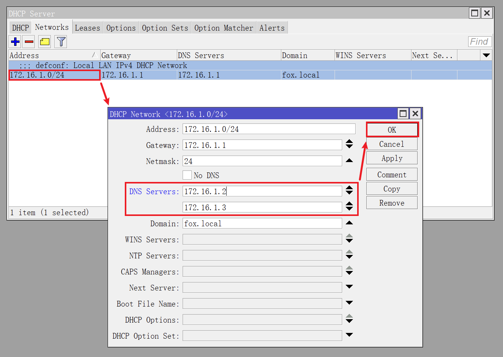

## 0.前景提要

在之前的文章《[01.定义网络接口和基础配置](./01.定义网络接口和基础配置.md)》中，配置了 RouterOS 自身的 DNS 服务器为国内知名 DNS 服务提供商。  

同时配置了 RouterOS DHCP 服务器的 `Networks` 参数，让内网设备在获取 IP 地址时，将 DNS 服务器设置为 RouterOS 的 IP 地址 `172.16.1.1` 。  

在根据我的系列文章《[Adguard Home 折腾手记](https://gitee.com/callmer/adh_toss_notes)》安装并配置了内网 DNS 服务器后，需要调整 RouterOS 的 DNS 和 DHCP 配置。  

让内网设备自动使用 Adguard Home 的 IP 地址作为 DNS 服务器，以达到全局 DNS 加密、广告过滤、恶意网站过滤的目的。

## 1.修改 DHCP 服务器

使用 Winbox 登录 RouterOS 。  

点击左侧导航 `IP` 菜单的子菜单 `DHCP Server` ，切换到 `Networks` 选项卡。  

鼠标 **双击** 下方的网络参数条目，进入配置界面。

在配置界面中，修改 `DNS Servers` 参数为内网两台 DNS 服务器的 IP 地址。  

演示中内网的 DNS 服务器 IP 地址为 `172.16.1.2` 和 `172.16.1.3` ：

DHCP 服务器网络参数修改完成后，如图所示：

## 2.修改 RouterOS DNS

点击左侧导航 `IP` 菜单的子菜单 `DNS` 。  

将 `Servers` 参数同样修改为内网 DNS 的 IP 地址：

设置完成后，内网设备不论是否有自定义的 DNS ，内网设备的 DNS 查询结果都由内网的 DNS 服务器返回。  
