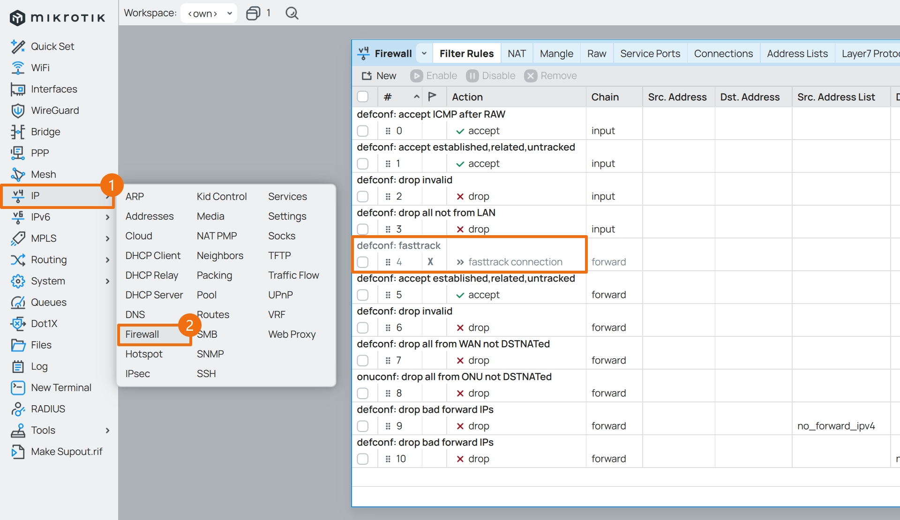
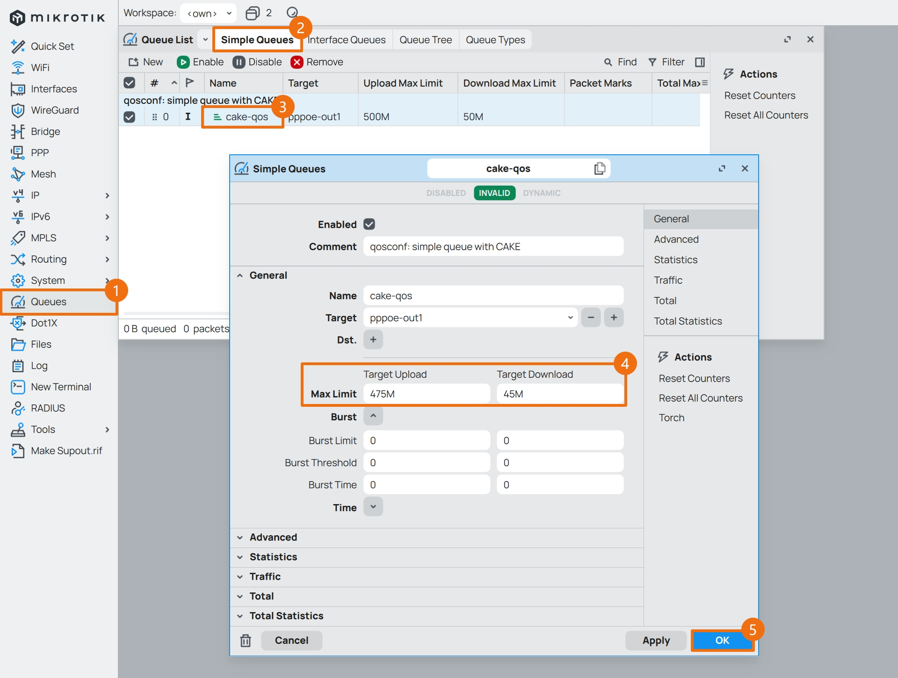
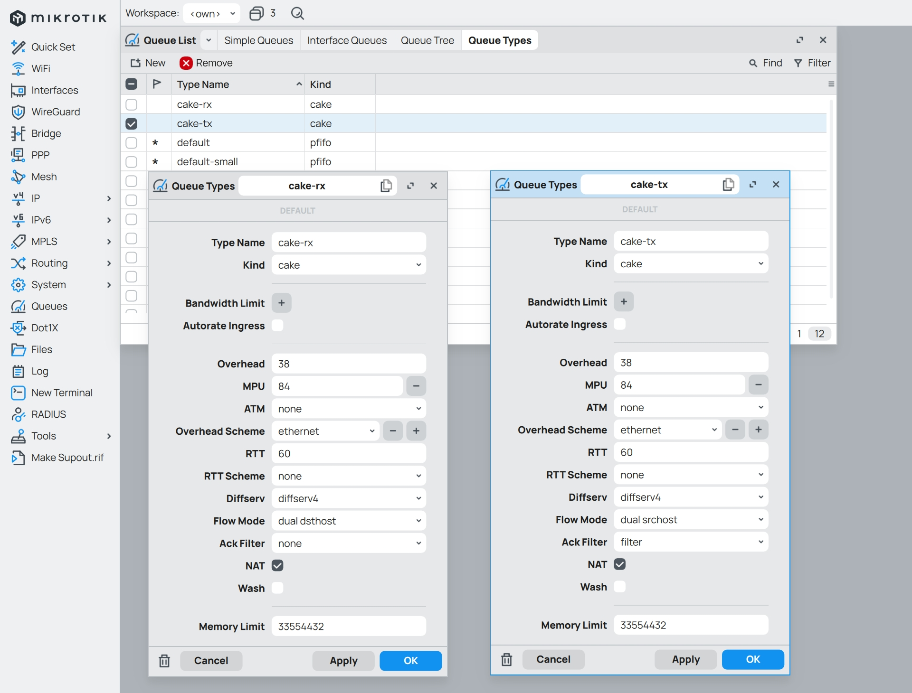
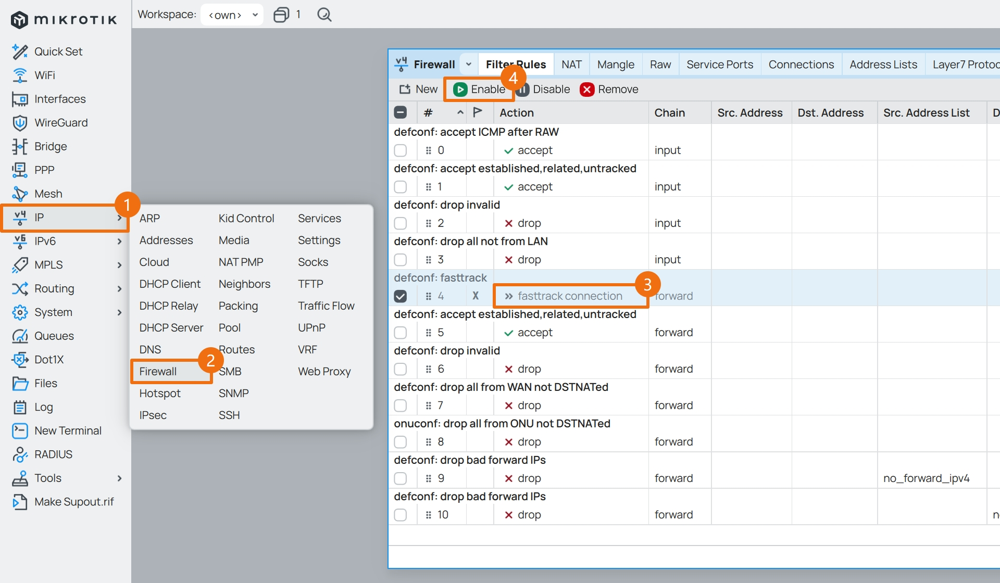
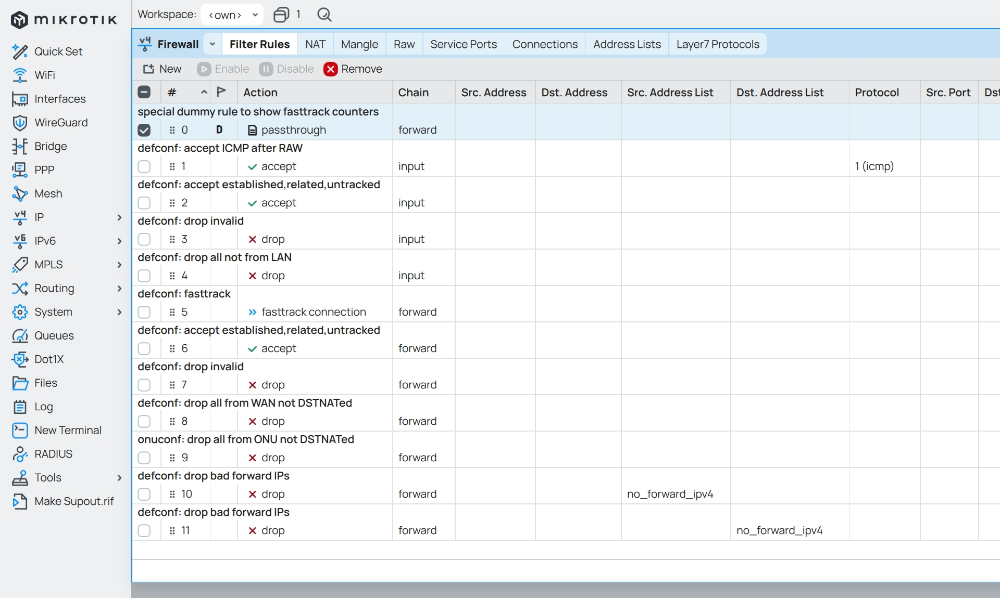
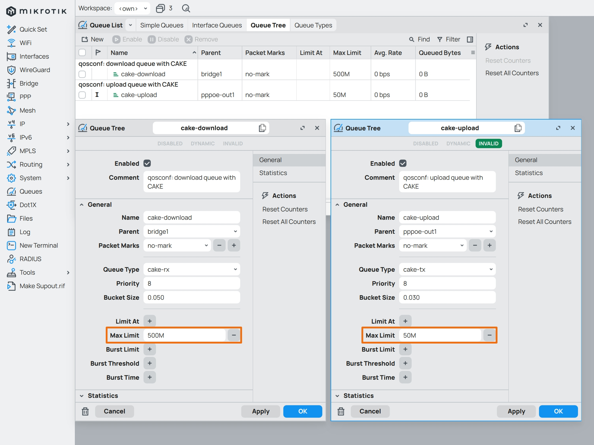
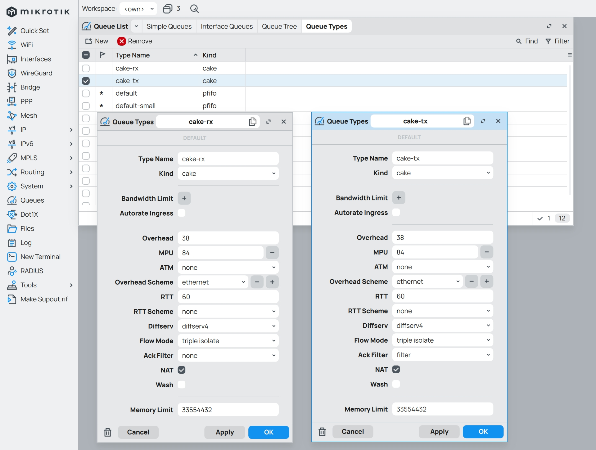

## 1.配置流量整形

在上一篇文章 [05.设置防火墙](./05.设置防火墙.md) 中，已经设置了 IPv4 防火墙，现在开始设置流量整形 QoS 。  

### 1.1.取舍 Fasttrack

可能细心的小伙伴已经察觉到，在防火墙中有个非常重要功能没有打开，那就是 RouterOS 的 `Fasttrack` 功能。  



这个功能的作用是跟踪已建立的连接，并让这些流量走 **“快速通道”** 来降低设备 CPU 使用率。  

但在配置流量整形时，如果使用了 `Simple Queues` 且 `Fasttrack` 为启用状态时，会使 `Simple Queues` 队列失效。  

对于如何取舍 `Fasttrack` 和 `Simple Queues` ，这里提供如下思路：  

- 如果使用的是 CPU 较弱的硬路由（比如 `E50UG` ），请选择开启 `Fasttrack`  

- 如果路由器 CPU 资源已达上限，在测速时仍无法跑满带宽，请选择开启 `Fasttrack`  

- 如果路由器在配置了流量整形后，在测速时反而无法跑满带宽，请选择开启 `Fasttrack`  

根据实际测试，QoS 的处理性能与网卡的 `Multiqueue` 参数（参阅：[00.PVE下安装系统](./00.PVE下安装系统.md) ）以及 CPU 的单核性能有关。   

当 **未设置** 网卡 `Multiqueue` 参数时，`Simple Queues` 在带宽测速时只会使用 **4** 个 CPU 核心中的 **1** 个核心，`Queue Tree` 情况类似。  

具体原因与 `Simple Queues` 和 `Queue Tree` 的设计逻辑有关，也与其设置方法有关，这里不展开说明。  

因此，当在未设置网卡 `Multiqueue` 的情况下使用 `Simple Queues` 或 `Queue Tree` 无法达到 QoS 限速的最大吞吐量时，这意味着当前设备的单核性能有限，建议启用 RouterOS 网卡的 `Multiqueue` 功能（尽管这可能会稍微降低 QoS 效果）。  

然后根据实际情况设置 `Fasttrack` 、`Simple Queues` 、 `Queue Tree` 或 `Interface Queues` ，以将对性能的影响降至最低。  

制约因素总结如下：  

- CPU 的单核性能将制约 QoS 能处理的最大带宽。  

- `Multiqueue` 可让流量 `I/O` 更加 “均衡” 的负载在多个 CPU 核心上，但会略微降低 QoS 效果。  

- `Fasttrack` 可有效降低 CPU 工作负载，但会让 `Simple Queues` 失效。  

- `Fasttrack` 可与 `Interface` 上的 `Queue Tree` 、 `Interface Queues` 协同工作。  

- `Simple Queues` 和 `Queue Tree` 每条队列工作在单个 CPU 核心上，需要 `Multiqueue` 来均衡 CPU 负载。  

- `Interface Queues` 在每个 `Interface` 上仅能应用一种流控算法及参数，不能对上下行流量区别配置。  

- `CAKE` 算法比 `Fq-CoDel` 算法在一定程度上能更好的控制缓冲区肿胀，但 `CAKE` 算法更消耗 CPU 资源。  

### 1.2.确定带宽上限

在执行配置命令之前，有一个十分重要的指标需要依托真实网络环境实测得出，那就是当前外网的 **实际带宽** 。  

目前国内运营商给用户的带宽一般会存在 `20%` 左右的余量，即如果您的宽带签约值为 `500Mbps` ，那么实际测速可能到达 `600Mbps` 左右，而且家用上下行的带宽并不对等，`500Mbps` 的下行带宽运营商可能只会给 `30~50Mbps` 的上行带宽。  

经常遇到的是，当下行带宽跑满时，比如某网络用户使用下载程序下载学习资料，此时其他网络用户在看在线视频或者打网络游戏时就会遇到延迟上升，甚至卡顿，这个现象在上行带宽跑满时尤为明显。  

简单来说，这是因为对带宽的大量占用，触发了运营商 QoS ，也就是运营商的限速，再加上数据包拥塞等一系列原因导致。  

而设置 RouterOS 流量整形的目的就是尽可能的不触发运营商的 QoS。设置思路也很简单，首先在 RouterOS 中设置一个合理的带宽用量上限，然后通过 RouterOS 的流量整形算法，根据不同内网设备的流量需求，均衡合理的动态分配内网带宽，以保证整体内网的网络服务质量，也就是内网的 QoS。  

参考 OpenWrt 官方文档《[SQM (Smart Queue Management)](https://openwrt.org/docs/guide-user/network/traffic-shaping/sqm)》 和《[SQM Details](https://openwrt.org/docs/guide-user/network/traffic-shaping/sqm-details)》，里面详细介绍了如何微调参数，这里结合实际情况，将带宽部分总结如下。  


一句话说明：如果签约带宽高于物理接口速率，那么带宽上限将设定为物理接口速率；如果签约带宽低于物理接口速率，并且实际速率可以超过签约带宽，那么带宽上限将设定为实际速率的平均值。  

**带宽测速一定要使用网线连接路由器，并且断开其他连接路由器的用网设备，以保证带宽测速的准确性。**  

如果实际带宽速率比签约带宽要低，建议检查光猫性能、光衰情况、网线质量、软路由的 CPU 分配，如果这些都没问题，那就是运营商问题，可以打电话给运营商并要求上门维修。  

**当然，为了省事，也可以直接取签约带宽的速率值为带宽上限值。**  

在拿到带宽上限后，分别乘以 `95%` 、 `90%` 、 `85%` ，得到包含带宽上限在内的共计四个档位的速率，留下备用，比如：  

- 下行带宽上限为 `500Mbps`，得到 `475Mbps` 、 `450Mbps` 、 `425Mbps` 共四个档位的速率。  

- 上行带宽上限为 `50Mbps`，得到 `48Mbps` 、 `45Mbps` 、 `43Mbps` 共四个档位的速率。  

### 1.3.配置 Simple Queues

RouterOS 的流量整形设置中，使用了在 Linux 下比较流行的 `CAKE` 算法。  

经过测试，`CAKE` 算法相比经典的 `Fq_CoDel` 算法能更好的控制缓冲区肿胀（Bufferbloat）。  

在使用流量整形命令时，请根据网络环境自行调整相关参数：  

- 带宽 `max-limit=下行带宽M/上行带宽M` 参数  

- 如果是 **光猫拨号** 环境，还需额外调整以下参数  
    - 外网接口 `target=外网接口` 参数  
    - 网络开销方案 `cake-overhead-scheme=开销方案` 参数  

**配置流量整形和调整参数时，建议使用网线连接路由器，并且断开其他连接路由器的用网设备，以保证结果的可靠性。**  

回到之前的终端工具，保留登录了 RouterOS 的终端窗口，新开启一个终端窗口，并使用如下命令。  

```bash
## Linux 和 macOS 系统下
$ ping aliyun.com

## Windows 系统 PowerShell 下
$ ping aliyun.com -t
```

观察 `ping` 命令的响应时间，粗略估计一个时延水平，但 **不要关闭该命令** 。  


然后，将之前测得的上（下）行带宽第一档位速率（也就是上下行带宽上限速率值，演示值为 `500Mbps/50Mbps` ）直接带入 `max-limit=下行带宽M/上行带宽M` 命令部分进行配置，命令如下。  

如果不便复制代码，请查阅文件 [ros_qos_cake.conf](./src/qos/ros_qos_cake.conf) 。  

```bash
/queue type
add name=cake-rx kind=cake cake-diffserv=diffserv4 cake-flowmode=dual-dsthost cake-memlimit=32M cake-rtt=60ms cake-overhead-scheme=ethernet cake-nat=yes
add name=cake-tx kind=cake cake-diffserv=diffserv4 cake-flowmode=dual-srchost cake-memlimit=32M cake-rtt=60ms cake-overhead-scheme=ethernet cake-nat=yes cake-ack-filter=filter

/queue simple
add name=cake-qos comment="qosconf: simple queue with CAKE" bucket-size=0.05/0.03 max-limit=500M/50M target=pppoe-out1 queue=cake-rx/cake-tx
```

执行完成后，用带宽测速工具再次测速，观察测速工具将上（下）行带宽跑满时，`ping` 命令的时延变化。  

如果在上（下）行带宽跑满的时候，出现了如图所示的高时延，并在带宽跑满时持续存在，说明当前上（下）行带宽上限档位过高。  

则需在 Winbox 中将 `Simple Queue` 的带宽速率值下调档位，直到 `ping` 命令的时延不会因为带宽测速而受到影响为止。  


因为队列中使用的是 `pppoe-out1` 接口，所以此处的上下行带宽与 Winbox 中的上下行英文相反。  



以下为 `CAKE` 在 `Simple Queue` 中使用的参数，展示如下。  



### 1.4.配置 Queue Tree

通过研究官方文档，发现另一种流量整形的配置方法可以与 `Fasttrack` 搭配使用，那就是 RouterOS 的 “队列树” `Queue Tree` 。  

根据官方文档有关 [Queues](https://help.mikrotik.com/docs/display/ROS/Queues) 的介绍：  

> If you are using the default configuration, be sure the FastTrack rule is disabled for this particular traffic, otherwise, it will bypass Simple Queues and they will not work.  

> The queue tree creates only a one-directional queue in one of the HTBs. It is also the only way how to add a queue on a separate interface. This way it is possible to ease mangle configuration - you don't need separate marks for download and upload - only the upload will get to the Public interface and only the download will get to a Private interface. The main difference from Simple Queues is that the Queue tree is not ordered - all traffic passes it together.  

根据实际测试，当 `Fasttrack` 开启时，如果 `Queue Tree` 应用于网络接口，比如 `pppoe-out1` 或 `bridge1` ，队列树仍然可以生效。  

回到 Winbox，点击左侧导航 `IP` 菜单的子菜单 `Firewall` ，将 `Fasttrack` 启用。  



此时防火墙中会出现用于显示 `Fasttrack` 数据的条目。  



然后，将之前测得的上（下）行带宽第一档位速率（也就是上下行带宽上限速率值，演示值为 `500Mbps/50Mbps` ）直接带入 `max-limit=下行带宽M(上行带宽M)` 命令部分进行配置，命令如下。  

如果不便复制代码，请查阅文件 [ros_qos_cake.conf](./src/qos/ros_qos_cake.conf) 。  

```bash
/queue type
add name=cake-rx kind=cake cake-diffserv=diffserv4 cake-flowmode=triple-isolate cake-memlimit=32M cake-rtt=60ms cake-overhead-scheme=ethernet cake-nat=yes
add name=cake-tx kind=cake cake-diffserv=diffserv4 cake-flowmode=triple-isolate cake-memlimit=32M cake-rtt=60ms cake-overhead-scheme=ethernet cake-nat=yes cake-ack-filter=filter

/queue tree
add name=cake-download comment="qosconf: download queue with CAKE" bucket-size=0.05 max-limit=500M packet-mark=no-mark parent=bridge1 queue=cake-rx
add name=cake-upload comment="qosconf: upload queue with CAKE" bucket-size=0.03 max-limit=50M packet-mark=no-mark parent=pppoe-out1 queue=cake-tx
```

**注意：`CAKE` 的相关参数与 `Simple Queues` 中的略有不同。**   

执行完成后，用带宽测速工具再次测速，同样观察测速工具将上（下）行带宽跑满时，`ping` 命令的时延变化。  

如果出现了高时延，则需要将对应的带宽速率值下调档位，直到 `ping` 命令的时延不会因为带宽测速而受到影响为止。  



以下为 `CAKE` 在 `Queue Tree` 中使用的参数，方便与之前的对比。  



最后留下一位高手使用 `Fq_CoDel` 算法配置 `Queue Tree` 的方法，以及我在 CHR 中的配置方法，供大家参考。  

高手原版配置命令：  

```bash
/queue type
add fq-codel-limit=1000 fq-codel-quantum=300 fq-codel-target=12ms kind=fq-codel name=fq-codel

/queue tree
add bucket-size=0.01 max-limit=500M name=download packet-mark=no-mark parent=bridge1 queue=fq-codel
add bucket-size=0.01 max-limit=50M name=upload packet-mark=no-mark parent=ether1 queue=fq-codel
```

CHR 中 `Fq_CoDel` 队列树配置命令：  

```bash
/queue type
add name=fq-codel kind=fq-codel fq-codel-limit=2560 fq-codel-memlimit=16M fq-codel-interval=80ms fq-codel-target=4ms

/queue tree
add name=fq-codel-download comment="qosconf: download queue with Fq-CoDel" bucket-size=0.05 max-limit=500M packet-mark=no-mark parent=bridge1 queue=fq-codel
add name=fq-codel-upload comment="qosconf: upload queue with Fq-CoDel" bucket-size=0.03 max-limit=50M packet-mark=no-mark parent=pppoe-out1 queue=fq-codel
```

### 1.5.配置 Interface Queues

RouterOS 的流量整形功能，除了上述两种方案外，还有一种名为 “接口队列” `Interface Queues` 的配置方案。  

根据实际测试，`Interface Queues` 特性如下：  

- 可应用于物理设备（例如 `ether1` ），也可应用于网络接口（例如 `pppoe-out1` 、 `bridge1` ）  

- `Interface Queues` 仅用于选择并设置流控算法，没有带宽设置选项  

- 每个接口仅能使用一个流控算法，无法像 `Queue Tree` 一样对上下行流量区别对待  

- 在设置物理设备时，所选流控算法可以不含带宽参数  

- 在设置网络接口时，所选流控算法必须含有带宽参数  

- `Interface Queues` 可与 `Fasttrack` 、 `Simple Queues` 或 `Queue Tree` 搭配使用  

对于已经使用了 `Simple Queues` 或 `Queue Tree` 的场景，可参考如下配置命令：  

```bash
/queue type
add name=fq-codel-iface kind=fq-codel fq-codel-limit=2560 fq-codel-memlimit=16M

/queue interface
set ether1 queue=fq-codel-iface
set ether2 queue=fq-codel-iface
set ether3 queue=fq-codel-iface
set ether4 queue=fq-codel-iface
set ether5 queue=fq-codel-iface
```

对于硬路由 E50UG ，可仅使用 `Interface Queues` 来达到最大带宽吞吐，并保持相对低延迟：  

```bash
/queue type
add name=fq-codel-iface kind=fq-codel fq-codel-limit=1024 fq-codel-memlimit=8M fq-codel-interval=80ms fq-codel-target=4ms

/queue interface
set ether1 queue=fq-codel-iface
set ether2 queue=fq-codel-iface
set ether3 queue=fq-codel-iface
set ether4 queue=fq-codel-iface
set ether5 queue=fq-codel-iface
```

感兴趣的小伙伴可以在此基础上进一步调试。  

根据官方文档，虽然在 `Fasttrack` 关闭时支持将 `Simple Queues` 和 `Queue Tree` 同时使用，以达到 “双重流控” 的效果，但本文中的示例配置方法并不支持同时使用两种流控，如果你拥有高性能硬件支持 “双重流控” ，欢迎分享你的 QoS 配置方案。  

至此，RouterOS 设置流量整形步骤完成。  

