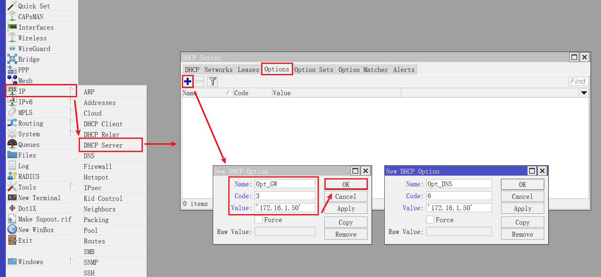
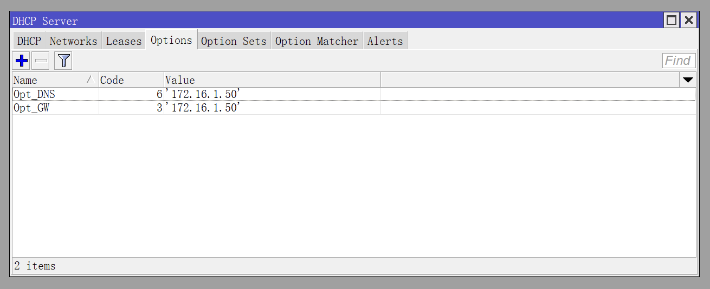
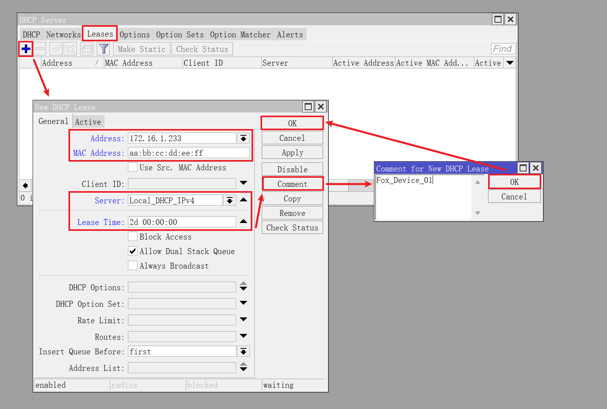
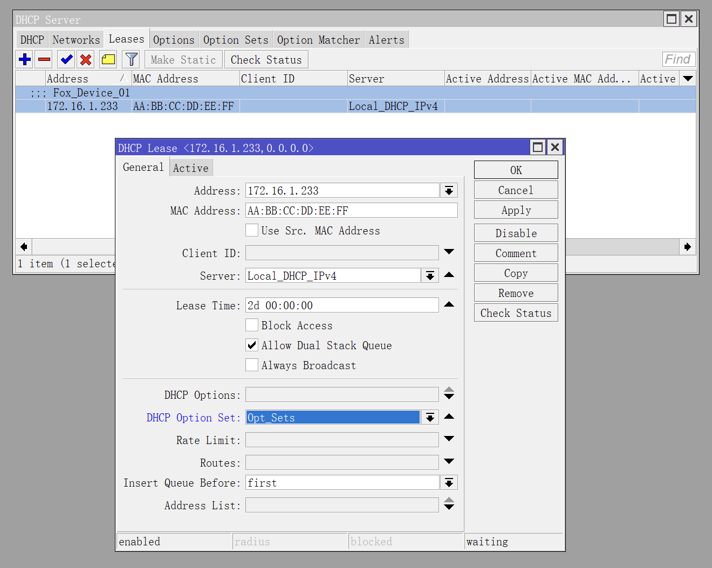
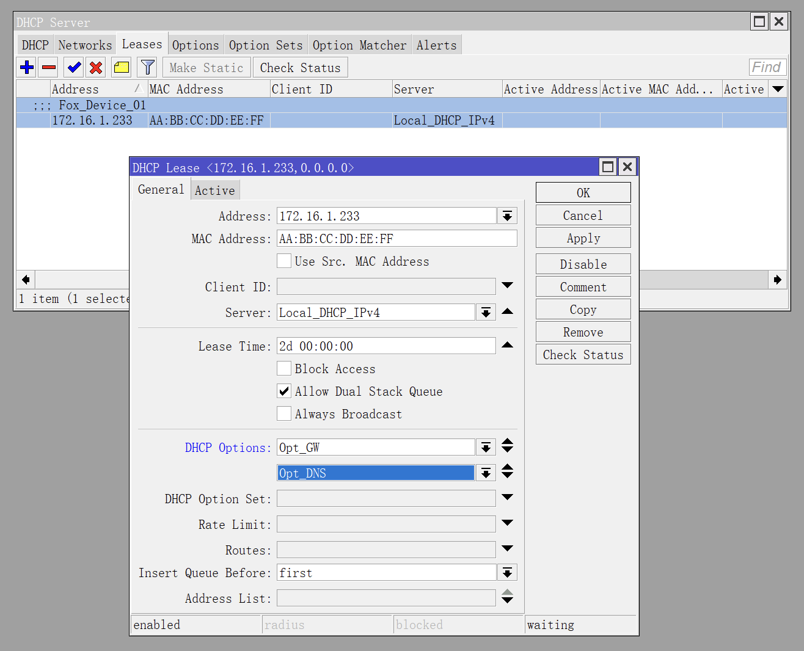

## 1.设置 DHCP Options

通过设置 DHCPv4 的 `Options` 参数，可以让内网设备从 DHCPv4 服务器中获取指定的 `网关地址` 和 `DNS 地址` 。  

演示用的 IPv4 地址均为 `172.16.1.50` 。  

使用 Winbox 登录 RouterOS ，点击左侧导航 `IP` 菜单的子菜单 `DHCP Server` 。  

切换到 `Options` 选项卡，点击 ` + ` 按钮：  

在弹出的 `New DHCP Options` 对话框中修改 `Name` 、 `Code` 、 `Value` 三个参数。  

|参数|值1|值2|说明|
|--|--|--|--|
|Name|`Opt_GW`|`Opt_DNS`|参数名称，可自定义|
|Code|`3`|`6`|`3` 表示设置网关地址，`6` 表示设置 DNS 地址|
|Value|`'172.16.1.50'`|`'172.16.1.50'`|填入对应的 IP 地址，需要用 **单引号** 括起来|

设置完成后，如下图所示：  

切换到 `Option Sets` 选项卡，点击 ` + ` 按钮，新增一个 “参数组” 。  

在弹出的 `New DHCP Option Set` 对话框中修改 `Name` 、 `Options` 两个参数。  

通过 `Options` 条目右侧按钮，可以添加多个 `Option` 参数。  

## 2.设置 DHCP 静态地址

切换到 `Leases` 选项卡，点击 ` + ` 按钮，新增一个 DHCPv4 静态地址。  

在 `New DHCP Lease` 对话框中修改参数，参数说明如下：  

|参数|值|说明|
|--|--|--|
|Address|`172.16.1.233`|指定的静态 IPv4 地址，需要与 DHCPv4 服务器同网段|
|MAC Address|`aa:bb:cc:dd:ee:ff`|设备的 MAC 地址|
|Server|`Local_DHCP_IPv4`|选择 DHCPv4 服务器|
|Lease Time|`2d 00:00:00`|设备 IPv4 地址租期|
|Comment|`Fox_Device_01`|设备备注信息，用英文填写|

点击 `OK` 后，该设备的静态 IP 地址设置完成，让设备重新联网即可获取指定的 IPv4 地址。  

如果需要让该设备使用指定的 DHCP 参数，可以修改 `DHCP Option Set` 参数：  

或者，逐一修改 `DHCP Options` 参数：  

区别在于，使用了 `DHCP Option Set` 后， “参数组” 内的所有 DHCP 参数都将应用于该设备。  

使用 `DHCP Options` 则可以对该设备的 DHCP 参数进行精细化设置。  

建议 `DHCP Options` 和 `DHCP Option Set`  **不要同时使用** 。  

只有配置了 DHCP Option 的内网设备才能获取指定的 DHCP 参数，而其他设备不受影响。  
