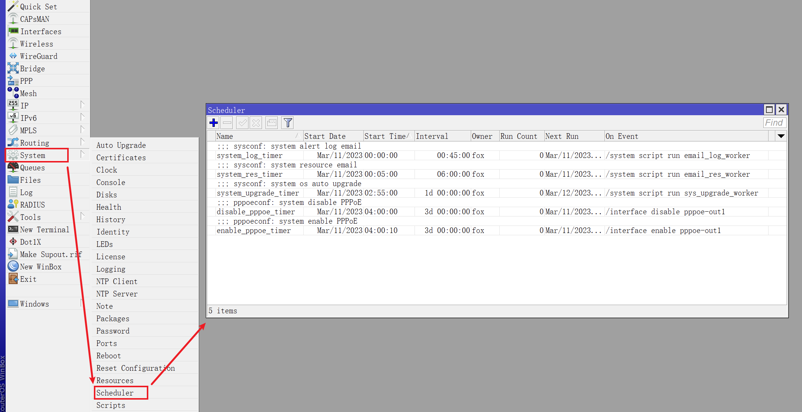
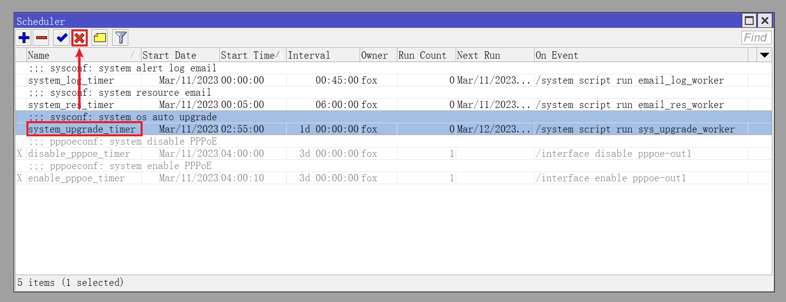
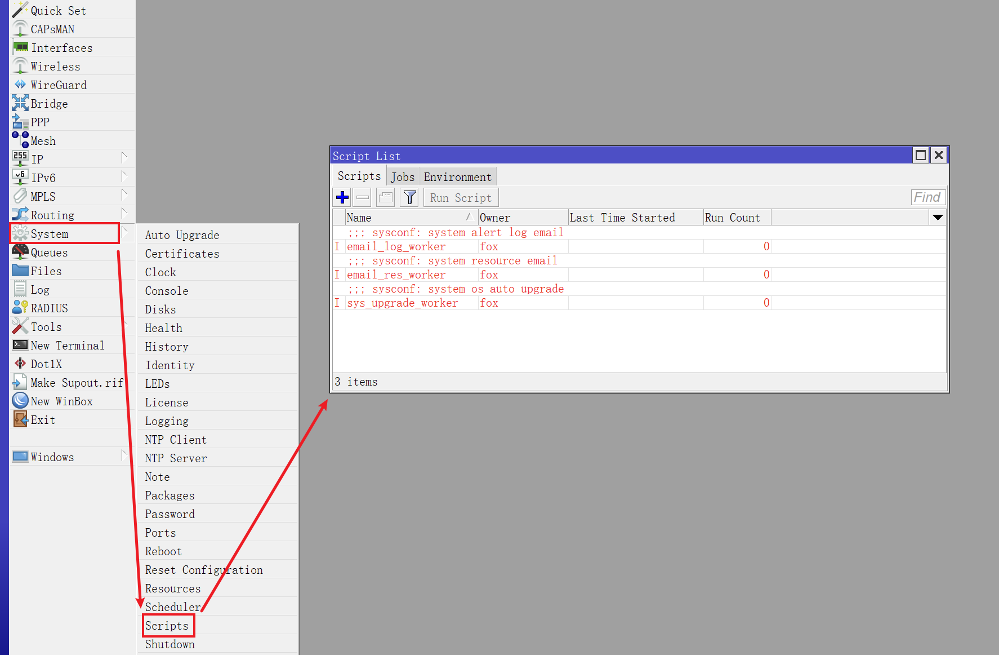
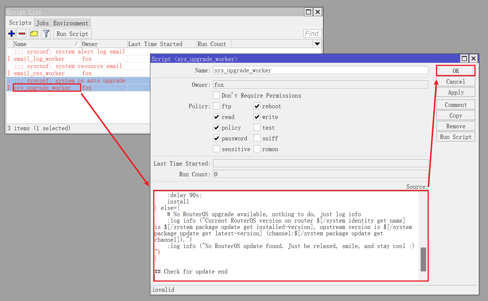
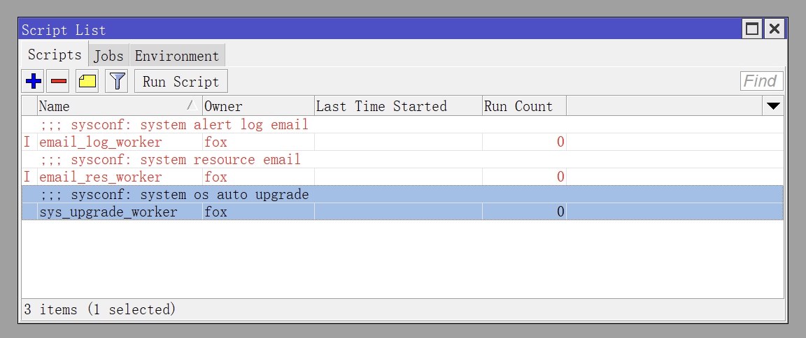
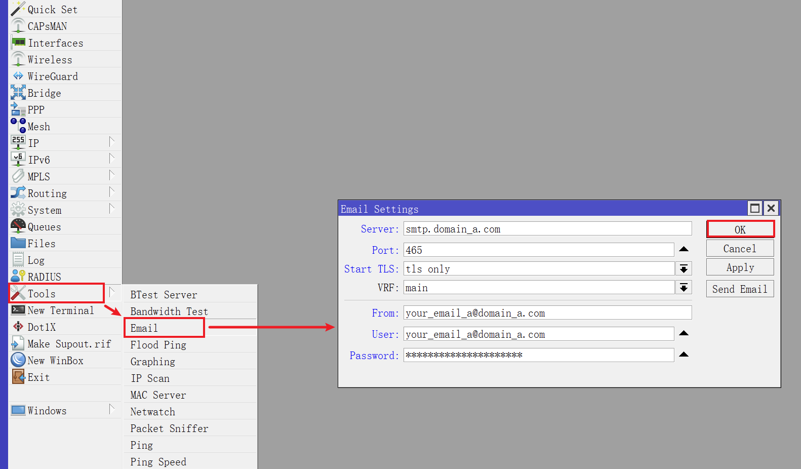
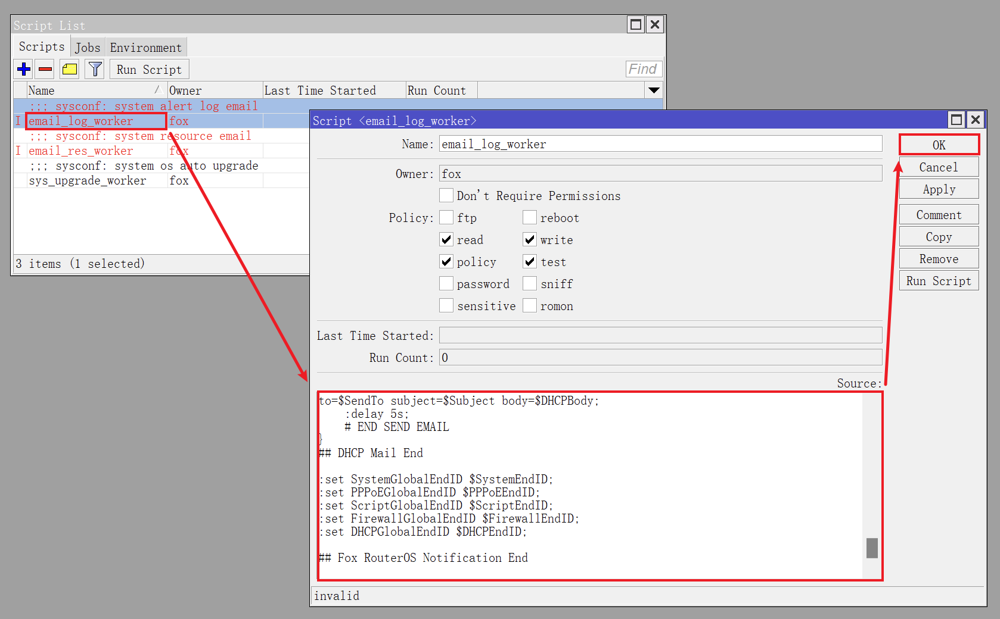
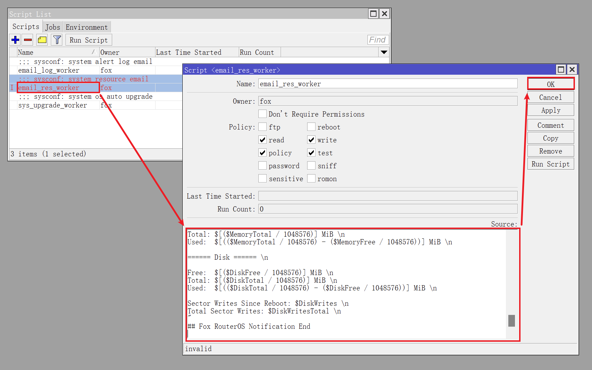
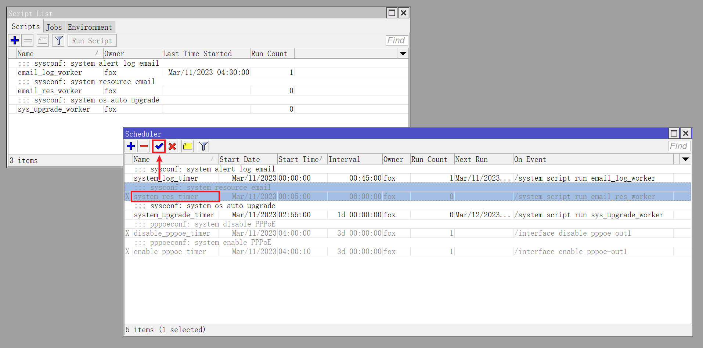

## 0.前期准备

在上一篇文章 [06.设置流量整形](./06.设置流量整形.md) 中，已经设置了 QoS ，现在开始设置系统定时任务。  

RouterOS 提供了强大的脚本能力，搭配系统的定时器功能，可以实现一些高级自动化操作。  

在正式开始之前需要做一些准备工作：

- 对于使用 **CHR 版本** RouterOS 的软路由  
    - 自动更新脚本，请查阅 [ros_sys_upgrade_worker_chr.conf](./src/upgrade/ros_sys_upgrade_worker_chr.conf)  
    - 系统日志邮件脚本，请查阅 [ros_email_log_worker.conf](./src/email/ros_email_log_worker.conf)  
    - 系统资源邮件脚本，请查阅 [ros_email_res_worker_chr.conf](./src/email/ros_email_res_worker_chr.conf)  


- 对于使用 **Mikrotik 原生** RouterOS 的硬路由  
    - 自动更新脚本，请查阅 [ros_sys_upgrade_worker_native.conf](./src/upgrade/ros_sys_upgrade_worker_native.conf)  
    - 系统日志邮件脚本，与 CHR 版本相同  
    - 系统资源邮件脚本，与 CHR 版本略有不同，请参考 [ros_email_res_worker_native.conf](./src/email/ros_email_res_worker_native.conf)  

- 使用系统发送邮件功能，需要准备一个邮箱并开启 `SMTP` 服务，推荐使用QQ邮箱或163邮箱  

## 1.定时器和脚本初始化

定时器和脚本配置较为复杂，所以推荐使用 SSH 工具在 RouterOS 的命令行环境下进行配置。  

在前篇文章中，我们不仅新建了一个系统管理员账号，同时在修改系统参数过程中对 SSH 服务进行过调整。  

如果修改过 SSH 服务的端口，在使用 `ssh` 命令登录 RouterOS 时，需要带上端口号。  

使用 **新的** 系统管理员账户进行登录：  

```bash
## 使用新管理员账户 fox 进行 ssh 登录
ssh fox@172.16.1.1

## 修改了 SSH 服务端口时的 ssh 登录
## 演示端口号为 5022 
ssh fox@172.16.1.1 -p 5022
```

RouterOS 的定时器将会创建 5 个，分别为：  

1. 定时触发系统日志邮件脚本  

2. 定时触发系统资源邮件脚本  

3. 定时触发系统自动更新脚本  

4. 定时断开 PPPoE 连接  

5. 定时重连 PPPoE 连接  

RouterOS 的脚本将会创建 3 个，分别为：  

1. 系统日志邮件脚本  

2. 系统资源邮件脚本  

3. 系统自动更新脚本  

在 RouterOS 的命令行环境下，将以下命令一次性全部粘贴到终端工具中即可初始化定时器和脚本：  

```bash
/system scheduler

add comment="sysconf: system alert log email" interval=45m name=system_log_timer on-event="/system script run email_log_worker" policy=read,write,policy,test start-time=00:00:00
add comment="sysconf: system resource email" interval=6h name=system_res_timer on-event="/system script run email_res_worker" policy=read,write,policy,test start-time=00:05:00

add comment="sysconf: system os auto upgrade" interval=1d name=system_upgrade_timer on-event="/system script run sys_upgrade_worker" policy=reboot,read,write,policy,password start-time=02:55:00

add comment="pppoeconf: system disable PPPoE" interval=3d name=disable_pppoe_timer on-event="/interface disable pppoe-out1" policy=write start-time=04:00:00
add comment="pppoeconf: system enable PPPoE" interval=3d name=enable_pppoe_timer on-event="/interface enable pppoe-out1" policy=write start-time=04:00:10

/system script

add comment="sysconf: system alert log email" dont-require-permissions=no name=email_log_worker policy=read,write,policy,test source=""
add comment="sysconf: system resource email" dont-require-permissions=no name=email_res_worker policy=read,write,policy,test source=""

add comment="sysconf: system os auto upgrade" dont-require-permissions=no name=sys_upgrade_worker policy=reboot,read,write,policy,password source=""

```

如果这段代码不好复制，请查阅文件 [ros_schedule_script.conf](./src/schedule/ros_schedule_script.conf) 进行复制。  

其中 `interval` 参数为定时器执行周期，`start-time` 参数为每天的触发时刻，各脚本时间设置汇总如下：  

|名称|开始时间|执行周期|说明|
|--|--|--|--|
|system_log_timer|00:00:00|45m|每 `45分钟` 执行一次系统日志触发器|
|system_res_timer|00:05:00|6h|每 `6小时` 执行一次系统资源触发器|
|system_upgrade_timer|02:55:00|1d|每 `1天` 执行一次系统更新触发器|
|disable_pppoe_timer|04:00:00|3d|每 `3天` 执行一次断连 PPPoE|
|enable_pppoe_timer|04:00:10|3d|每 `3天` 执行一次重连 PPPoE|
 
命令执行完毕后，打开 Winbox ，点击左侧导航 `System` 菜单的子菜单 `Scheduler` ，可以看到已有 5 个定时器：  



如果需要禁用某个定时器，使用鼠标 **单击** 选中定时器，点击 ` × ` 按钮，即可禁用该定时器：  



## 2.完善系统更新脚本

点击 Winbox 左侧导航 `System` 菜单的子菜单 `Scripts` ，可以看到已有 3 个脚本：  



但脚本条目均为红色，因为之前的命令只设置了脚本的基本参数，还未添加脚本代码。  

根据所使用的 RouterOS 版本不同，从给 CHR 软路由用的 [ros_sys_upgrade_worker_chr.conf](./src/upgrade/ros_sys_upgrade_worker_chr.conf) 和给原生硬件用的 [ros_sys_upgrade_worker_native.conf](./src/upgrade/ros_sys_upgrade_worker_native.conf) 两个更新脚本中选择一个，并复制其代码。  

鼠标 **双击** 系统自动更新脚本 `sys_upgrade_worker` ，进入脚本配置界面，在 `Source` 处粘贴脚本代码：   



脚本粘贴完成后， `sys_upgrade_worker` 脚本将转变为正常状态：  



## 3.系统邮件通知

### 3.1.准备发信邮箱

RouterOS 支持使用 `SMTP` 协议进行邮件发送，推荐使用国内的QQ邮箱或163邮箱。  

需要说明的是，这里使用邮箱主要在发送 **系统日志信息** 和 **系统资源信息** ，如果无需邮件发送功能，可以跳过本段内容。  

本文以163邮箱作为演示，登录163邮箱后，点击顶部 `设置` 菜单的子菜单 `POP3/SMTP/IMAP` ：


点击 `POP3/SMTP服务` 右侧的 `开启` ：  


根据提示信息进行安全认证之后，就能拿到一个第三方客户端的 **授权密码** ，该密码只出现一次，因此需要将密码复制出来并保存。  

`使用设备` 处填写一个备注，以便后续区分：  


然后找到 `SMTP` 服务器地址 `smtp.163.com` ，并记录下 `SSL` 端口号 `465` ：  


### 3.2.设置 RouterOS 邮件服务

回到 Winbox，点击左侧导航 `Tools` 菜单的子菜单 `Email` ，对邮件服务进行设置：  

|参数|值|说明|
|--|--|--|
|Server|`smtp.163.com`|SMTP服务器地址|
|Port|`465`|SMTP服务端口|
|Start TLS|`tls only`|使用 SSL |
|From|`your_163@163.com`|发件箱地址，即刚才的163邮箱地址|
|User|`your_163@163.com`|账户，与 From 相同|
|Password|************|邮箱的授权密码|

参考表格中的内容填写相关参数，`From` 和 `User` 均为刚开启了 `SMTP` 服务的邮箱地址，`Password` 为刚获取的授权密码，设置完成后点击 `OK` ：  



### 3.3.完善系统日志邮件脚本

复制 [ros_email_log_worker.conf](./src/email/ros_email_log_worker.conf) 中的脚本代码，并使用文本编辑器工具对脚本中有关 **邮箱部分** 参数进行修改：  

```bash
## Resolve Mail Server
:local MailServer "smtp.163.com";                    # Need to customize
:local MailPort "465";
:local MailTls "yes";
:local SendFrom "your_163_email_account@163.com";    # Need to customize
:local SendTo "your_qq_email_account@qq.com";        # Need to customize
:local MailIp;
:set MailIp [:resolve $MailServer ];
:delay 1s;
## Resolve End
```

**注意：**  
**Windows 环境下的一些文本编辑工具会在编辑文本时增加额外“空格”，并修改“换行符”。**  
**推荐使用 [Notepad3](https://www.rizonesoft.com/downloads/notepad3/) 、[Visual Studio Code](https://code.visualstudio.com/Download) 这类代码编辑器。**  

点击 Winbox 左侧导航 `System` 菜单的子菜单 `Scripts` ，鼠标 **双击** 系统日志邮件脚本 `email_log_worker` 。  

进入脚本配置界面后，在 `Source` 处粘贴脚本代码：  



### 3.4.完善系统资源邮件脚本

同样，根据所使用的 RouterOS 版本不同，从给 CHR 软路由用的 [ros_email_res_worker_chr.conf](./src/email/ros_email_res_worker_chr.conf) 和给原生硬件用的 [ros_email_res_worker_native.conf](./src/email/ros_email_res_worker_native.conf) 两个脚本中选择一个，复制其代码，与 **系统日志邮件脚本** 一样，需要修改 **邮箱部分** 参数。  

如果实际网络环境中没有使用 PPPoE 拨号，则需要额外修改有关 **外网接口部分** 参数：  

```bash
## Fox RouterOS Notification
:local Project "RESOURCES REPORT";
:local WanInterface "pppoe-out1";            # Need to customize
:local updChannel "stable";
```

鼠标 **双击** 系统资源邮件脚本 `email_res_worker` ，进入脚本配置界面，在 `Source` 处粘贴脚本代码：  



设置完成后，如果之前禁用了两个系统邮件脚本的定时器，现在可以重新将其启用。  

点击 Winbox 左侧导航 `System` 菜单的子菜单 `Scheduler` ，使用鼠标 **单击** 选中定时器，点击 ` ✓ ` 按钮进行启用：  



至此 RouterOS 设置定时任务步骤完成，系统会定时自动升级，并将系统的日志、资源信息发送给指定的邮箱。  

结合 PVE 的周期性重启及备份策略，保证了路由器系统的健康运行。  

