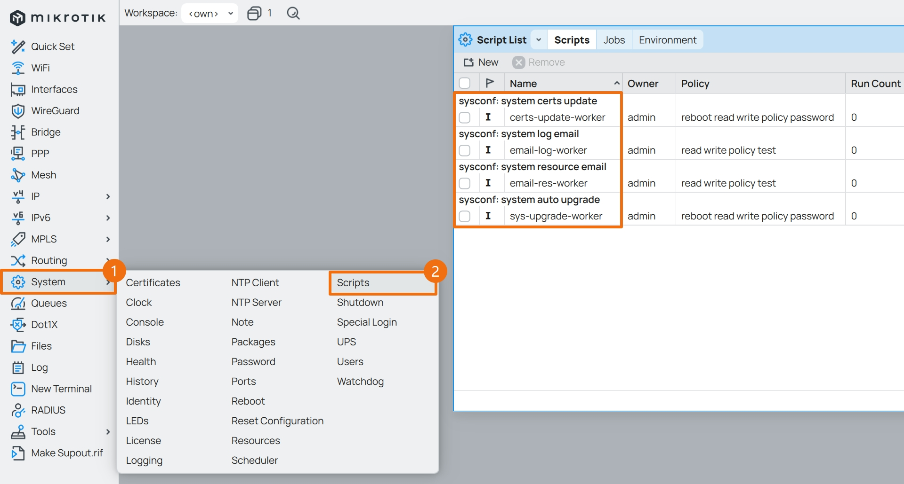
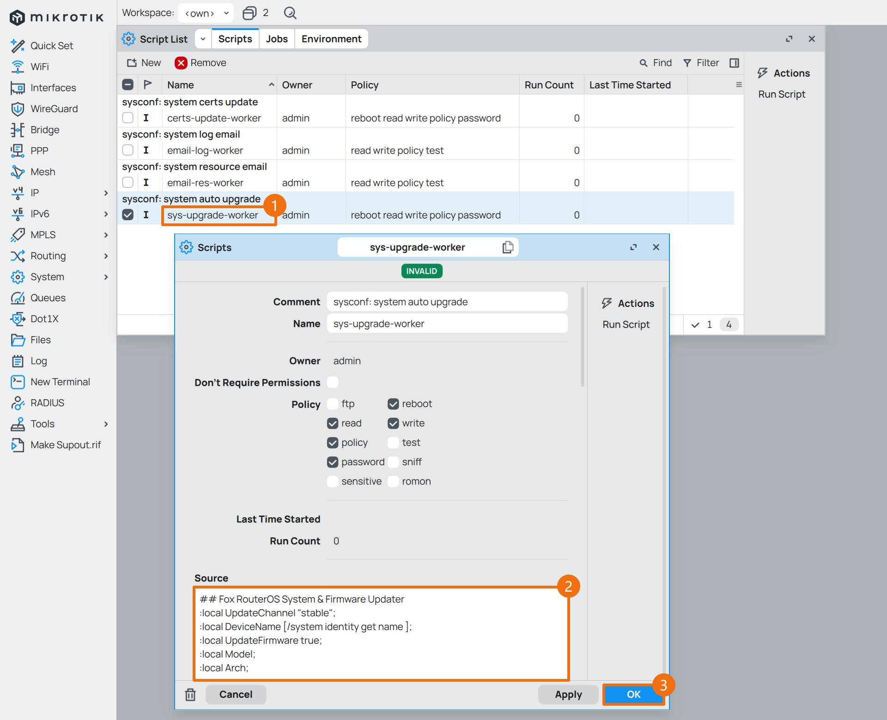
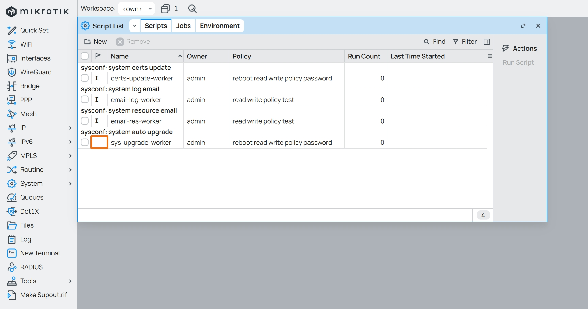
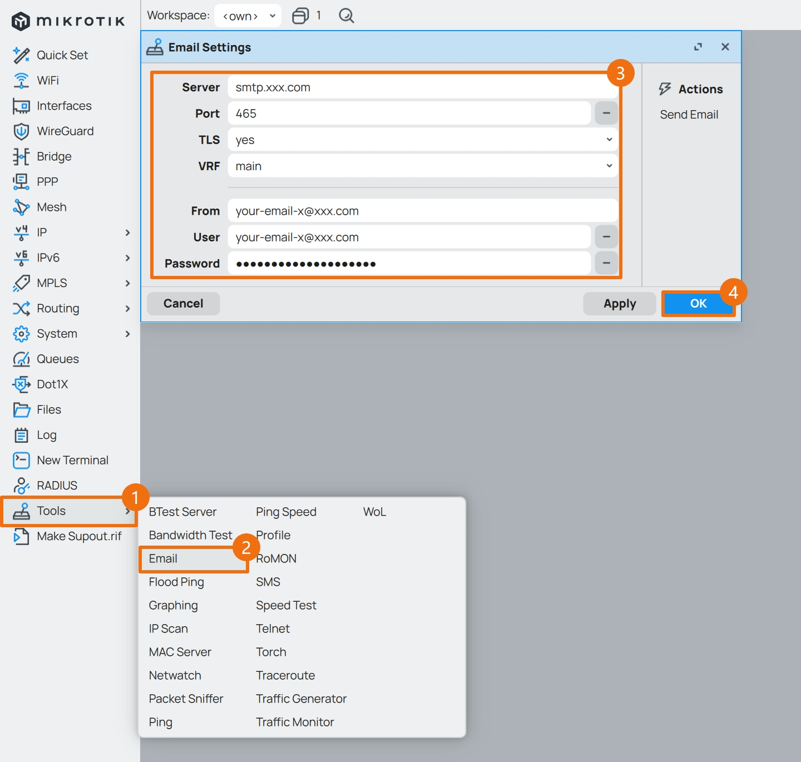
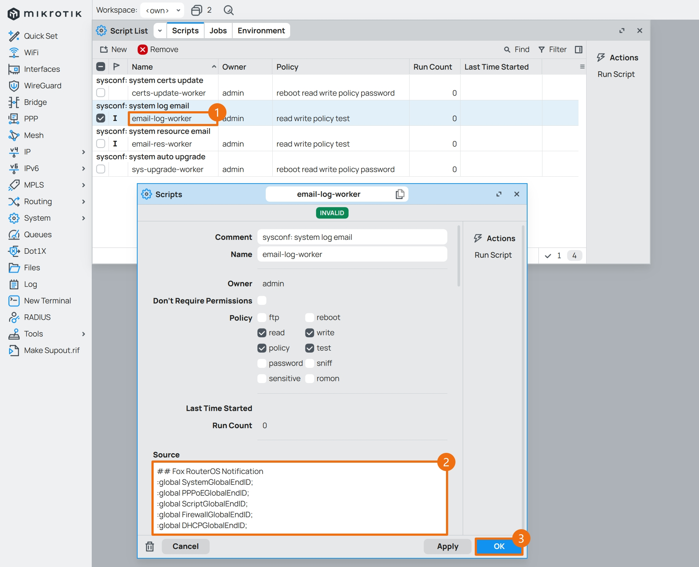
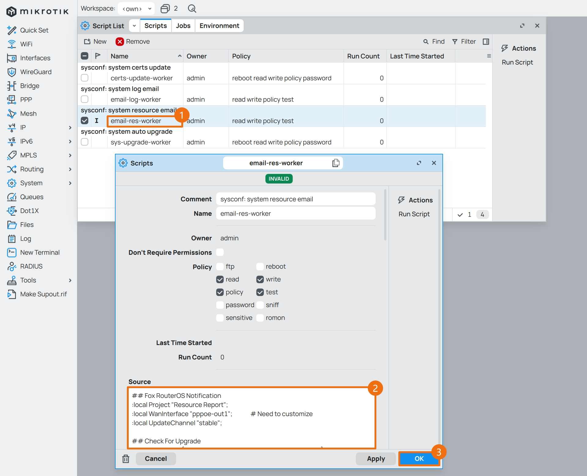

## 0.前期准备

在上一篇文章 [06.设置流量整形](./06.设置流量整形.md) 中，已经设置了 QoS ，现在开始设置系统定时任务。  

RouterOS 提供了强大的脚本能力，搭配系统的定时器功能，可以实现一些高级自动化操作。  

- 如果后续将根据文章 [09.设置系统参数](./09.设置系统参数.md#4设置系统账户) 创建额外的系统管理员账户，建议优先执行账户相关设置。  

- 由于涉及运行权限，因此在创建定时器和脚本时，请使用具有管理权限的系统账户。  

在正式开始之前需要做一些准备工作：  

- 要使用 RouterOS 发送邮件功能，需要准备一个邮箱并开启 `SMTP` 服务，推荐使用 QQ 邮箱或 163 邮箱  

- 对于使用 **CHR 版本** RouterOS 的软路由  
    - 系统自动更新脚本，请查阅文件 [ros_sys_upgrade_worker.conf](./src/upgrade/ros_sys_upgrade_worker.conf)  
    - 系统日志邮件脚本，请查阅文件 [ros_email_log_worker.conf](./src/email/ros_email_log_worker.conf)  
    - 系统资源邮件脚本，请查阅文件 [ros_email_res_worker.chr.conf](./src/email/ros_email_res_worker.chr.conf)  


- 对于使用 **Mikrotik 原生** RouterOS 的硬路由  
    - 系统自动更新脚本，与 CHR 版本相同  
    - 系统日志邮件脚本，与 CHR 版本相同  
    - 系统资源邮件脚本，与 CHR 版本略有不同，请查阅文件 [ros_email_res_worker.native.conf](./src/email/ros_email_res_worker.native.conf)  

## 1.定时器和脚本初始化

定时器和脚本配置较为复杂，因此推荐使用 RouterOS 自带的终端工具 `Terminal` 进行配置。  

如果使用第三方终端工具登录 RouterOS ，`ssh` 命令演示如下。  

```bash
## 使用管理员账户 admin 进行 SSH 登录
$ ssh admin@172.16.1.1

## 修改了 SSH 服务端口时的 SSH 登录
## 演示端口号为 5022
$ ssh admin@172.16.1.1 -p 5022
```

RouterOS 的定时器将会创建 5 个，分别为：  

1. 定时触发系统日志邮件脚本  

2. 定时触发系统资源邮件脚本  

3. 定时触发系统自动更新脚本  

4. 定时断开 PPPoE 连接  

5. 定时重连 PPPoE 连接  

RouterOS 的脚本将会创建 3 个，分别为：  

1. 系统日志邮件脚本  

2. 系统资源邮件脚本  

3. 系统自动更新脚本  

在 RouterOS 的命令行环境下，将以下命令一次性全部粘贴到 `CLI` 中执行，即可初始化定时器和脚本。  

如果不便复制代码，请查阅文件 [ros_schedule_script.pppoe.conf](./src/schedule/ros_schedule_script.pppoe.conf) 。  

```bash
/system scheduler

add comment="sysconf: system log email" interval=45m name=system-log-timer on-event="/system script run email-log-worker" policy=read,write,policy,test start-time=00:00:00
add comment="sysconf: system resource email" interval=6h name=system-res-timer on-event="/system script run email-res-worker" policy=read,write,policy,test start-time=00:05:00

add comment="sysconf: system auto upgrade" interval=1d name=system-upgrade-timer on-event="/system script run sys-upgrade-worker" policy=reboot,read,write,policy start-time=02:55:00

add comment="pppoeconf: disable pppoe-out1" interval=3d name=disable-pppoe-timer on-event="/interface disable pppoe-out1" policy=write start-time=04:00:00
add comment="pppoeconf: enable pppoe-out1" interval=3d name=enable-pppoe-timer on-event="/interface enable pppoe-out1" policy=write start-time=04:00:10


/system script

add comment="sysconf: system log email" dont-require-permissions=no name=email-log-worker policy=read,write,policy,test source=""
add comment="sysconf: system resource email" dont-require-permissions=no name=email-res-worker policy=read,write,policy,test source=""

add comment="sysconf: system auto upgrade" dont-require-permissions=no name=sys-upgrade-worker policy=reboot,read,write,policy source=""
```

其中 `interval` 参数为定时器执行周期，`start-time` 参数为每天的触发时刻，各脚本时间设置汇总如下。  

|名称|开始时间|执行周期|说明|
|--|--|--|--|
|system-log-timer|00:00:00|45m|每 `45分钟` 执行一次系统日志触发器|
|system-res-timer|00:05:00|6h|每 `6小时` 执行一次系统资源触发器|
|system-upgrade-timer|02:55:00|1d|每 `1天` 执行一次系统更新触发器|
|disable-pppoe-timer|04:00:00|3d|每 `3天` 执行一次断连 PPPoE|
|enable-pppoe-timer|04:00:10|3d|每 `3天` 执行一次重连 PPPoE|
 
命令执行完毕后，打开 Winbox ，点击左侧导航 `System` 菜单的子菜单 `Scheduler` ，可以看到已有 5 个定时器。  


如果需要禁用某个定时器，使用鼠标 **单击** 选中定时器，点击 `Disable` ，即可禁用该定时器。  


## 2.完善系统更新脚本

点击 Winbox 左侧导航 `System` 菜单的子菜单 `Scripts` ，可以看到已有 3 个脚本。  



首先设置系统自动更新脚本，复制 [ros_sys_upgrade_worker.conf](./src/upgrade/ros_sys_upgrade_worker.conf) 中的脚本代码。  

鼠标 **双击** 系统自动更新脚本 `sys-upgrade-worker` ，进入脚本配置界面，在 `Source` 处粘贴脚本代码。   



脚本输入完成后，`sys-upgrade-worker` 状态里代表脚本无效的 `I` 标志会消失。  



## 3.系统邮件通知

### 3.1.准备发信邮箱

需要说明的是，这里主要发送 **系统日志信息** 和 **系统资源信息** 相关邮件，若无需邮件提醒功能，可跳过本段内容。  

本文以 163 邮箱作为演示，登录 163 邮箱后，点击顶部 `设置` 菜单的子菜单 `POP3/SMTP/IMAP` 。  


点击 `POP3/SMTP服务` 右侧的 `开启` 。  


根据提示信息进行安全认证之后，就能拿到一个第三方客户端的 **授权密码** ，该密码只出现一次，因此需要将密码复制出来并保存。  

`使用设备` 处填写一个备注，以便后续区分。  


然后找到 `SMTP` 服务器地址 `smtp.163.com` ，并记录下加密传输端口号，目前更推荐使用 `587` 端口。  


### 3.2.设置 RouterOS 邮件服务

回到 Winbox，点击左侧导航 `Tools` 菜单的子菜单 `Email` ，对邮件服务进行设置。  

|参数|值|说明|
|--|--|--|
|Server|`smtp.xxx.com`| SMTP 服务器地址，例如 `smtp.163.com`|
|Port|`587`|SMTP 服务加密传输端口<br>163 邮箱文档中注明端口为 `465/994` ，但 `587` 端口也能使用|
|TLS|`yes`|严格使用 TLS 加密|
|From|`your-email-x@xxx.com`|发件箱地址，例如 `fox@163.com`|
|User|`your-email-x@xxx.com`|账户，与 `From` 相同，例如 `fox@163.com`|
|Password|`************`|邮箱的授权密码|
|Certificate Verification|`yes`|验证服务器证书|

参考表格中的内容，`From` 和 `User` 均为刚开启了 `SMTP` 服务的邮箱地址，`Password` 为刚获取的授权密码，设置完成后点击 `OK` 。  



### 3.3.完善系统日志邮件脚本

复制 [ros_email_log_worker.conf](./src/email/ros_email_log_worker.conf) 中的脚本代码，并使用文本编辑器工具对脚本中有关 **邮箱部分** 参数进行修改。  

- Windows 部分文本编辑器，会额外加空格且修改换行符，推荐使用 [Visual Studio Code](https://code.visualstudio.com/Download) 这类代码编辑器。  

- 脚本包含各分类日志的 “获取 & 发送” 开关，请按需调整。  

```bash
## Fox RouterOS Notification
:global SendSystemLog true;
:global SendPPPoELog true;
:global SendScriptLog true;
:global SendFirewallLog true;
:global SendDHCPLog true;

## Resolve Mail Server
:local MailServer "<smtp.xxx.com>";            # Need to customize
:local SendTo "<your-email-y@yyy.com>";        # Need to customize
:local MailTls "yes";
:local MailIp;
:onerror e {
    :retry command={
        :set MailIp [:resolve $MailServer ];
        :delay 2s;
    } delay=5 max=3;
} do={
    # Failed to resolve mail server
    :error ("Failed to resolve email server address...");
}
## End Resolve
```

点击 Winbox 左侧导航 `System` 菜单的子菜单 `Scripts` ，鼠标 **双击** 系统日志邮件脚本 `email-log-worker` 。  

进入脚本配置界面后，在 `Source` 处粘贴脚本代码。  



### 3.4.完善系统资源邮件脚本

同样，根据所使用的 RouterOS 的类型，从以下两个系统资源邮件脚本中选择合适的版本，并复制其代码：  

- CHR 使用：[ros_email_res_worker.chr.conf](./src/email/ros_email_res_worker.chr.conf)  

- 官方硬件使用：[ros_email_res_worker.native.conf](./src/email/ros_email_res_worker.native.conf)  

与 **系统日志邮件脚本** 一样，需要修改 **邮箱部分** 参数。  

若实际网络环境中没有使用 PPPoE 拨号，则需要额外修改有关 **外网接口部分** 参数。  

```bash
## Fox RouterOS Notification
:local Project "Resource Report";
:local WanInterface "pppoe-out1";              # Need to customize
:local UpdateChannel "stable";
```

鼠标 **双击** 系统资源邮件脚本 `email-res-worker` ，进入脚本配置界面，在 `Source` 处粘贴脚本代码。  



设置完成后，如果之前禁用了两个系统邮件脚本的定时器，现在可以重新将其启用。  

点击 Winbox 左侧导航 `System` 菜单的子菜单 `Scheduler` ，使用鼠标 **单击** 选中定时器，点击 `Enable` 进行启用。  


至此 RouterOS 设置定时任务步骤完成，系统会定时自动升级，并将系统的日志、资源信息发送给指定的邮箱。  

结合 PVE 的周期性重启及备份策略，保证了路由器系统的健康运行。  

