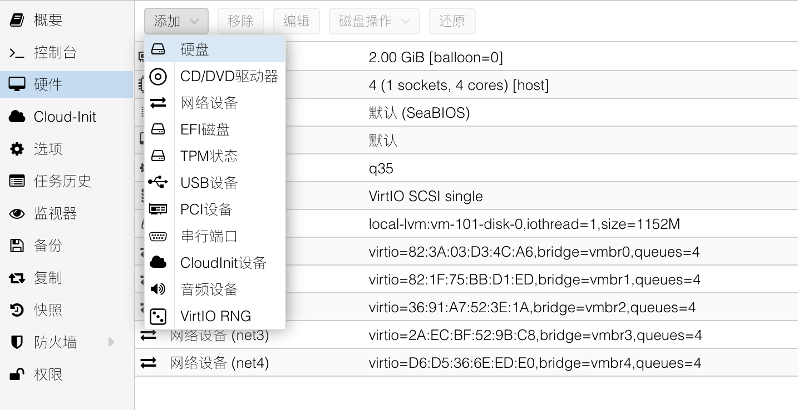
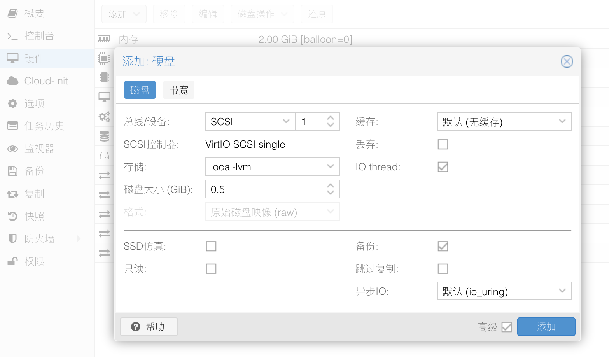
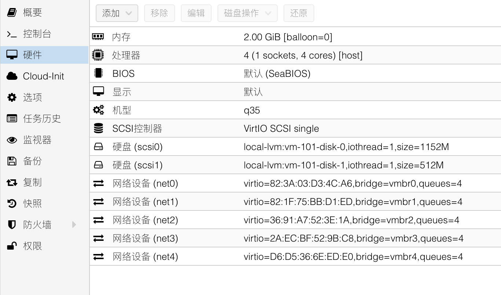
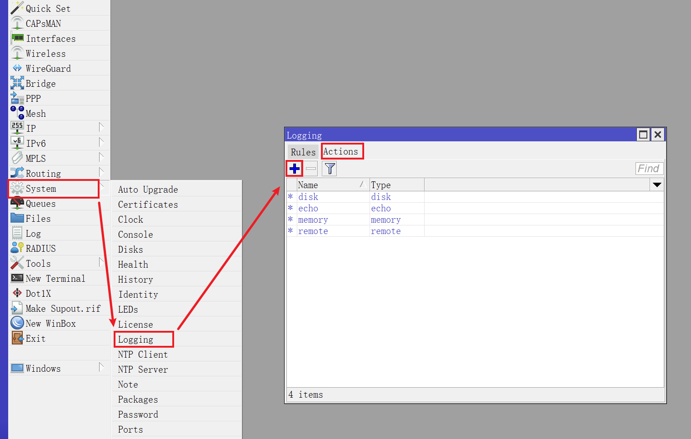
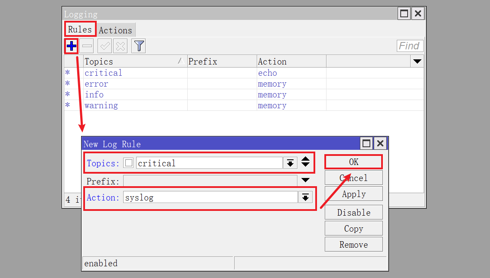
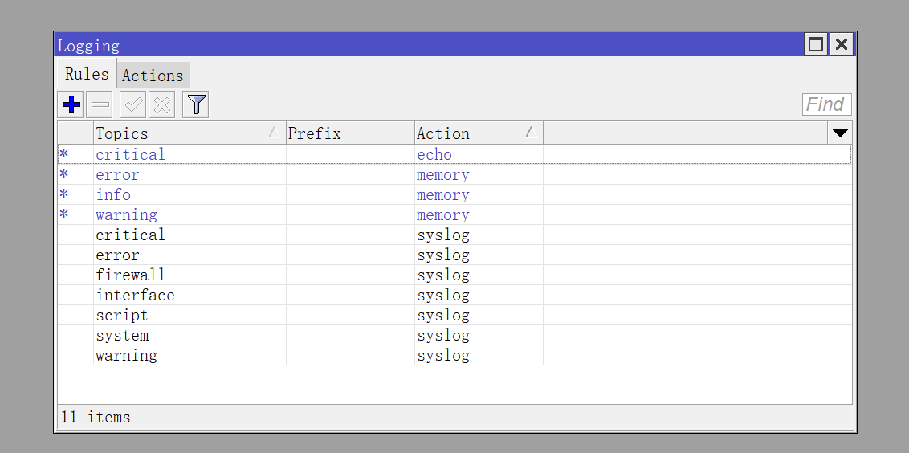

## 1.创建RouterOS日志硬盘

我们知道 RouterOS 的日志都在内存中，当系统重启后历史日志记录将会丢失。  

而使用附加硬盘来记录 RouterOS 的日志后，可以在系统意外重启时候看到历史日志信息，方便追溯问题。  

登录 PVE 的 WEB 管理后台，进入 RouterOS 虚拟机 `硬件` 配置界面。  

点击顶部 `添加` ，选择 `硬盘` ：

 

`总线/设备` 选择 `SCSI` ，设备编号 PVE 会自动设置，演示中为 `1` 。  

`磁盘大小` 根据 PVE 服务器资源剩余情况酌情设置，演示为 `0.5` GiB。  

打开底部 `高级` 选项，并确认 `IO thread` 选项为 **勾选** 状态：

日志硬盘添加完成后，如图所示：

## 2.RouterOS格式化硬盘

打开 Winbox ，使用具有管理员权限的账号进行登录。  

点击 Winbox 左侧导航 `System` 菜单的子菜单 `Disks` ，查看当前硬盘列表：

鼠标 **单击** 选中新加入的硬盘，点击 `Format Drive` ，对硬盘进行格式化操作。  

|参数|值|说明|
|--|--|--|
|Slot|`slot1`|选择待格式化硬盘的槽位|
|File System|`ext4`|硬盘的文件系统，建议 CHR 选择 `ext4`|
|Label|`logdrive`|硬盘的标签，可用英文自由定义|
|MBR Partition Table| **取消勾选** |建议取消勾选，避免产生额外的分区|

等待硬盘格式化完成后，即可使用该硬盘用于记录离线日志。  

## 3.配置RouterOS日志规则

### 3.1.添加日志操作方式

点击 Winbox 左侧导航 `System` 菜单的子菜单 `Logging` ，查看当前日志操作方式条目。  

点击 ` + ` 按钮，新建一个日志操作方式。

在弹出的对话框中，对日志操作方式进行调整：

|参数|值|说明|
|--|--|--|
|Name|`syslog`|名称，可用英文自由定义|
|Type|`disk`|表示操作方式为写入硬盘|
|File Name|`/slot1/offline_log`|文件路径以及文件名称前缀|
|Lines Per File|`1000`|每个文件的行数，保持默认 1000 即可|
|File Count|`100`|保留的日志文件数|
|Stop on Full|不勾选|是否在容量用尽时停止|

**注意：**   
**文件路径 `/slot1/` 为之前硬盘路径，需要根据实际情况进行调整。**   
**每个日志文件记录了 `1000` 行日志条目后就会新创建一个日志文件。**   
**设置了 `File Count` 为 `100` 后，该日志硬盘中将总共有 `100` 个日志文件，共计 `10000 (1000 x 10)` 行日志。**   

### 3.2.创建日志规则

切换到 `Rules` 选项卡，点击 ` + ` 按钮，创建新的日志规则。

|参数|值|说明|
|--|--|--|
|Topics|`critical`|根据日志主题来匹配日志日条目，建议单选|
|Action|`syslog`|选择日志操作方式，选择刚创建的 `syslog` 方式|

可以根据实际使用需求，逐条添加多个日志规则。  

这里推荐记录的日志 `Topics` 包括：  

 `critical` 、 `error` 、 `warning` 、 `system` 、 `script` 、 `firewall` 、 `interface` 

点击 Winbox 左侧导航 `Files` 菜单，可以看到自动创建的日志文件：

