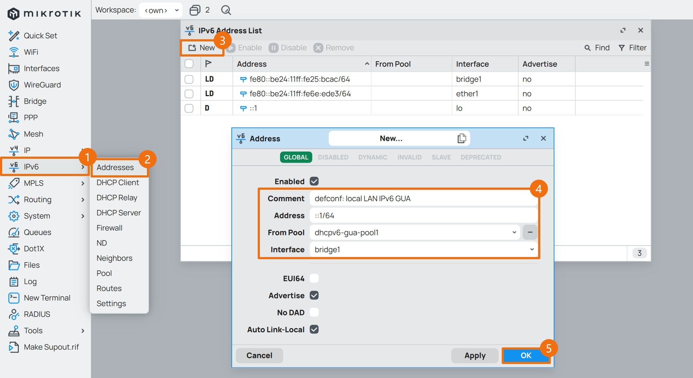
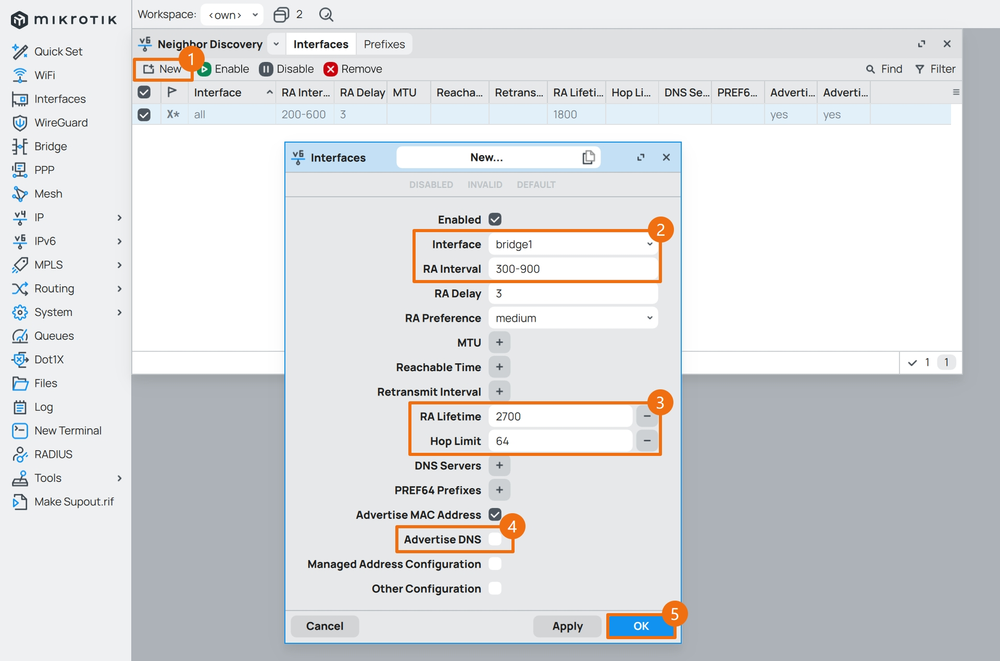
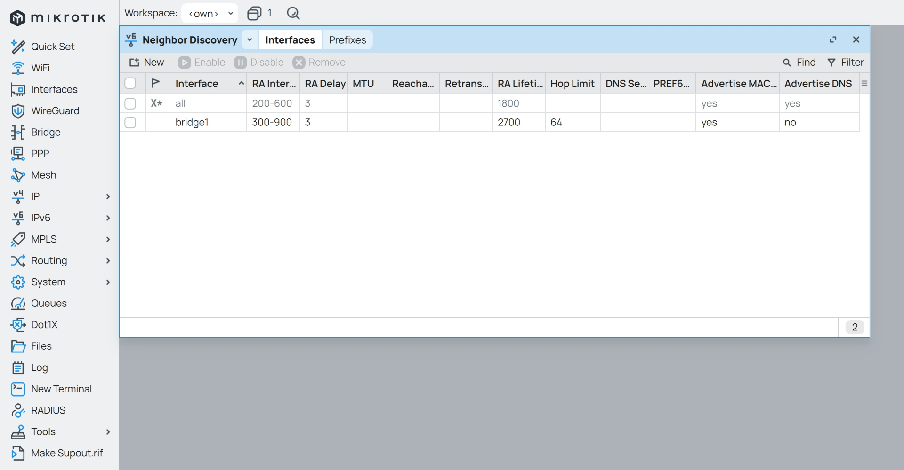
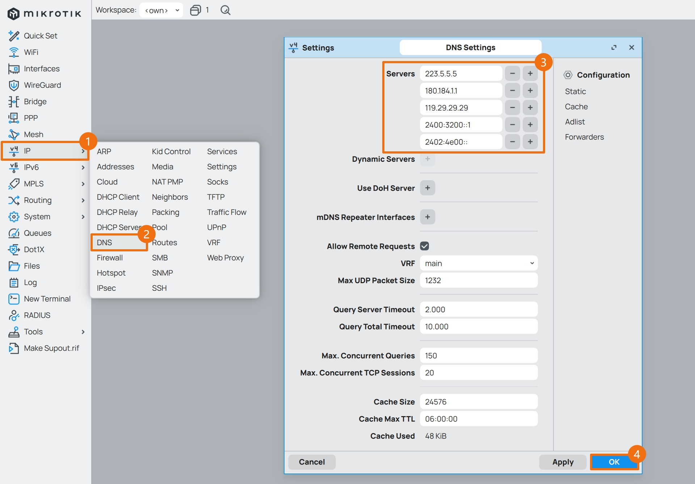
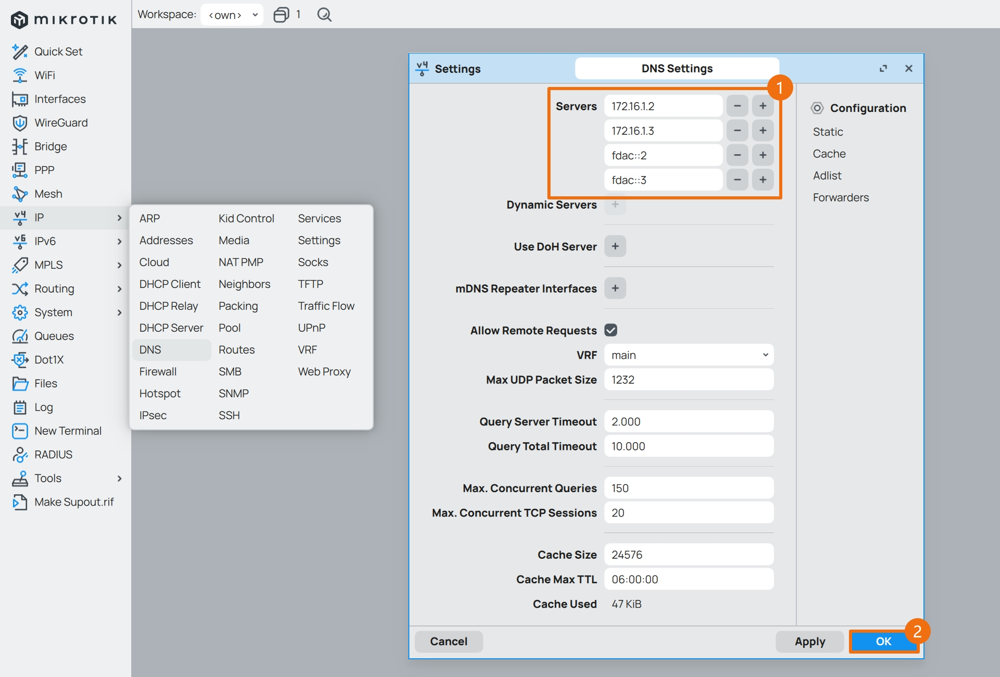
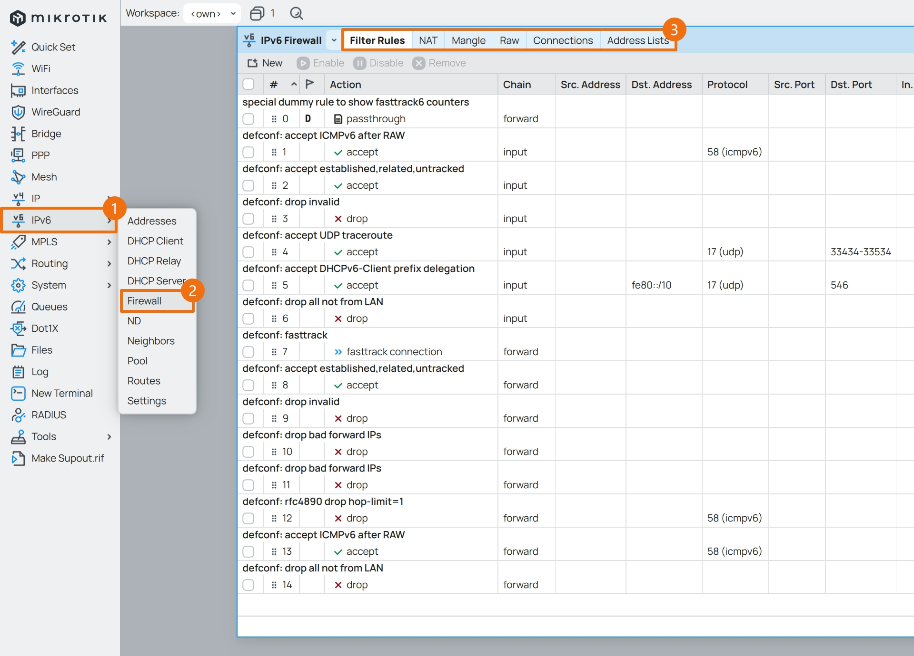
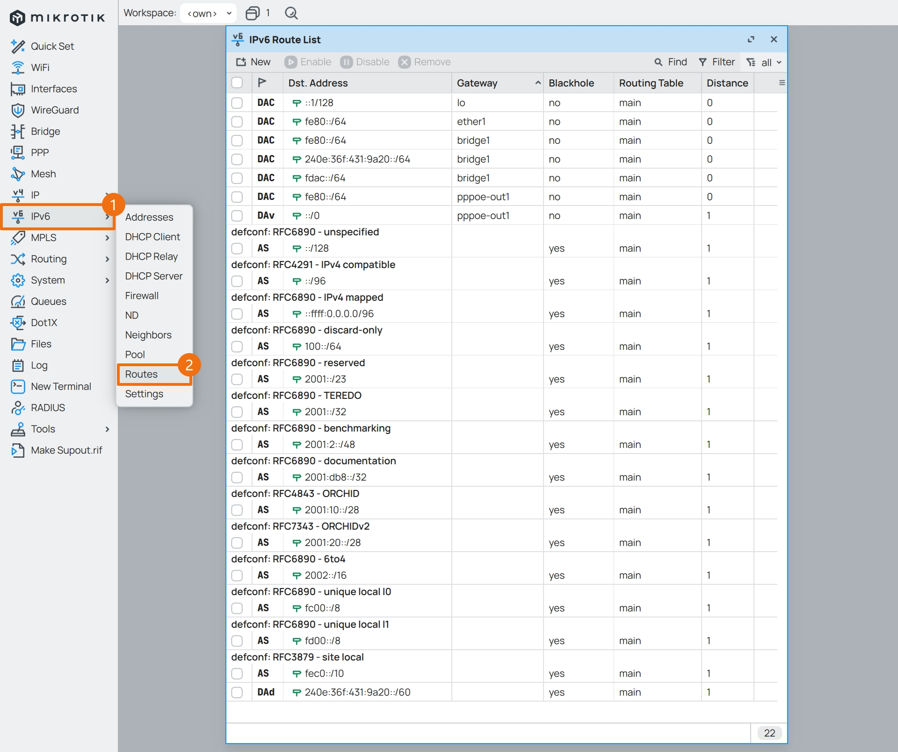

## 0.背景说明

在 RouterOS 近期版本更新中，Mikrotik 官方对 IPv6 相关功能做了许多优化，是时候配置 IPv6 网络了。  

根据 Mikrotik 官方文档，目前 RouterOS 能较好的支持以 `SLAAC` 方式来配置 IPv6 。  

而 RouterOS 的 DHCPv6 暂时只支持通告前缀信息，不能分发地址。  

## 1.获取 IPv6 前缀

使用 Winbox 登录 RouterOS ，点击左侧导航 `IPv6` 菜单的子菜单 `Settings` 。  

若无需使用 IPv6 或运营商未提供 IPv6 接入，可使用以下方法关闭 RouterOS 的 IPv6 功能。  


否则，请勿勾选 `Disable IPv6` ，保持 RouterOS IPv6 相关功能为开启状态。  

并将 `Max Neighbor Entries` 参数（类似于 `ARP` 表最大条目数）修改为合适的数值，演示为 `1024` 。  


点击左侧导航 `IPv6` 菜单的子菜单 `DHCP Client` ，点击 ` + ` 按钮。  

|参数|值|说明|
|--|--|--|
|Interface|`pppoe-out1`|从 PPPoE 拨号中获取 IPv6 前缀|
|Request|`prefix`|表示只获取前缀信息|
|Pool Name|`dhcpv6-gua-pool1`|设置本地 IPv6 GUA 地址池名称|
|Pool Prefix Length|`64`|设置本地 IPv6 GUA 地址池长度|
|Use Peer DNS| **取消勾选** |不使用运营商的 IPv6 DNS 服务器|
|Add Default Route| **不勾选** |是否加入默认路由，建议是无需勾选|
|Comment|`defconf: local DHCPv6 Client`|备注信息|

`Pool Prefix Length` 参数默认值为 `64` ，该参数与运营商相关，官方文档 [DHCPv6 Client](https://help.mikrotik.com/docs/display/ROS/DHCP#DHCP-DHCPv6Client) 参考如下:  

> Prefix length parameter that will be set for IPv6 pool in which received IPv6 prefix is added.  
> Prefix length must be greater than the length of the received prefix,  
> otherwise, prefix-length will be set to received prefix length + 8 bits.  

国内运营商，其前缀长度一般为 `56` 、 `60` 、 `64` ，不同的 `Pool Prefix Length` 将影响内网 IPv6 子网数量。  

对于 `Add Default Route` 参数，没有相关 RFC 文档表明 `DHCPv6 Client` 在仅获取前缀时需要添加默认路由。  

经过测试，该选项勾选与否均不影响后续设置以及 IPv6 的网络访问。  


`DHCPv6 Client` 创建完成后，如果正确获取到了 IPv6 前缀信息，将如图所示。  

如果未获取到前缀信息，尝试让 PPPoE 重新拨号。  

如果在重新拨号后，仍未获取 IPv6 的前缀信息，那么运营商可能并未提供 IPv6 接入能力。  


## 2.设置接口 IPv6 地址

在设置接口 IPv6 地址时， `pppoe-out1` 接口通常无需分配地址，只需给 `bridge1` 接口分配 IPv6 地址即可。  

|IPv6 地址类型|地址范围|说明|
|--|--|--|
|Global Unicast Address ( GUA )|`2000::/3`|全局单播地址，类似于公网 IPv4 地址|
|Unique Local Address ( ULA )|`FC00::/7`|唯一本地地址，类似于私有 IPv4 地址|
|Link Local Address ( LLA )|`FE80::/10`|链路本地地址，每个启用 IPv6 的设备都需要此类地址|

由于 RouterOS 还未设置 IPv6 防火墙，给内部接口分配 IPv6 GUA 地址后，此时内网已经与公网互联。  

如果当前 RouterOS 及内网设备有不完善的安全设置（比如使用了弱登录密码），系统存在被入侵的风险。  

因此建议先关闭 `DHCPv6 Client` ，直到 RouterOS IPv6 防火墙等内容设置完成后，再将其打开。  

### 2.1.分配 IPv6 GUA 地址

点击 Winbox 左侧导航 `IPv6` 菜单的子菜单 `Addresses` ，点击 ` + ` 按钮。  

|参数|值|说明|
|--|--|--|
|Address|`::1/64`|自动匹配前缀，前缀长度 `64` ，并使用顺序第一个地址|
|From Pool|`dhcpv6-gua-pool1`|选择 `DHCPv6 Client` 中创建的地址池|
|Interface|`bridge1`|选择内部网桥接口|
|Advertise| **勾选** |勾选该选项，内网设备将生成 IPv6 GUA 地址|
|Comment|`defconf: local LAN IPv6 GUA`|备注信息|



### 2.2.分配 IPv6 ULA 地址

根据 [RFC4193 - Unique Local IPv6 Unicast Addresses](https://www.rfc-editor.org/rfc/rfc4193) 中给出的定义，IPv6 ULA 地址前缀为 `FC00::/7` 。  

该前缀包含 `FC00::/8` 和 `FD00::/8` 两个部分，严格意义上 ULA 目前应该使用 `FD00::/8` 。  

对于 IPv6 ULA 地址，在以下使用场景中可考虑创建并分配：  

- 仅路由器本身具有 IPv6 GUA 地址，内网环境需使用 IPv6 ULA 地址并搭配 [NPTv6](https://www.rfc-editor.org/rfc/rfc6296.html) 进行公网访问的场景  

- 内网环境中的部分服务，需使用某固定的 IPv6 地址，且 IPv6 LLA 地址无法满足使用需求的场景  

- 内网环境中需使用 IPv6 ULA 地址进行跨路由器组网的场景  

在实际使用场景下，建议使用类似 [RFC4193 IPv6 Generator](https://cd34.com/rfc4193/) 的工具来生成符合规范的 IPv6 ULA 地址。  

该工具只需要输入接口（例如 RouterOS 的 `bridge1` ）的 MAC 地址即可。  


得到符合规范的 IPv6 ULA 地址，如图所示。  


回到 Winbox ，再次点击 ` + ` 按钮，方便起见，本文使用 `fdac::/64` 作为演示。  

|参数|值|说明|
|--|--|--|
|Address|`fdac::1/64`|指定前缀，前缀长度 `64` ，并使用顺序第一个地址|
|Interface|`bridge1`|选择内部网桥接口|
|Advertise| **勾选** |勾选该选项，内网设备将生成 IPv6 ULA 地址|
|Comment|`lanconf: local LAN IPv6 ULA`|备注信息|


`DHCPv6 Client` 正确获取 IPv6 前缀，并且内部网桥 `bridge1` 两类 IPv6 地址均添加完成后，如图所示。  


## 3.设置 ND 服务

### 3.1.设置 ND 前缀

点击 Winbox 左侧导航 `IPv6` 菜单的子菜单 `ND` 。  

在 `Neighbor Discovery` 对话框中切换到 `Prefixes` 选项卡。  

这里可以看 `Prefix` 列表中的 `fdac::/64` 被标记为 `D` ，表示该条目为 “自动动态生成” 条目。  

根据 [RFC9096 - Improving the Reaction of Customer Edge Routers to IPv6 Renumbering Events](https://www.rfc-editor.org/rfc/rfc9096) 修改 `Prefix` 的默认参数。  

点击 `Default` ，将 `Valid Lifetime` 设置为 `90` 分钟，将 `Preferred Lifetime` 设置为 `45` 分钟。  

|参数|值|说明|
|--|--|--|
|Valid Lifetime|`01:30:00`|IPv6 地址最大有效期|
|Preferred Lifetime|`00:45:00`|IPv6 地址建议有效期|


### 3.2.设置 ND 通告

在 `Neighbor Discovery` 对话框中切换到 `Interfaces` 选项卡。  

鼠标 **单击** 选中 `Interface` 为 `all` 的条目，点击 ` × ` 按钮将其禁用。  


点击 ` + ` 按钮，新增一个 `ND` 通告配置。  

|参数|值|说明|
|--|--|--|
|Interface|`bridge1`|选择 `ND` 通告使用的接口|
|RA Interval|`300-900`|设置 `ND` 通告的时间间隔，时间单位为秒|
|RA Lifetime|`2700`|设置 `ND` 通告的生存周期，时间单位为秒|
|Hop Limit|`64`|缺省情况下，将设备初始发送 IPv6 单播报文的跳数限制为 64|
|DNS Servers| - |`ND` 通告的 IPv6 DNS 服务器地址|
|Advertise MAC Address| 勾选 |在 `ND` 通告中包含 `Interface` 接口的 MAC 地址信息|
|Advertise DNS| - |在 `ND` 通告中包含 `DNS Servers` 中指定的 DNS 服务器|

如果在某些场景下，需避免内网设备获取 IPv6 DNS 服务器，则可将 `DNS Servers` 参数留空，并取消勾选 `Advertise DNS` 选项。  

在 `DNS Servers` 参数为空，但 `Advertise DNS` 选项为勾选状态时，RouterOS 将从系统 DNS 列表中选择具有 IPv6 地址的 DNS 服务器进行通告。  



如果内网环境中 **没有** 自建 DNS 服务器，但需指定内网设备获取的 IPv6 DNS 服务器，则可适当调整 `DNS Servers` 参数。  

通常情况下 `DNS Servers` 参数可为以下几种：  

- 公共 DNS 服务器的 IPv6 地址  

- RouterOS `bridge1` 接口的 IPv6 GUA / ULA / LLA 地址  

- 内网 DNS 服务器的 IPv6 GUA / ULA / LLA 地址  

假如内网通告了 IPv6 ULA 地址前缀，且待指定的 IPv6 DNS 服务器为 `fdac::1` ，与 `bridge1` 接口的 IPv6 ULA 地址相同，则 `ND` 配置如下。  


或者，待指定的 IPv6 DNS 服务器为自建 DNS 服务器 `fdac::2` 、 `fdac::3` ，则 `ND` 配置如下。  


`ND` 配置完成后，如图所示。  



## 4.修改系统 DNS

启用 IPv6 后，需要给 RouterOS 重新指定上游 DNS 服务器地址。  

点击 Winbox 左侧导航 `IP` 菜单的子菜单 `DNS` ，并修改 `Servers` 参数。  

在 `Servers` 处增加国内知名的 DNS 服务提供商的 IPv6 地址。  

- 阿里云 AliDNS 的 IPv6 地址为：`2400:3200::1` 和 `2400:3200:baba::1`  

- 腾讯云 DNSPod 的 IPv6 地址为：`2402:4e00::` 和 `2402:4e00:1::`  



假如内网通告了 IPv6 ULA 地址前缀，且内网 DNS 服务器的 IPv6 地址为 `fdac::2` 、 `fdac::3` ，则 DNS 可配置如下。  

由于 `172.16.1.2` 和 `fdac::2` 实质上为同一台服务器，因此也可保持只有内网 DNS 服务器的 IPv4 地址。  



## 5.设置 IPv6 防火墙

与前文 [05.设置防火墙](./05.设置防火墙.md) 类似，IPv6 防火墙同样涉及 `address-list` 、`filter` 、`nat` 、`mangle` 、`raw` 等内容。  

依然建议复制防火墙配置命令，一次性全部粘贴到 `CLI` 中进行 “一键配置” 。  

如需使用全局 `NPTv6` 访问外部 IPv6 网络，请在 `nat` 表中启用备注为 `defconf: masquerade IPv6` 的防火墙规则。  

由于防火墙的配置命令很长，因此请根据实际情况选择对应的 IPv6 防火墙配置脚本。  

|联网模式| IPv6 ULA |内网 DNS |检测 DDoS |防火墙等级|配置脚本|
|--|--|--|--|--|--|
|PPPoE|否|否|否|初级|[ros_firewall_ipv6.pppoe.basic.conf](./src/firewall/ros_firewall_ipv6.pppoe.basic.conf)|
||否|否|否|高级|[ros_firewall_ipv6.pppoe.advanced.conf](./src/firewall/ros_firewall_ipv6.pppoe.advanced.conf)|
||是|是|是|高级|[ros_firewall_ipv6.pppoe.expert.conf](./src/firewall/ros_firewall_ipv6.pppoe.expert.conf)|

**需要注意的是，防火墙配置命令中的部分 IPv6 ULA 地址，需要根据实际情况进行调整。**  

- 内网 IPv6 ULA 地址前缀： `fdac::/64`
  - RouterOS IPv6 ULA 地址： `fdac::1`

- 内网 DNS 服务器 IPv6 ULA 地址： `fdac::2` 、 `fdac::3`

IPv6 防火墙配置完成后，回到 Winbox，点击左侧导航 `IPv6` 菜单的子菜单 `Firewall` 并查看防火墙各个选项卡中内容。  



确认防火墙条目与命令中的条目一致后，便可启用 IPv6 的 `DHCPv6 Client` ，建议重启一次 RouterOS。  

重启内网设备的网卡，检查是否获取了 GUA / ULA 地址。  

Windows11 IPv6 连接处会显示 `Internet` ，表示此时 Windows 是可以访问 IPv6 网络的。  

可以通过这个网站来进行测试 [IPv6 Test](https://master.test-ipv6.com) 。  


## 6.设置 IPv6 黑洞路由

与 IPv4 黑洞路由类似，IPv6 黑洞路由同样基于 [RFC6890 - Special-Purpose IP Address Registries](https://www.rfc-editor.org/rfc/rfc6890) 创建，本段内容为可选步骤。  

配置 IPv6 黑洞路由时，将以下命令一次性全部粘贴到 `CLI` 中执行即可。  

如果不便复制代码，请查阅文件 [ros_blackhole_ipv6.conf](./src/firewall/ros_blackhole_ipv6.conf) 。  

```bash
/ipv6 route

add blackhole comment="defconf: RFC6890 - unspecified" disabled=no dst-address=::/128
add blackhole comment="defconf: RFC4291 - IPv4 compatible" disabled=no dst-address=0000::/96
add blackhole comment="defconf: RFC6890 - IPv4 mapped" disabled=no dst-address=::ffff:0:0/96
add blackhole comment="defconf: RFC6890 - discard-only" disabled=no dst-address=100::/64
add blackhole comment="defconf: RFC6890 - reserved" disabled=no dst-address=2001::/23
add blackhole comment="defconf: RFC6890 - TEREDO" disabled=no dst-address=2001::/32
add blackhole comment="defconf: RFC6890 - benchmarking" disabled=no dst-address=2001:2::/48
add blackhole comment="defconf: RFC6890 - documentation" disabled=no dst-address=2001:db8::/32
add blackhole comment="defconf: RFC4843 - ORCHID" disabled=no dst-address=2001:10::/28
add blackhole comment="defconf: RFC7343 - ORCHIDv2" disabled=no dst-address=2001:20::/28
add blackhole comment="defconf: RFC6890 - 6to4" disabled=no dst-address=2002::/16
add blackhole comment="defconf: RFC6890 - unique local l0" disabled=no dst-address=fc00::/8
add blackhole comment="defconf: RFC6890 - unique local l1" disabled=no dst-address=fd00::/8
add blackhole comment="defconf: RFC3879 - site local" disabled=no dst-address=fec0::/10
```

点击 Winbox 左侧导航 `IP` 菜单的子菜单 `Routes` 并查看防火墙各个选项卡中内容。  



至此，RouterOS 设置 IPv6 步骤完成。  

