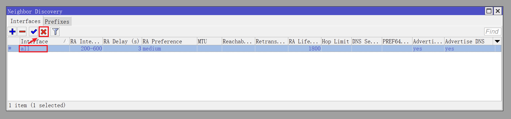

## 0.前景提要

在 RouterOS 近期版本更新中，Mikrotik 官方对 IPv6 相关功能做了许多优化，是时候配置 IPv6 网络了。  

根据 Mikrotik 官方文档，目前 RouterOS 能比较好的支持以 `SLAAC` 方式来配置 IPv6 ，而 DHCPv6 暂时只支持通告前缀信息，而不能分发地址。  

经过实际测试，如果把公网 IPv6 前缀信息通告到内网设备（即让内网设备直接具有公网 IPv6 地址），当 PPPoE 重新拨号或其他原因导致该公网 IPv6 前缀发生变化时，内网设备虽然也能同步获取新的公网 IPv6 地址，但此时 RouterOS 的 IPv6 路由表已经自动刷新，导致新旧公网 IPv6 地址并存的内网设备无法通过 IPv6 正常上网，只能通过重启该内网设备的网卡，让该内网设备刷新公网 IPv6 地址（等价于去掉旧的公网 IPv6 地址），才能恢复 IPv6 的网络访问。  

根据抓取 RouterOS 和 OpenWrt 的 `ICMPv6` 相关包可以发现，RouterOS 的 `Neighbor Discovery` 功能目前不支持通告 `ICMPv6 Option` 为 `Type: Route Information (24)` 的信息。  

而且 OpenWrt 在公网 IPv6 前缀发生变化时，除了会通告新的 IPv6 路由信息外，也会在系统 IPv6 路由表中新增路由条目，而旧的 IPv6 路由条目并不会删除，直到 OpenWrt 系统重启。  

总体而言， OpenWrt 对 IPv6 的支持就目前来说是好于 RouterOS 的，毕竟现在 OpenWrt 对 DHCPv6 也有良好的支持。  

## 1.获取 IPv6 前缀

如果按照之前的文章《[04.系统参数调整](./04.系统参数调整.md)》关闭了 IPv6 ，此时需要将其重新打开。  

使用 Winbox 登录 RouterOS ，点击左侧导航 `IPv6` 菜单的子菜单 `Settings` 。  

取消勾选 `Disable IPv6` ，表示开启 RouterOS IPv6 相关功能。  

并将 `Max Neighbor Entries` 参数（类似于 `ARP` 表最大条目数）修改为合适的数值，演示为 `1024` 。  


点击左侧导航 `IPv6` 菜单的子菜单 `DHCP Client` ，点击 ` + ` 按钮：  


|参数|值|说明|
|--|--|--|
|Interface|`pppoe-out1`|从 PPPoE 拨号中获取 IPv6 前缀|
|Request|`prefix`|表示只获取前缀信息|
|Pool Name|`Local_Pool_GUA_IPv6`|设置 IPv6 地址池名称|
|Use Peer DNS| **取消勾选** |不使用运营商的 IPv6 DNS|
|Add Default Route| **不勾选** |是否加入默认路由，建议是无需勾选|
|Comment|`defconf: DHCPv6 on PPPoE`|备注信息|

**注意：**  
**对于 `Add Default Route` 参数，官方建议是无需勾选。**  
**没有相关 RFC 文档表明 `DHCPv6 Client` 需要添加默认路由，该选项可能是 RouterOS 特有的 “便捷设置” 。**  
**经过测试，该选项勾选与否均不影响后续设置以及 IPv6 的网络访问。**  
**同时，该选项也无法解决 IPv6 前缀改变后，内网设备因旧的 IPv6 公网地址过期而网络中断的问题。**  

`DHCPv6 Client` 创建完成后，如果正确获取到了 IPv6 前缀信息，将如图所示：  


如果未获取到前缀信息，尝试让 PPPoE 重新拨号。  

如果在重新拨号后，仍未获取 IPv6 的前缀信息，那么运营商可能并未提供 IPv6 接入能力。  

## 2.设置接口 IPv6 地址

在设置接口 IPv6 时，拨号接口 `pppoe-out1` 是 **无需** 分配 IPv6 公网地址的。  

只需给网桥接口 `bridge1` 分配一个 IPv6 GUA 公网地址，并附加一个 IPv6 ULA 私有地址即可。  

**注意：**  
**当前 RouterOS IPv6 还未设置防火墙，给内部接口分配公网 IPv6 之后，RouterOS 相当于已经与公网互联。**  
**如果当前 RouterOS 有不完善的安全设置（比如使用了弱登录密码），系统存在被入侵的风险。**  
**因此建议先关闭 `DHCPv6 Client` ，直到 RouterOS IPv6 防火墙等内容设置完成后，再将其打开。**  

### 2.1.分配 IPv6 公网地址

点击 Winbox 左侧导航 `IPv6` 菜单的子菜单 `Addresses` ，点击 ` + ` 按钮：  


|参数|值|说明|
|--|--|--|
|Address|`::1/64`|自动匹配前缀，前缀长度 `64` ，并使用顺序第一个地址|
|From Pool|`Local_Pool_GUA_IPv6`|选择 `DHCPv6 Client` 中创建的地址池|
|Interface|`bridge1`|选择内部网桥接口|
|Advertise| **勾选** |勾选该选项，内网设备将生成公网 IPv6 地址|
|Comment|`defconf: Local LAN GUA IPv6 Address`|备注信息|

### 2.2.分配 IPv6 私有地址

根据 [RFC-4193](https://www.rfc-editor.org/rfc/rfc4193) 中给出的定义，IPv6 ULA 私有地址前缀为 `FC00::/7` 。  

该前缀包含 `FC00::/8` 和 `FD00::/8` 两个部分，严格意义上 ULA 目前应该使用 `FD00::/8` 。  

在实际使用场景下，建议使用类似 [RFC4193 IPv6 Generator](https://cd34.com/rfc4193/) 的工具来生成符合规范的 ULA 私有地址。  

该工具只需要输入接口（例如 RouterOS 的 `bridge1` ）的 MAC 地址即可。  


得到符合规范的 ULA 私有地址为：  


回到 Winbox ，再次点击 ` + ` 按钮：  

**注意：方便起见，本文使用 `fdac::/64` 作为演示。**  


|参数|值|说明|
|--|--|--|
|Address|`fdac::1/64`|指定前缀，前缀长度 `64` ，并使用顺序第一个地址|
|Interface|`bridge1`|选择内部网桥接口|
|Advertise| **勾选** |勾选该选项，内网设备将生成私有 IPv6 地址|
|Comment|`defconf: Local LAN ULA IPv6 Address`|备注信息|

`DHCPv6 Client` 正确获取 IPv6 前缀，并且内部网桥 `bridge1` 两个 IPv6 地址均添加完成后，如图所示：


## 3.配置 ND 服务

### 3.1.配置 ND 前缀

点击 Winbox 左侧导航 `IPv6` 菜单的子菜单 `ND` 。  

在 `Neighbor Discovery` 对话框中切换到 `Prefixes` 选项卡。  

这里可以看 Prefix `fdac::/64` 被标记为 `D` ，表示该条目为 “自动动态生成” 条目。  

点击 `Default` ，修改 Prefix 的生存周期：  


根据 [Systemd.Network](https://systemd.network/systemd.network.html#%5BIPv6Prefix%5D%20Section%20Options) 中的描述：  

> Preferred and valid lifetimes for the prefix measured in seconds.   
> PreferredLifetimeSec= defaults to 1800 seconds (30 minutes) and   
> ValidLifetimeSec= defaults to 3600 seconds (one hour).

经过一段时间的测试，将 `Preferred Lifetime` 设置为 `1` 小时，将 `Valid Lifetime` 设置为 `2` 小时较为可靠。  

|参数|值|说明|
|--|--|--|
|Valid Lifetime|`02:00:00`|IPv6 地址最大生存周期|
|Preferred Lifetime|`01:00:00`|IPv6 地址建议生存周期|

### 3.2.配置 ND 通告

在 `Neighbor Discovery` 对话框中切换到 `Interfaces` 选项卡。  

鼠标 **单击** 选中 `Interface` 为 `all` 的条目，点击 ` × ` 按钮将其禁用：



点击 ` + ` 按钮，新增一个 ND 通告配置。  

如果内网环境中 **没有** 自建 DNS 服务器，则可以将 `DNS Servers` 参数设置为 `fdac::1` ，与 `bridge1` 的 ULA IPv6 地址相同。  


|参数|值|说明|
|--|--|--|
|Interface|`bridge1`|选择ND通告使用的接口|
|RA Interval|`60-120`|设置ND通告的时间间隔，时间单位为秒|
|Hop Limit|`64`|缺省情况下，由设备初始发送 IPv6 单播报文的跳数限制是64|
|DNS Servers|`fdac::1`|ND 通告的 IPv6 的 DNS 服务器地址|
|Advertise MAC Address| **建议勾选** |ND 通告中将包含接口的 MAC 地址信息|
|Advertise DNS| **必须勾选** |使用 ND 设置的 DNS 服务器来通告|

如果内网中 **有** 自建 DNS 服务器，则需要将 `DNS Servers` 参数设置为内网 DNS 服务器的 IPv6 地址。  

假设内网 DNS 服务器分别为 `fdac::2` 、 `fdac::3` ，则 ND 配置如下：  


`ND` 配置完成后，如图所示：


## 4.修改系统 DNS

启用 IPv6 后，需要给 RouterOS 重新指定上游 DNS 服务器地址。  

点击 Winbox 左侧导航 `IP` 菜单的子菜单 `DNS` ，并修改 `Servers` 参数。  

在 `Servers` 处增加国内知名的 DNS 服务提供商的 IPv6 地址。  

- 腾讯云 DNSPod 的 IPv6 地址为：`2402:4e00::` 和 `2402:4e00:1::` 。  
- 阿里云 AliDNS 的 IPv6 地址为：`2400:3200::1` 和 `2400:3200:baba::1` 。  


如果内网中 **有** 自建 DNS 服务器，则需要将 `Servers` 参数设置为内网 DNS 服务器的 IPv6 地址。  

假设内网 DNS 服务器分别为 `fdac::2` 、 `fdac::3` ，则 DNS 配置如下：  


## 5.配置 IPv6 防火墙

与前文《[02.配置防火墙和流量整形](./02.配置防火墙和流量整形.md#3配置防火墙)》类似，IPv6 防火墙同样涉及 `address-list` 、`filter` 、`nat` 、`mangle` 、`raw` 等内容。  

依然建议复制防火墙配置命令，一次性全部粘贴到 CLI 中进行 “一键配置” 。  

**若需使用 NAT66 的方式来访问外部 IPv6 网络，请在 `nat` 表中启用第一条防火墙规则。**  

防火墙配置命令中的部分 IPv6 ULA 地址需要根据实际情况进行调整。  

- 内网使用的 IPv6 ULA 地址前缀 `fdac::/64`
  - RouterOS 的 IPv6 ULA 地址 `fdac::1`
- 内网 DNS 服务器的 IPv6 ULA 地址 `fdac::2` 、 `fdac::3`

如果 **没有** 内网 DNS 服务器，并移除了 `local_dns_ipv6` 地址列表，则需同步移除 `nat` 表中以下 `2` 条防火墙条目：  

```bash
add action=accept chain=dstnat comment="lanconf: accept local DNS server's query (UDP)" dst-port=53 in-interface-list=LAN protocol=udp src-address-list=local_dns_ipv6
add action=accept chain=dstnat comment="lanconf: accept local DNS server's query (TCP)" dst-port=53 in-interface-list=LAN protocol=tcp src-address-list=local_dns_ipv6 log=yes log-prefix=fw_dnsv6_tcp
```

由于 IPv6 防火墙的配置命令很长，因此请查阅文件 [ros_firewall_ipv6.conf](./src/firewall/ros_firewall_ipv6.conf) 进行复制。  

IPv6 防火墙配置完成后，回到 Winbox，点击左侧导航 `IPv6` 菜单的子菜单 `Firewall` 并查看防火墙各个选项卡中内容：  


确认防火墙条目与命令中的条目一致后，便可启用 IPv6 的 `DHCPv6 Client` ，建议重启一次 RouterOS。  

重启内网设备的网卡，检查是否获取了 GUA / ULA 地址。  

Windows11 IPv6 连接处会显示 `Internet` ，表示此时 Windows 是可以访问 IPv6 网络的。  


可以通过这个网站来进行测试 [IPv6 Test](https://master.test-ipv6.com) ，至此，RouterOS 的 IPv6 配置已经完成。  
