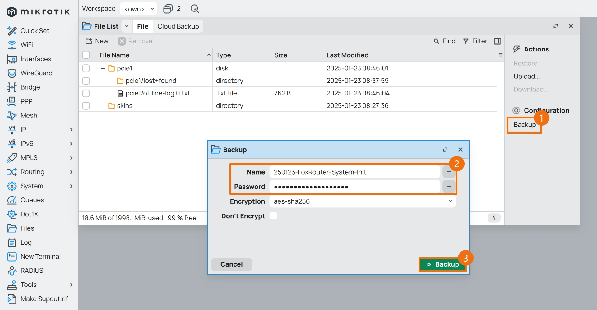

## 1.设置系统名称

在上一篇文章 [08.设置IPv6](./08.设置IPv6.md) 中，已经设置了 IPv6 网络，现在开始调整系统参数。  

点击左侧导航 `System` 菜单的子菜单 `Identity` ，进入 RouterOS 系统名称管理界面。  

在 `Identity` 处使用英文填写系统名称。  


## 2.设置时区 NTP

点击左侧导航 `System` 菜单的子菜单 `Clock` ，进入 RouterOS 系统时间管理界面。  

确认 `Time Zone Autodetect` 为勾选状态，`Time Zone Name` 为 `Asia/Shanghai` 。  


点击左侧导航 `System` 菜单的子菜单 `NTP Client` ，进入 RouterOS 系统 NTP 管理界面。  

勾选 `Enabled` ，在 `NTP Servers` 处填写国内常用 NTP 服务器地址 `ntp.aliyun.com` 、 `ntp.tencent.com` 和 `cn.pool.ntp.org` 。  


## 3.调整系统服务

RouterOS 默认开启了 `api` 、`ftp` 等系统服务，这些服务日常使用中并不常用，可以关闭。  

对于日常会用到的系统服务，比如 `ssh` 、 `winbox` 等，需要限制可访问的 `IP` 地址段。  

点击左侧导航 `IP` 菜单的子菜单 `Settings` ，进入 RouterOS 系统服务管理界面。  

鼠标 **单击** 选中需要关闭的服务，点击 ` × ` 按钮，即可关闭服务。  


在之前的 RouterOS 设置中，内网网段规划为 `172.16.1.0/24` ，因此系统服务的 “可访问来源地址” 保持与内网网段相同。  

鼠标 **双击** 某项服务，进入该服务的配置界面，在 `Available From` 处填写对应网段 `172.16.1.0/24` 。  

如需修改该服务的监听 `端口` ，在 `Port` 处填写对应端口号。  


## 4.系统安全增强

与防火墙相关的配置项，比如路由器安全增强，在参考了官方文档 [Securing your router](https://help.mikrotik.com/docs/display/ROS/Securing+your+router) 后做了如下调整：  

1. `max-neighbor-entries` 参数调整为 `1024`  

2. `rp-filter` 设置为松散模式 `loose`  

3. 启用了 `tcp-syncookies`  

4. 关闭了用于探测其他 MikroTik 路由器的 `discover-interface-list`  

5. 关闭了以下服务  
    - `ip` - `proxy` 服务  
    - `ip` - `socks` 服务  
    - `ip` - `upnp` 服务  
    - `ip` - `cloud` 服务  

6. 启用了 `ssh` 服务的 “强加密” 模式 `strong-crypto`  

7. 关闭了 `smb` 服务并调整了服务的网络接口，同时移除了 `guests` 账户和默认分享  

8. 关闭了 `disk` 服务有关 `smb` 和 `media` 的自动分享  

9. 对 `mac-server` 服务进行了调整，将影响 Winbox 对 RouterOS 的探测发现  
    - 关闭了 `mac-server` 的 `allowed-interface-list`  
    - 关闭了 `mac-winbox` 的 `allowed-interface-list`  
    - 关闭了 `mac-server` 的 `ping`  

10. 关闭了用于带宽测试的 `tool` - `bandwidth-server` 服务  

配置系统安全增强时，将以下命令一次性全部粘贴到 `CLI` 中执行即可。  

如果不便复制代码，请查阅文件 [ros_sys_hardened.conf](./src/system/ros_sys_hardened.conf) 。  

```bash
/ip settings
set max-neighbor-entries=1024 rp-filter=loose tcp-syncookies=yes

/ip neighbor discovery-settings
set discover-interface-list=none

/ip proxy
set enabled=no

/ip socks
set enabled=no

/ip upnp
set enabled=no

/ip cloud
set ddns-enabled=no update-time=no

/ip ssh
set strong-crypto=yes

/ip smb
set enabled=no interfaces=bridge1

/ip smb users
set numbers=[ find where name ~ "guest" ] disabled=yes

/ip smb shares
set numbers=[ find where name ~ "pub" ] disabled=yes

/disk settings
set auto-smb-sharing=no auto-media-sharing=no auto-media-interface=none

/tool mac-server
set allowed-interface-list=none

/tool mac-server mac-winbox
set allowed-interface-list=none

/tool mac-server ping
set enabled=no

/tool bandwidth-server
set enabled=no
```

## 5.设置系统账户

点击左侧导航 `System` 菜单的子菜单 `Users` ，进入 RouterOS 系统账户管理界面。  

默认情况下，RouterOS 会有一个内建管理员 `admin` ，权限为 `full` 。  


安全起见，建议新建一个管理员账号，权限设置为 `full` ，并将默认管理员 `admin` 的权限设置为 `read` “只读”。  

切换到 `Groups` 选项卡，鼠标双击 `read` 权限组，仅保留 `read` 、 `winbox` 、`web` 权限。  


修改完成后如图所示。  


返回 `Users` 选项卡，新建一个管理员账户。  

|参数|值|说明|
|--|--|--|
|Name|`fox`|账户名，需要用英文|
|Group|`full`|账户权限组|
|Allowed Address|`172.16.1.0/24`|可访问来源地址，与内网网段相同|
|Password|************|账户的密码，设置一个高强度密码|
|Comment|`defconf: system admin user`|账户备注信息|


设置完成后，如图所示。  


登出 Winbox，并用 **新创建的** 管理员账户进行登录，以确保新管理员账户可正常使用。  

鼠标 **双击** 管理员 `admin` 条目，修改其权限和可访问来源地址。  


修改完成后，如图所示。  


后续再使用 RouterOS 的过程中，如果不涉及对系统参数的调整，可以仅使用 `read` 权限下的 `admin` 账户。  

避免在日常检查系统运行状态时，意外调整了系统参数导致系统异常。  

## 6.设置系统日志

打开 Winbox ，使用具有管理员权限的账号进行登录。  

点击 Winbox 左侧导航 `System` 菜单的子菜单 `Disks` ，查看当前硬盘列表。  


鼠标 **单击** 选中新加入的硬盘，点击 `Format Drive` ，对硬盘进行格式化操作。  

|参数|值|说明|
|--|--|--|
|Slot|`slot1`|选择待格式化硬盘的槽位|
|File System|`ext4`|硬盘的文件系统，建议 CHR 选择 `ext4`|
|Label|`logdrive`|硬盘的标签，可用英文自由定义|
|MBR Partition Table| **不勾选** |建议不勾选，避免产生额外的分区|


等待硬盘格式化完成后，即可使用该硬盘用于记录离线日志。  


### 6.1.添加日志操作方式

点击 Winbox 左侧导航 `System` 菜单的子菜单 `Logging` ，查看当前日志操作方式条目。  

点击 ` + ` 按钮，新建一个日志操作方式。  


在弹出的对话框中，对日志操作方式进行调整。  

|参数|值|说明|
|--|--|--|
|Name|`syslog`|名称，可用英文自由定义|
|Type|`disk`|表示操作方式为写入硬盘|
|File Name|`/slot1/offline-log`|文件路径以及文件名称前缀|
|Lines Per File|`1000`|每个文件的行数，保持默认 1000 即可|
|File Count|`100`|保留的日志文件数|
|Stop on Full|不勾选|是否在容量用尽时停止|

**注意：**   
**文件路径 `/slot1/` 为之前硬盘路径，需要根据实际情况进行调整。**   
**每个日志文件记录了 `1000` 行日志条目后就会新创建一个日志文件。**   
**设置了 `File Count` 为 `100` 后，该日志硬盘中将总共有 `100` 个日志文件，共计 `100,000 (1000 x 100)` 行日志。**   


### 6.2.创建日志规则

切换到 `Rules` 选项卡，点击 ` + ` 按钮，创建新的日志规则。  

|参数|值|说明|
|--|--|--|
|Topics|`critical`|根据日志主题来匹配日志日条目，建议单选|
|Action|`syslog`|选择日志操作方式，选择刚创建的 `syslog` 方式|


可以根据实际使用需求，逐条添加多个日志规则。  

这里推荐记录的日志 `Topics` 包括：  

 `critical` 、 `error` 、 `warning` 、 `system` 、 `script` 、 `firewall` 、 `interface` 


点击 Winbox 左侧导航 `Files` 菜单，可以看到自动创建的日志文件。  


## 7.备份系统设置

及时备份系统配置，有助于在系统异常时快速将系统恢复到正常状态。  

点击左侧导航 `Files` 菜单，在 `File List` 页面点击 `Backup` ，输入备份的名称以及备份密码，即可对系统配置进行备份。  

- `Name` ：备份文件的名称，全英文字符，参考规则为 `修改时间_路由器名称_修改内容`  
- `Password` ：备份文件的密码，可与管理员登录密码不同，需牢记  



备份完成后，如图所示。  


建议将备份文件下载到本地，进行多副本额外保存。  

至此，RouterOS 设置系统参数步骤完成。  

