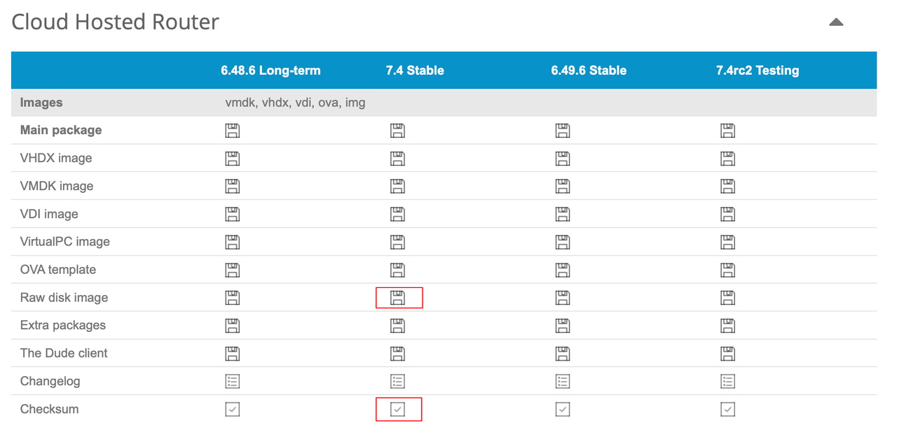

## 0.前景提要

在上一篇文章《[0.PVE下RouterOS安装](./0.PVE下RouterOS安装.md)》中，我们已经在 PVE 环境下安装好了 RouterOS。  

但是由于我咕的太久，现在 RouterOS 已经更新到了 7.4 Stable 版本。  

为了保证文章的及时性，我决定重装 RouterOS。  

到 [Mikrotik](https://mikrotik.com/download) 的官方网站下载最新的 Winbox 软件、RouterOS 固件以及固件对应的校验信息。  

### Winbox:


### RouterOS 固件:



### RouterOS 固件校验信息：


 **_说明：_**   

 _本系列文章适用于 CHR 版本和 MikroTik 原厂硬路由的 RouterOS 配置。_   

 _对于原厂硬路由，RouterOS 自带的 `Quick Set` 可以减少配置步骤，但自动配置出来的内容较为简单，且仍需调整参数。_   

 _这里推荐 2 款 MikroTik 的硬件设备，普通家庭上网环境可以使用被誉为弱电箱神器的 `hex` 系列 `RB750Gr3` ，如果对网络性能有较高要求则可以使用 `RB5009UG+S+IN` 。_  


## 1.备注网口

由于 Winbox 目前只支持 Windows 系统，因此在 macOS 或 Linux 系统下时，需要准备一个 Windows 的虚拟机或者使用 `Wine` 。  

  

打开 Winbox ，并将 Windows 设备的 LAN 口与 PVE 软路由的 ETH1 到 ETH3 中的一个物理网口相连。  

此时 Winbox 会识别到一个新的 RouterOS 设备，并显示出该设备的 mac 地址，该设备的 IP 地址为 `0.0.0.0` 。

  

点击 mac 地址来登录 RouterOS，默认账户 `admin` ，默认密码为空。登录系统后显示：


该对话框表示该系统未被授权。  

对于未被授权的设备将处于“试用”状态，RouterOS 的试用时长为 24 小时，且带宽被限制在 `1Mbps` 。  

点击 `OK` 关闭该窗口，点击左侧导航的 `Interfaces` ：


如果在 PVE 下安装 RouterOS 并添加网口过程中没有出现问题，此处应该显示 5 个网口。  

鼠标依次 **双击** 每个网口，进入网口配置界面，并根据表格中的内容，对每个网口进行备注：

| 网口名称   | PVE网桥编号 | 物理网口 | 作用       | 备注                            |
|-------|---------|------|----------|-------------------------------|
| ether1 | vmbr0   | ETH0 | PPPoE 拨号 | `defconf: Local WAN`           |
| ether2 | vmbr1   | ETH1 | 内部网桥成员   | `defconf: Local LAN1`           |
| ether3 | vmbr2   | ETH2 | 内部网桥成员   | `defconf: Local LAN2`           |
| ether4 | vmbr3   | ETH3 | 内部网桥成员   | `defconf: Local LAN3`           |
| ether5 | vmbr4   | 无    | 内部网桥成员   | `defconf: Local LAN for Guests` |


备注完成后如图所示：


## 2.创建内部网桥

点击左侧导航的 `Bridge`，点击“添加”按钮：


|参数|值|说明|
|--|--|--|
|Name|`bridge1`|网桥名称，可自由定义，但建议保持 `bridge1` ，后续配置中会用到该名称|
|Admin. MAC Address|`2E:79:19:59:20:16`|网桥的 MAC 地址，为可选参数，但对 IPv6 的设置有帮助|
|Comment|`defconf: Local Bridge`|网桥备注信息|

网桥创建完成后，给该网桥添加成员网口，切换到 `Ports` 选项卡，点击“添加”按钮。  

从 `Interface` 下拉列表中选中需要添加的网口，`Bridge` 下拉列表中选中刚创建的网桥 `bridge1` 。  


点击 `OK` ，即可把网口添加为网桥成员接口。  

重复该操作，将所有 LAN 口都添加入该网桥。  


当然，除了使用 Winbox 来添加网桥以及成员接口的方法外，还可以使用 CLI 来创建网桥并添加成员接口。  

RouterOS 网桥的 MAC 地址将会自动设置，如果希望固定网桥的 MAC 地址，需要通过 CLI 来配置，参考如下： 

 **说明：**  
 **演示中网桥的 MAC 地址 `2E:79:19:59:20:16` 为随机生成的地址，可根据实际情况进行调整。**    

```bash
/interface bridge
add admin-mac=2E:79:19:59:20:16 auto-mac=no comment="defconf: Local Bridge" name=bridge1

/interface bridge port
add bridge=bridge1 interface=ether2
add bridge=bridge1 interface=ether3
add bridge=bridge1 interface=ether4
add bridge=bridge1 interface=ether5
```

## 3.创建 PPPoE 拨号

演示环境为使用 RouterOS 拨号上网，如果使用光猫拨号，可以跳过本段。  

点击左侧导航的 `PPP` ，点击“添加”按钮，选择 `PPPoE Client` ：  


| 参数        | 值           |
|------------|--------------|
| Name       | `pppoe-out1` |
| Interfaces | `ether1`     |

切换到 `Dial Out` 选项卡，填写 PPPoE 拨号需要的用户名和密码，并填写一个备注：


| 参数                | 值                         |
|-------------------|-----------------------------|
| User              | 拨号账户                     |
| Password          | 拨号密码                     |
| Use Peer DNS      | 不勾选                       |
| Add Default Route |  **必须勾选**                |
| Comment           | `defconf: Local PPPoE IPv4` |

`Use Peer DNS` 表示是否使用拨号下发的 DNS 服务器，推荐此处不勾选，后续将会设置 RouterOS 所使用的 `DNS` 服务器。  

确保 `Add Default Route` 为勾选状态。  

此时回到 `Interfaces` 页面，暂时将 PPPoE 拨号禁用。  

因为现在防火墙暂未设置，即使拨号成功也无法正常上网，而且为了避免外网某些流量意外访问到 RouterOS，安全起见，先禁用 PPPoE 拨号。


## 4.设置接口 IPv4 地址

本部分主要设置网桥 `bridge1` 和 `ether1` 的 IPv4 地址，其中 `ether1` 的地址设置方法与是否使用 RouterOS 拨号而有所不同。  

参考之前的网络规划：
- 光猫地址：`192.168.100.1/24`
- RouterOS 地址：`172.16.1.1/24`

首先设置网桥的 IPv4 地址，点击左侧导航 `IP` 菜单的子菜单 `Addresses` ，点击“添加”按钮：


|参数|值|
|--|--|
|Address|`172.16.1.1/24`|
|Network|`172.16.1.0`|
|Interface|`bridge1`|
|Comment|`defconf: Local LAN IPv4 Address`|

### 4.1.RouterOS 拨号时

 **对于使用 RouterOS 拨号的场景** ，并且希望能通过 RouterOS 问到光猫时，需要给 `ether1` 分配一个和光猫同网段的地址 `192.168.100.2/24` ：


|参数|值|
|--|--|
|Address|`192.168.100.2/24`|
|Network|`192.168.100.0`|
|Interface|`ether1`|
|Comment|`modemconf: Link IPv4 Address For Modem`|

接口地址设置完成后如图所示：


### 4.2.光猫拨号时

 **对于使用光猫拨号的场景** ，`ether1` 的地址应通过光猫的 DHCP 来分配。  

点击左侧导航 `IP` 菜单的子菜单 `DHCP Client` ，点击“添加”按钮：


| 参数                | 值                       |
|-------------------|-------------------------|
| Interface         | `ether1`                |
| Use Peer DNS      | 取消勾选                    |
| Use Peer NTP      | 取消勾选                    |
| Add Default Route |  **必须为 yes**                  |
| Comment           | `defconf: DHCP For WAN` |

创建完成后，如果获取到了 IPv4 地址则表示设置正确，如图所示：


## 5.设置 IPv4 DHCP 服务器

目前我并没有使用 IPv6 网络，因此本文中仅使用 IPv4 的 DHCP 服务，后续如果挖坑 IPv6，将会补全 IPv6 相关设置。  

设置 DHCP 服务器分为两个部分，一是创建 DHCP 的地址池，二是创建 DHCP 服务器。  

### 5.1.创建 DHCP 地址池

先创建 DHCP 地址池，点击左侧导航 `IP` 菜单的子菜单 `Pool` ，点击“添加”按钮：  


|参数|值|
|--|--|
|Name|`Local_Pool_IPv4`|
|Addresses|`172.16.1.101-172.16.1.150`|
|Comment|`defconf: Local LAN IPv4 Pool`|

 **_说明：_**   

 _在 `Addresses` 处填写的地址段为 `172.16.1.101-172.16.1.150` ，表示该地址池有 50 个可用 IPv4 地址；我预留了一部分地址用于内网设备的静态 IP 设置。_   

 _对于内网设备较多的情况下，可以酌情加大该地址池的空间；由于子网掩码为 `/24` 即 `255.255.255.0` ，因此该地址池最大的地址空间为 `172.16.1.2-172.16.1.254` 。_   

地址池创建完成后，如图所示：


### 5.2.创建 DHCP 服务器

接下来创建 DHCP 服务器， 点击左侧导航 `IP` 菜单的子菜单 `DHCP Server` ，点击“添加”按钮：

 

|参数|值|
|--|--|
|Name|`Local_DHCP_IPv4`|
|Interface|`bridge1`|
|Lease Time|`1d 00:00:00`|
|Address Pool|`Local_Pool_IPv4`|
|Bootp Support|`none`|
|Comment|`defconf: Local LAN IPv4 DHCP Server`|

创建完成 DHCP 服务器后如图所示：


接下来创建 DHCP 服务器网络参数，切换到 `Networks` 选项卡，点击“添加”按钮：


|参数|值|
|--|--|
|Address|`172.16.1.0/24`|
|Gateway|`172.16.1.1`|
|Netmask|`24`|
|DNS Server|`172.16.1.1`|
|Domain|`fox.lab` (可选)|
|Comment|`defconf: Local LAN IPv4 DHCP Network`|

DHCP 服务器网络参数创建完成后，如图所示：


此时重连一次电脑的网络，电脑将能够从 RouterOS 获取到 IP 地址：


## 6.设置 DNS

点击左侧导航 `IP` 菜单的子菜单 `DNS` ，并修改参数：


|参数|值|
|--|--|
|Servers|`223.5.5.5` <br> `119.29.29.29`|
|Allow Remote Requests| **必须勾选** |
|Max. Concurrent Queries|`150`|
|Cache Size|`1024`|
|Cache Max TTL|`1d 00:00:00`|

`Servers` 处可填写国内知名的 DNS 服务提供商，比如阿里云的 `223.5.5.5` 。  

`Allow Remote Requests`  **必须勾选** ，其作用是允许内网设备通过 RouterOS 地址来进行 DNS 查询。  

在之前的 DHCP 网络设置部分，将 RouterOS 地址设置成了内网设备的 DNS 服务器地址，因此，如果此处不勾选该选项，则会导致内网设备无法进行 DNS 解析。  

至此，RouterOS 基础配置已经完成，后续将设置 RouterOS 的接口组和防火墙，让 RouterOS 以及内网设备正常上网。
